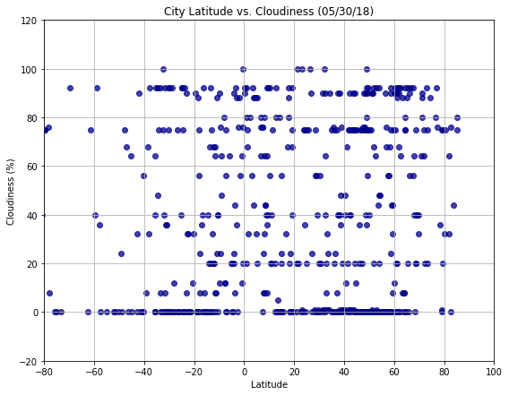

# *Analysis*
- There is a relatively strong correlation between latitude and temperature. 
- The higher latitudes have lower temperatures and the lower latitudes have higher temperatures.
- The correlation between humidity and latitude is very weak.
- There is almost no correlation between cloudiness and latitude.
- The correlation between latitude and wind speed is very weak.


```python
! pip install citipy
```


```python
# Dependencies
import pandas as pd
import matplotlib.pyplot as plt
import numpy as np
from citipy import citipy
#import openweathermapy.core as owm
#config
from config import api_key
import requests
```


```python
# DF for randomly generated lat and long
selected_cities = pd.DataFrame()
selected_cities['random_latitude'] = [np.random.uniform(-90,90) for x in range(1500)]
selected_cities['random_longitude'] = [np.random.uniform(-180, 180) for x in range(1500)]

# add closest city and country column
selected_cities['nearest_city'] = ""
selected_cities['country'] = ""

#find and add closest city and country code
for index, row in selected_cities.iterrows():
    lat = row['random_latitude']
    lng = row['random_longitude']
    selected_cities.set_value(index, 'nearest_city', citipy.nearest_city(lat, lng).city_name)
    selected_cities.set_value(index, 'country', citipy.nearest_city(lat, lng).country_code)
    
```

    /Users/kanika/anaconda3/lib/python3.6/site-packages/ipykernel/__main__.py:14: FutureWarning: set_value is deprecated and will be removed in a future release. Please use .at[] or .iat[] accessors instead
    /Users/kanika/anaconda3/lib/python3.6/site-packages/ipykernel/__main__.py:15: FutureWarning: set_value is deprecated and will be removed in a future release. Please use .at[] or .iat[] accessors instead


```python
selected_cities.head()
```


<div>
<style scoped>
    .dataframe tbody tr th:only-of-type {
        vertical-align: middle;
    }

    .dataframe tbody tr th {
        vertical-align: top;
    }

    .dataframe thead th {
        text-align: right;
    }
</style>
<table border="1" class="dataframe">
  <thead>
    <tr style="text-align: right;">
      <th></th>
      <th>random_latitude</th>
      <th>random_longitude</th>
      <th>nearest_city</th>
      <th>country</th>
    </tr>
  </thead>
  <tbody>
    <tr>
      <th>0</th>
      <td>-36.563508</td>
      <td>23.072413</td>
      <td>knysna</td>
      <td>za</td>
    </tr>
    <tr>
      <th>1</th>
      <td>44.481609</td>
      <td>85.943641</td>
      <td>shihezi</td>
      <td>cn</td>
    </tr>
    <tr>
      <th>2</th>
      <td>7.640272</td>
      <td>45.103457</td>
      <td>odweyne</td>
      <td>so</td>
    </tr>
    <tr>
      <th>3</th>
      <td>-59.022942</td>
      <td>41.505058</td>
      <td>port alfred</td>
      <td>za</td>
    </tr>
    <tr>
      <th>4</th>
      <td>14.288385</td>
      <td>-83.330494</td>
      <td>puerto cabezas</td>
      <td>ni</td>
    </tr>
  </tbody>
</table>
</div>


```python
selected_cities = selected_cities.drop_duplicates(['nearest_city', 'country'])
selected_cities = selected_cities.dropna()
len(selected_cities['nearest_city'].value_counts())
```


    472


```python
selected_cities = selected_cities.rename(columns = {'nearest_city': 'city',
                                                   'random_latitude':'Latitude',
                                                   'random_longitude': 'Longitude'
                                                   })
```


```python
selected_cities.head()
```


<div>
<style scoped>
    .dataframe tbody tr th:only-of-type {
        vertical-align: middle;
    }

    .dataframe tbody tr th {
        vertical-align: top;
    }

    .dataframe thead th {
        text-align: right;
    }
</style>
<table border="1" class="dataframe">
  <thead>
    <tr style="text-align: right;">
      <th></th>
      <th>Latitude</th>
      <th>Longitude</th>
      <th>city</th>
      <th>country</th>
    </tr>
  </thead>
  <tbody>
    <tr>
      <th>0</th>
      <td>-36.563508</td>
      <td>23.072413</td>
      <td>knysna</td>
      <td>za</td>
    </tr>
    <tr>
      <th>1</th>
      <td>44.481609</td>
      <td>85.943641</td>
      <td>shihezi</td>
      <td>cn</td>
    </tr>
    <tr>
      <th>2</th>
      <td>7.640272</td>
      <td>45.103457</td>
      <td>odweyne</td>
      <td>so</td>
    </tr>
    <tr>
      <th>3</th>
      <td>-59.022942</td>
      <td>41.505058</td>
      <td>port alfred</td>
      <td>za</td>
    </tr>
    <tr>
      <th>4</th>
      <td>14.288385</td>
      <td>-83.330494</td>
      <td>puerto cabezas</td>
      <td>ni</td>
    </tr>
  </tbody>
</table>
</div>


```python
#Counter
count = 0
# setting up additional columns to hold information
selected_cities['Temperature'] = ""
selected_cities['Humidity'] = ""
selected_cities['Cloudiness'] = ""
selected_cities['Wind Speed'] = ""
selected_cities.head()
```


<div>
<style scoped>
    .dataframe tbody tr th:only-of-type {
        vertical-align: middle;
    }

    .dataframe tbody tr th {
        vertical-align: top;
    }

    .dataframe thead th {
        text-align: right;
    }
</style>
<table border="1" class="dataframe">
  <thead>
    <tr style="text-align: right;">
      <th></th>
      <th>Latitude</th>
      <th>Longitude</th>
      <th>city</th>
      <th>country</th>
      <th>Temperature</th>
      <th>Humidity</th>
      <th>Cloudiness</th>
      <th>Wind Speed</th>
    </tr>
  </thead>
  <tbody>
    <tr>
      <th>0</th>
      <td>-36.563508</td>
      <td>23.072413</td>
      <td>knysna</td>
      <td>za</td>
      <td></td>
      <td></td>
      <td></td>
      <td></td>
    </tr>
    <tr>
      <th>1</th>
      <td>44.481609</td>
      <td>85.943641</td>
      <td>shihezi</td>
      <td>cn</td>
      <td></td>
      <td></td>
      <td></td>
      <td></td>
    </tr>
    <tr>
      <th>2</th>
      <td>7.640272</td>
      <td>45.103457</td>
      <td>odweyne</td>
      <td>so</td>
      <td></td>
      <td></td>
      <td></td>
      <td></td>
    </tr>
    <tr>
      <th>3</th>
      <td>-59.022942</td>
      <td>41.505058</td>
      <td>port alfred</td>
      <td>za</td>
      <td></td>
      <td></td>
      <td></td>
      <td></td>
    </tr>
    <tr>
      <th>4</th>
      <td>14.288385</td>
      <td>-83.330494</td>
      <td>puerto cabezas</td>
      <td>ni</td>
      <td></td>
      <td></td>
      <td></td>
      <td></td>
    </tr>
  </tbody>
</table>
</div>


```python
# Loop through and get the weather data using the Open Weather API.
print("Beginning Data Retrieval")
print("-----------------------------------")
for index, row in selected_cities.iterrows():
  #Open weather url.
    url = "https://api.openweathermap.org/data/2.5/weather?"
    #units = "Imperial"
    query_url = url + "lat=" + str(row["Latitude"]) + "&lon=" + str(row["Longitude"]) + "&appid=" + api_key #+ "&units=" + units   
    
    print(f"Processing Record {count} of Set 1500 | {row['city']}")
    print(query_url)
    count += 1
    weather = requests.get(query_url).json()
    #print(weather)
    try:
        temperature = weather["main"]["temp"]
        humidity = weather["main"]["humidity"]
        cloudiness = weather["clouds"]["all"]
        wind_speed = weather["wind"]["speed"]
        
        selected_cities.set_value(index, "Temperature", temperature)
        selected_cities.set_value(index,"Humidity", humidity)
        selected_cities.set_value(index,"Cloudiness", cloudiness)
        selected_cities.set_value(index,"Wind Speed", wind_speed)
        
    except KeyError: 'main'
print("----------------------------")
print("Data Retrieval Complete")
print("----------------------------")
```

    Beginning Data Retrieval
    -----------------------------------
    Processing Record 0 of Set 1500 | knysna
    https://api.openweathermap.org/data/2.5/weather?lat=-36.56350755087967&lon=23.07241343820587&appid=00b2e7b17b18c6952f2baaa2768c8586


    /Users/kanika/anaconda3/lib/python3.6/site-packages/ipykernel/__main__.py:21: FutureWarning: set_value is deprecated and will be removed in a future release. Please use .at[] or .iat[] accessors instead
    /Users/kanika/anaconda3/lib/python3.6/site-packages/ipykernel/__main__.py:22: FutureWarning: set_value is deprecated and will be removed in a future release. Please use .at[] or .iat[] accessors instead
    /Users/kanika/anaconda3/lib/python3.6/site-packages/ipykernel/__main__.py:23: FutureWarning: set_value is deprecated and will be removed in a future release. Please use .at[] or .iat[] accessors instead
    /Users/kanika/anaconda3/lib/python3.6/site-packages/ipykernel/__main__.py:24: FutureWarning: set_value is deprecated and will be removed in a future release. Please use .at[] or .iat[] accessors instead


    Processing Record 1 of Set 1500 | shihezi
    https://api.openweathermap.org/data/2.5/weather?lat=44.481608776225954&lon=85.9436407823352&appid=00b2e7b17b18c6952f2baaa2768c8586
    Processing Record 2 of Set 1500 | odweyne
    https://api.openweathermap.org/data/2.5/weather?lat=7.640272449327725&lon=45.103456523397085&appid=00b2e7b17b18c6952f2baaa2768c8586
    Processing Record 3 of Set 1500 | port alfred
    https://api.openweathermap.org/data/2.5/weather?lat=-59.02294200001892&lon=41.5050578272824&appid=00b2e7b17b18c6952f2baaa2768c8586
    Processing Record 4 of Set 1500 | puerto cabezas
    https://api.openweathermap.org/data/2.5/weather?lat=14.288385335944994&lon=-83.33049404852096&appid=00b2e7b17b18c6952f2baaa2768c8586
    Processing Record 5 of Set 1500 | iberia
    https://api.openweathermap.org/data/2.5/weather?lat=-11.981521438050592&lon=-69.55102121478986&appid=00b2e7b17b18c6952f2baaa2768c8586
    Processing Record 6 of Set 1500 | ushuaia
    https://api.openweathermap.org/data/2.5/weather?lat=-84.39351348267931&lon=-38.3850556953719&appid=00b2e7b17b18c6952f2baaa2768c8586
    Processing Record 7 of Set 1500 | acarau
    https://api.openweathermap.org/data/2.5/weather?lat=8.42198339568391&lon=-39.69204647854016&appid=00b2e7b17b18c6952f2baaa2768c8586
    Processing Record 8 of Set 1500 | castro
    https://api.openweathermap.org/data/2.5/weather?lat=-47.426501045230275&lon=-92.27721049338014&appid=00b2e7b17b18c6952f2baaa2768c8586
    Processing Record 9 of Set 1500 | cherskiy
    https://api.openweathermap.org/data/2.5/weather?lat=76.42149367429519&lon=163.61027544512348&appid=00b2e7b17b18c6952f2baaa2768c8586
    Processing Record 10 of Set 1500 | souillac
    https://api.openweathermap.org/data/2.5/weather?lat=-60.50700156122258&lon=75.81732019205916&appid=00b2e7b17b18c6952f2baaa2768c8586
    Processing Record 11 of Set 1500 | springbok
    https://api.openweathermap.org/data/2.5/weather?lat=-30.117265335332988&lon=17.00259120591241&appid=00b2e7b17b18c6952f2baaa2768c8586
    Processing Record 12 of Set 1500 | airai
    https://api.openweathermap.org/data/2.5/weather?lat=18.940336533078323&lon=144.47591091805361&appid=00b2e7b17b18c6952f2baaa2768c8586
    Processing Record 13 of Set 1500 | carnarvon
    https://api.openweathermap.org/data/2.5/weather?lat=-26.94718289477956&lon=113.25158672669488&appid=00b2e7b17b18c6952f2baaa2768c8586
    Processing Record 14 of Set 1500 | esperance
    https://api.openweathermap.org/data/2.5/weather?lat=-43.067173338903196&lon=127.64001960355841&appid=00b2e7b17b18c6952f2baaa2768c8586
    Processing Record 15 of Set 1500 | aanekoski
    https://api.openweathermap.org/data/2.5/weather?lat=62.76008510618141&lon=25.17020868025341&appid=00b2e7b17b18c6952f2baaa2768c8586
    Processing Record 16 of Set 1500 | hermanus
    https://api.openweathermap.org/data/2.5/weather?lat=-83.02939977893581&lon=-10.580142907591238&appid=00b2e7b17b18c6952f2baaa2768c8586
    Processing Record 17 of Set 1500 | albany
    https://api.openweathermap.org/data/2.5/weather?lat=-78.70519381048396&lon=113.25372056734426&appid=00b2e7b17b18c6952f2baaa2768c8586
    Processing Record 18 of Set 1500 | cabatuan
    https://api.openweathermap.org/data/2.5/weather?lat=15.188622331087004&lon=127.93460049071291&appid=00b2e7b17b18c6952f2baaa2768c8586
    Processing Record 19 of Set 1500 | owo
    https://api.openweathermap.org/data/2.5/weather?lat=7.12835177878442&lon=5.376435633664954&appid=00b2e7b17b18c6952f2baaa2768c8586
    Processing Record 20 of Set 1500 | bluff
    https://api.openweathermap.org/data/2.5/weather?lat=-70.7810328159693&lon=157.40046632482887&appid=00b2e7b17b18c6952f2baaa2768c8586
    Processing Record 21 of Set 1500 | ushuaia
    https://api.openweathermap.org/data/2.5/weather?lat=-82.93446529222616&lon=-43.9509460520666&appid=00b2e7b17b18c6952f2baaa2768c8586
    Processing Record 22 of Set 1500 | khatanga
    https://api.openweathermap.org/data/2.5/weather?lat=70.09507391358781&lon=95.67562555625557&appid=00b2e7b17b18c6952f2baaa2768c8586
    Processing Record 23 of Set 1500 | samarai
    https://api.openweathermap.org/data/2.5/weather?lat=-11.736858012518837&lon=148.98393293134933&appid=00b2e7b17b18c6952f2baaa2768c8586
    Processing Record 24 of Set 1500 | vanimo
    https://api.openweathermap.org/data/2.5/weather?lat=-3.841183763011273&lon=138.74436831158005&appid=00b2e7b17b18c6952f2baaa2768c8586
    Processing Record 25 of Set 1500 | isla aguada
    https://api.openweathermap.org/data/2.5/weather?lat=19.33076173742539&lon=-91.82861299527613&appid=00b2e7b17b18c6952f2baaa2768c8586
    Processing Record 26 of Set 1500 | yellowknife
    https://api.openweathermap.org/data/2.5/weather?lat=86.03053123247358&lon=-104.87964751883307&appid=00b2e7b17b18c6952f2baaa2768c8586
    Processing Record 27 of Set 1500 | hithadhoo
    https://api.openweathermap.org/data/2.5/weather?lat=-14.973071270940196&lon=80.31454543762976&appid=00b2e7b17b18c6952f2baaa2768c8586
    Processing Record 28 of Set 1500 | barentsburg
    https://api.openweathermap.org/data/2.5/weather?lat=75.302809626895&lon=0.8072769054693651&appid=00b2e7b17b18c6952f2baaa2768c8586
    Processing Record 29 of Set 1500 | bayir
    https://api.openweathermap.org/data/2.5/weather?lat=30.3167312949941&lon=37.77186527324159&appid=00b2e7b17b18c6952f2baaa2768c8586
    Processing Record 30 of Set 1500 | punta arenas
    https://api.openweathermap.org/data/2.5/weather?lat=-59.39678844391136&lon=-92.76796503113063&appid=00b2e7b17b18c6952f2baaa2768c8586
    Processing Record 31 of Set 1500 | cherskiy
    https://api.openweathermap.org/data/2.5/weather?lat=73.37095682427739&lon=162.8245867367516&appid=00b2e7b17b18c6952f2baaa2768c8586
    Processing Record 32 of Set 1500 | mataura
    https://api.openweathermap.org/data/2.5/weather?lat=-82.215356566321&lon=-166.7125371168101&appid=00b2e7b17b18c6952f2baaa2768c8586
    Processing Record 33 of Set 1500 | yar-sale
    https://api.openweathermap.org/data/2.5/weather?lat=76.37249618207309&lon=70.98893764163421&appid=00b2e7b17b18c6952f2baaa2768c8586
    Processing Record 34 of Set 1500 | teya
    https://api.openweathermap.org/data/2.5/weather?lat=62.04109596352359&lon=90.04587274643023&appid=00b2e7b17b18c6952f2baaa2768c8586
    Processing Record 35 of Set 1500 | cidreira
    https://api.openweathermap.org/data/2.5/weather?lat=-52.32925090636102&lon=-27.449278233579065&appid=00b2e7b17b18c6952f2baaa2768c8586
    Processing Record 36 of Set 1500 | kodiak
    https://api.openweathermap.org/data/2.5/weather?lat=52.5780279085395&lon=-149.39579684675044&appid=00b2e7b17b18c6952f2baaa2768c8586
    Processing Record 37 of Set 1500 | sataua
    https://api.openweathermap.org/data/2.5/weather?lat=-7.719491706209041&lon=-173.72189276968228&appid=00b2e7b17b18c6952f2baaa2768c8586
    Processing Record 38 of Set 1500 | kazalinsk
    https://api.openweathermap.org/data/2.5/weather?lat=47.910944291013635&lon=61.97861140473279&appid=00b2e7b17b18c6952f2baaa2768c8586
    Processing Record 39 of Set 1500 | mataura
    https://api.openweathermap.org/data/2.5/weather?lat=-53.10598727570607&lon=-147.40937293451992&appid=00b2e7b17b18c6952f2baaa2768c8586
    Processing Record 40 of Set 1500 | bluff
    https://api.openweathermap.org/data/2.5/weather?lat=-88.65348981311773&lon=174.15175703511966&appid=00b2e7b17b18c6952f2baaa2768c8586
    Processing Record 41 of Set 1500 | attawapiskat
    https://api.openweathermap.org/data/2.5/weather?lat=69.60025994195993&lon=-85.5821834032497&appid=00b2e7b17b18c6952f2baaa2768c8586
    Processing Record 42 of Set 1500 | atuona
    https://api.openweathermap.org/data/2.5/weather?lat=-4.813193863391675&lon=-126.90746277774511&appid=00b2e7b17b18c6952f2baaa2768c8586
    Processing Record 43 of Set 1500 | batagay-alyta
    https://api.openweathermap.org/data/2.5/weather?lat=68.1914570754457&lon=130.23382213615008&appid=00b2e7b17b18c6952f2baaa2768c8586
    Processing Record 44 of Set 1500 | kapaa
    https://api.openweathermap.org/data/2.5/weather?lat=33.22142754483703&lon=-172.31077444436195&appid=00b2e7b17b18c6952f2baaa2768c8586
    Processing Record 45 of Set 1500 | balad
    https://api.openweathermap.org/data/2.5/weather?lat=33.66818385737855&lon=44.19657868682782&appid=00b2e7b17b18c6952f2baaa2768c8586
    Processing Record 46 of Set 1500 | jamestown
    https://api.openweathermap.org/data/2.5/weather?lat=-26.065048668437953&lon=-16.426812535978968&appid=00b2e7b17b18c6952f2baaa2768c8586
    Processing Record 47 of Set 1500 | hobart
    https://api.openweathermap.org/data/2.5/weather?lat=-42.882553752316255&lon=157.2011314740539&appid=00b2e7b17b18c6952f2baaa2768c8586
    Processing Record 48 of Set 1500 | airai
    https://api.openweathermap.org/data/2.5/weather?lat=10.7007995265935&lon=138.74457211162655&appid=00b2e7b17b18c6952f2baaa2768c8586
    Processing Record 49 of Set 1500 | hanstholm
    https://api.openweathermap.org/data/2.5/weather?lat=57.29277320809476&lon=8.642341262303091&appid=00b2e7b17b18c6952f2baaa2768c8586
    Processing Record 50 of Set 1500 | westport
    https://api.openweathermap.org/data/2.5/weather?lat=57.33133543321688&lon=-14.705457395090292&appid=00b2e7b17b18c6952f2baaa2768c8586
    Processing Record 51 of Set 1500 | ixtapa
    https://api.openweathermap.org/data/2.5/weather?lat=10.46622751398985&lon=-105.69735088377875&appid=00b2e7b17b18c6952f2baaa2768c8586
    Processing Record 52 of Set 1500 | atuona
    https://api.openweathermap.org/data/2.5/weather?lat=-7.9179073342196205&lon=-138.25885681733638&appid=00b2e7b17b18c6952f2baaa2768c8586
    Processing Record 53 of Set 1500 | narsaq
    https://api.openweathermap.org/data/2.5/weather?lat=75.07469288223274&lon=-67.64366417352224&appid=00b2e7b17b18c6952f2baaa2768c8586
    Processing Record 54 of Set 1500 | bluff
    https://api.openweathermap.org/data/2.5/weather?lat=-64.53178015694822&lon=165.88977545852106&appid=00b2e7b17b18c6952f2baaa2768c8586
    Processing Record 55 of Set 1500 | ponta delgada
    https://api.openweathermap.org/data/2.5/weather?lat=31.020093880516725&lon=-27.13425189320293&appid=00b2e7b17b18c6952f2baaa2768c8586
    Processing Record 56 of Set 1500 | mys shmidta
    https://api.openweathermap.org/data/2.5/weather?lat=69.79712994927277&lon=-175.35649016377832&appid=00b2e7b17b18c6952f2baaa2768c8586
    Processing Record 57 of Set 1500 | grand river south east
    https://api.openweathermap.org/data/2.5/weather?lat=-19.582602422178695&lon=62.17388947740781&appid=00b2e7b17b18c6952f2baaa2768c8586
    Processing Record 58 of Set 1500 | minot
    https://api.openweathermap.org/data/2.5/weather?lat=47.74735052942009&lon=-101.70980482797967&appid=00b2e7b17b18c6952f2baaa2768c8586
    Processing Record 59 of Set 1500 | mar del plata
    https://api.openweathermap.org/data/2.5/weather?lat=-39.49392631242922&lon=-53.019262636009756&appid=00b2e7b17b18c6952f2baaa2768c8586
    Processing Record 60 of Set 1500 | gueret
    https://api.openweathermap.org/data/2.5/weather?lat=46.33910755452095&lon=1.4299256472831985&appid=00b2e7b17b18c6952f2baaa2768c8586
    Processing Record 61 of Set 1500 | vaini
    https://api.openweathermap.org/data/2.5/weather?lat=-28.380751158557445&lon=-178.96922655824184&appid=00b2e7b17b18c6952f2baaa2768c8586
    Processing Record 62 of Set 1500 | aykhal
    https://api.openweathermap.org/data/2.5/weather?lat=70.02624839129396&lon=107.95904562600026&appid=00b2e7b17b18c6952f2baaa2768c8586
    Processing Record 63 of Set 1500 | myrtle beach
    https://api.openweathermap.org/data/2.5/weather?lat=32.83044680907827&lon=-78.33871279090788&appid=00b2e7b17b18c6952f2baaa2768c8586
    Processing Record 64 of Set 1500 | lompoc
    https://api.openweathermap.org/data/2.5/weather?lat=27.118172190248558&lon=-132.7241143079349&appid=00b2e7b17b18c6952f2baaa2768c8586
    Processing Record 65 of Set 1500 | la ronge
    https://api.openweathermap.org/data/2.5/weather?lat=65.43613072465897&lon=-104.37517449928615&appid=00b2e7b17b18c6952f2baaa2768c8586
    Processing Record 66 of Set 1500 | punta arenas
    https://api.openweathermap.org/data/2.5/weather?lat=-60.607582179536706&lon=-78.83268434649762&appid=00b2e7b17b18c6952f2baaa2768c8586
    Processing Record 67 of Set 1500 | bredasdorp
    https://api.openweathermap.org/data/2.5/weather?lat=-85.7315421195752&lon=27.999314720084243&appid=00b2e7b17b18c6952f2baaa2768c8586
    Processing Record 68 of Set 1500 | progreso
    https://api.openweathermap.org/data/2.5/weather?lat=21.772888252879156&lon=-90.12884780951008&appid=00b2e7b17b18c6952f2baaa2768c8586
    Processing Record 69 of Set 1500 | ancud
    https://api.openweathermap.org/data/2.5/weather?lat=-40.85402205274824&lon=-81.21845070106869&appid=00b2e7b17b18c6952f2baaa2768c8586
    Processing Record 70 of Set 1500 | namibe
    https://api.openweathermap.org/data/2.5/weather?lat=-12.26198529684136&lon=3.8839903368642865&appid=00b2e7b17b18c6952f2baaa2768c8586
    Processing Record 71 of Set 1500 | hilo
    https://api.openweathermap.org/data/2.5/weather?lat=11.426065306818828&lon=-136.22730010642698&appid=00b2e7b17b18c6952f2baaa2768c8586
    Processing Record 72 of Set 1500 | torbay
    https://api.openweathermap.org/data/2.5/weather?lat=47.6324640020477&lon=-49.679658845652824&appid=00b2e7b17b18c6952f2baaa2768c8586
    Processing Record 73 of Set 1500 | coihaique
    https://api.openweathermap.org/data/2.5/weather?lat=-48.0521006344238&lon=-75.46336031229532&appid=00b2e7b17b18c6952f2baaa2768c8586
    Processing Record 74 of Set 1500 | busselton
    https://api.openweathermap.org/data/2.5/weather?lat=-66.02152421718363&lon=95.64725537747671&appid=00b2e7b17b18c6952f2baaa2768c8586
    Processing Record 75 of Set 1500 | cidreira
    https://api.openweathermap.org/data/2.5/weather?lat=-48.88179124303548&lon=-30.78792126317967&appid=00b2e7b17b18c6952f2baaa2768c8586
    Processing Record 76 of Set 1500 | moron
    https://api.openweathermap.org/data/2.5/weather?lat=22.695329187746665&lon=-78.01501092900672&appid=00b2e7b17b18c6952f2baaa2768c8586
    Processing Record 77 of Set 1500 | busselton
    https://api.openweathermap.org/data/2.5/weather?lat=-78.05504595727162&lon=84.24472334830142&appid=00b2e7b17b18c6952f2baaa2768c8586
    Processing Record 78 of Set 1500 | atuona
    https://api.openweathermap.org/data/2.5/weather?lat=-0.534429551747877&lon=-143.74837745613337&appid=00b2e7b17b18c6952f2baaa2768c8586
    Processing Record 79 of Set 1500 | bida
    https://api.openweathermap.org/data/2.5/weather?lat=8.43793536808576&lon=6.14265840337049&appid=00b2e7b17b18c6952f2baaa2768c8586
    Processing Record 80 of Set 1500 | barrow
    https://api.openweathermap.org/data/2.5/weather?lat=78.70150042855903&lon=-154.86986907962984&appid=00b2e7b17b18c6952f2baaa2768c8586
    Processing Record 81 of Set 1500 | yellowknife
    https://api.openweathermap.org/data/2.5/weather?lat=88.09916448205979&lon=-105.89801770727136&appid=00b2e7b17b18c6952f2baaa2768c8586
    Processing Record 82 of Set 1500 | asosa
    https://api.openweathermap.org/data/2.5/weather?lat=10.08280639848573&lon=34.78073500511985&appid=00b2e7b17b18c6952f2baaa2768c8586
    Processing Record 83 of Set 1500 | lagoa
    https://api.openweathermap.org/data/2.5/weather?lat=50.20451546968067&lon=-23.825296558498565&appid=00b2e7b17b18c6952f2baaa2768c8586
    Processing Record 84 of Set 1500 | atuona
    https://api.openweathermap.org/data/2.5/weather?lat=-9.21844167343339&lon=-140.8225509164405&appid=00b2e7b17b18c6952f2baaa2768c8586
    Processing Record 85 of Set 1500 | bathsheba
    https://api.openweathermap.org/data/2.5/weather?lat=13.213272207375937&lon=-58.85523129019771&appid=00b2e7b17b18c6952f2baaa2768c8586
    Processing Record 86 of Set 1500 | lorengau
    https://api.openweathermap.org/data/2.5/weather?lat=11.457051126980403&lon=147.4328074685102&appid=00b2e7b17b18c6952f2baaa2768c8586
    Processing Record 87 of Set 1500 | huicungo
    https://api.openweathermap.org/data/2.5/weather?lat=-7.31216148549052&lon=-77.000632748497&appid=00b2e7b17b18c6952f2baaa2768c8586
    Processing Record 88 of Set 1500 | atar
    https://api.openweathermap.org/data/2.5/weather?lat=20.83627167516677&lon=-12.474679666153634&appid=00b2e7b17b18c6952f2baaa2768c8586
    Processing Record 89 of Set 1500 | cherskiy
    https://api.openweathermap.org/data/2.5/weather?lat=68.89611837401972&lon=162.3946272526219&appid=00b2e7b17b18c6952f2baaa2768c8586
    Processing Record 90 of Set 1500 | madona
    https://api.openweathermap.org/data/2.5/weather?lat=56.766966386144475&lon=26.186888476276835&appid=00b2e7b17b18c6952f2baaa2768c8586
    Processing Record 91 of Set 1500 | khani
    https://api.openweathermap.org/data/2.5/weather?lat=55.5675310320492&lon=120.97817334496051&appid=00b2e7b17b18c6952f2baaa2768c8586
    Processing Record 92 of Set 1500 | ucluelet
    https://api.openweathermap.org/data/2.5/weather?lat=46.35762885068962&lon=-127.72523497132002&appid=00b2e7b17b18c6952f2baaa2768c8586
    Processing Record 93 of Set 1500 | qaanaaq
    https://api.openweathermap.org/data/2.5/weather?lat=82.87731289568592&lon=-80.5007619986365&appid=00b2e7b17b18c6952f2baaa2768c8586
    Processing Record 94 of Set 1500 | harper
    https://api.openweathermap.org/data/2.5/weather?lat=-2.1113744656263833&lon=-7.3431676587997&appid=00b2e7b17b18c6952f2baaa2768c8586
    Processing Record 95 of Set 1500 | port alfred
    https://api.openweathermap.org/data/2.5/weather?lat=-89.57099378816775&lon=47.833800872447284&appid=00b2e7b17b18c6952f2baaa2768c8586
    Processing Record 96 of Set 1500 | viedma
    https://api.openweathermap.org/data/2.5/weather?lat=-40.448213016162725&lon=-65.27480256924015&appid=00b2e7b17b18c6952f2baaa2768c8586
    Processing Record 97 of Set 1500 | inzhavino
    https://api.openweathermap.org/data/2.5/weather?lat=52.18636415980515&lon=42.365358979256996&appid=00b2e7b17b18c6952f2baaa2768c8586
    Processing Record 98 of Set 1500 | kuche
    https://api.openweathermap.org/data/2.5/weather?lat=42.49380426488213&lon=83.51347129352831&appid=00b2e7b17b18c6952f2baaa2768c8586
    Processing Record 99 of Set 1500 | bilma
    https://api.openweathermap.org/data/2.5/weather?lat=21.803264478236727&lon=15.908958966884796&appid=00b2e7b17b18c6952f2baaa2768c8586
    Processing Record 100 of Set 1500 | honiara
    https://api.openweathermap.org/data/2.5/weather?lat=-12.813611136491375&lon=158.7096560758693&appid=00b2e7b17b18c6952f2baaa2768c8586
    Processing Record 101 of Set 1500 | rikitea
    https://api.openweathermap.org/data/2.5/weather?lat=-24.191515932838954&lon=-127.13482250488751&appid=00b2e7b17b18c6952f2baaa2768c8586
    Processing Record 102 of Set 1500 | korcula
    https://api.openweathermap.org/data/2.5/weather?lat=42.9844283701278&lon=16.902120496525498&appid=00b2e7b17b18c6952f2baaa2768c8586
    Processing Record 103 of Set 1500 | busselton
    https://api.openweathermap.org/data/2.5/weather?lat=-45.03913321782045&lon=105.86343725846746&appid=00b2e7b17b18c6952f2baaa2768c8586
    Processing Record 104 of Set 1500 | vaini
    https://api.openweathermap.org/data/2.5/weather?lat=-58.29323852951205&lon=-173.82986548543994&appid=00b2e7b17b18c6952f2baaa2768c8586
    Processing Record 105 of Set 1500 | jamestown
    https://api.openweathermap.org/data/2.5/weather?lat=-28.42451489585605&lon=-4.807866901211327&appid=00b2e7b17b18c6952f2baaa2768c8586
    Processing Record 106 of Set 1500 | dikson
    https://api.openweathermap.org/data/2.5/weather?lat=77.7764977548913&lon=70.56568417534518&appid=00b2e7b17b18c6952f2baaa2768c8586
    Processing Record 107 of Set 1500 | rikitea
    https://api.openweathermap.org/data/2.5/weather?lat=-80.91780923392648&lon=-125.80685123453398&appid=00b2e7b17b18c6952f2baaa2768c8586
    Processing Record 108 of Set 1500 | mar del plata
    https://api.openweathermap.org/data/2.5/weather?lat=-37.81304517271435&lon=-57.20980193268275&appid=00b2e7b17b18c6952f2baaa2768c8586
    Processing Record 109 of Set 1500 | kiunga
    https://api.openweathermap.org/data/2.5/weather?lat=-6.4530293127482565&lon=139.373589193197&appid=00b2e7b17b18c6952f2baaa2768c8586
    Processing Record 110 of Set 1500 | hermanus
    https://api.openweathermap.org/data/2.5/weather?lat=-69.28402137644491&lon=3.7498690852083882&appid=00b2e7b17b18c6952f2baaa2768c8586
    Processing Record 111 of Set 1500 | gemena
    https://api.openweathermap.org/data/2.5/weather?lat=3.0302665744748367&lon=19.674826998208374&appid=00b2e7b17b18c6952f2baaa2768c8586
    Processing Record 112 of Set 1500 | beringovskiy
    https://api.openweathermap.org/data/2.5/weather?lat=52.42839505842855&lon=178.93301640235654&appid=00b2e7b17b18c6952f2baaa2768c8586
    Processing Record 113 of Set 1500 | mataura
    https://api.openweathermap.org/data/2.5/weather?lat=-87.1839581737439&lon=-162.72201576113434&appid=00b2e7b17b18c6952f2baaa2768c8586
    Processing Record 114 of Set 1500 | vaini
    https://api.openweathermap.org/data/2.5/weather?lat=-38.602465271153655&lon=-178.5840512787992&appid=00b2e7b17b18c6952f2baaa2768c8586
    Processing Record 115 of Set 1500 | ushuaia
    https://api.openweathermap.org/data/2.5/weather?lat=-89.16067058687587&lon=-18.524782592960378&appid=00b2e7b17b18c6952f2baaa2768c8586
    Processing Record 116 of Set 1500 | atuona
    https://api.openweathermap.org/data/2.5/weather?lat=-8.767211122926128&lon=-140.2625417718883&appid=00b2e7b17b18c6952f2baaa2768c8586
    Processing Record 117 of Set 1500 | butaritari
    https://api.openweathermap.org/data/2.5/weather?lat=6.964868676326915&lon=161.6734765332908&appid=00b2e7b17b18c6952f2baaa2768c8586
    Processing Record 118 of Set 1500 | bundaberg
    https://api.openweathermap.org/data/2.5/weather?lat=-22.91606259209763&lon=154.1950683531408&appid=00b2e7b17b18c6952f2baaa2768c8586
    Processing Record 119 of Set 1500 | port lavaca
    https://api.openweathermap.org/data/2.5/weather?lat=27.976963096276677&lon=-96.18541231790273&appid=00b2e7b17b18c6952f2baaa2768c8586
    Processing Record 120 of Set 1500 | ahipara
    https://api.openweathermap.org/data/2.5/weather?lat=-35.03899038560911&lon=166.23886106648064&appid=00b2e7b17b18c6952f2baaa2768c8586
    Processing Record 121 of Set 1500 | souillac
    https://api.openweathermap.org/data/2.5/weather?lat=-64.31195497157371&lon=77.91258031563541&appid=00b2e7b17b18c6952f2baaa2768c8586
    Processing Record 122 of Set 1500 | atuona
    https://api.openweathermap.org/data/2.5/weather?lat=2.823828227056026&lon=-122.69458262730396&appid=00b2e7b17b18c6952f2baaa2768c8586
    Processing Record 123 of Set 1500 | castro
    https://api.openweathermap.org/data/2.5/weather?lat=-52.263706602628105&lon=-91.42059488937264&appid=00b2e7b17b18c6952f2baaa2768c8586
    Processing Record 124 of Set 1500 | tabiauea
    https://api.openweathermap.org/data/2.5/weather?lat=-1.6760127967285996&lon=171.18078807885547&appid=00b2e7b17b18c6952f2baaa2768c8586
    Processing Record 125 of Set 1500 | pisco
    https://api.openweathermap.org/data/2.5/weather?lat=-18.304355667377223&lon=-82.29525774300198&appid=00b2e7b17b18c6952f2baaa2768c8586
    Processing Record 126 of Set 1500 | gat
    https://api.openweathermap.org/data/2.5/weather?lat=26.54008418496882&lon=8.159239058648836&appid=00b2e7b17b18c6952f2baaa2768c8586
    Processing Record 127 of Set 1500 | moussoro
    https://api.openweathermap.org/data/2.5/weather?lat=13.43087442035845&lon=16.379945642947007&appid=00b2e7b17b18c6952f2baaa2768c8586
    Processing Record 128 of Set 1500 | cabedelo
    https://api.openweathermap.org/data/2.5/weather?lat=-6.179998932266315&lon=-26.221003021738625&appid=00b2e7b17b18c6952f2baaa2768c8586
    Processing Record 129 of Set 1500 | belushya guba
    https://api.openweathermap.org/data/2.5/weather?lat=75.51335542626586&lon=56.17190071443355&appid=00b2e7b17b18c6952f2baaa2768c8586
    Processing Record 130 of Set 1500 | mataura
    https://api.openweathermap.org/data/2.5/weather?lat=-45.99974440459447&lon=-154.001085792256&appid=00b2e7b17b18c6952f2baaa2768c8586
    Processing Record 131 of Set 1500 | ondorhaan
    https://api.openweathermap.org/data/2.5/weather?lat=47.23060741179529&lon=110.94685496176356&appid=00b2e7b17b18c6952f2baaa2768c8586
    Processing Record 132 of Set 1500 | new norfolk
    https://api.openweathermap.org/data/2.5/weather?lat=-72.82772836319343&lon=129.52571965198695&appid=00b2e7b17b18c6952f2baaa2768c8586
    Processing Record 133 of Set 1500 | jalandhar
    https://api.openweathermap.org/data/2.5/weather?lat=31.327956877963032&lon=75.50931395381326&appid=00b2e7b17b18c6952f2baaa2768c8586
    Processing Record 134 of Set 1500 | rikitea
    https://api.openweathermap.org/data/2.5/weather?lat=-56.92077031901891&lon=-132.59911724018275&appid=00b2e7b17b18c6952f2baaa2768c8586
    Processing Record 135 of Set 1500 | avarua
    https://api.openweathermap.org/data/2.5/weather?lat=-50.86242312567879&lon=-164.21825194678416&appid=00b2e7b17b18c6952f2baaa2768c8586
    Processing Record 136 of Set 1500 | rikitea
    https://api.openweathermap.org/data/2.5/weather?lat=-64.61123406389872&lon=-134.09333556750343&appid=00b2e7b17b18c6952f2baaa2768c8586
    Processing Record 137 of Set 1500 | bababe
    https://api.openweathermap.org/data/2.5/weather?lat=18.365917241215215&lon=-13.405102300453905&appid=00b2e7b17b18c6952f2baaa2768c8586
    Processing Record 138 of Set 1500 | rodino
    https://api.openweathermap.org/data/2.5/weather?lat=52.61927988512849&lon=80.43483037315224&appid=00b2e7b17b18c6952f2baaa2768c8586
    Processing Record 139 of Set 1500 | kahului
    https://api.openweathermap.org/data/2.5/weather?lat=28.284328994736&lon=-153.66997886696623&appid=00b2e7b17b18c6952f2baaa2768c8586
    Processing Record 140 of Set 1500 | cidreira
    https://api.openweathermap.org/data/2.5/weather?lat=-39.40554613517796&lon=-38.545220452994926&appid=00b2e7b17b18c6952f2baaa2768c8586
    Processing Record 141 of Set 1500 | sao felix do xingu
    https://api.openweathermap.org/data/2.5/weather?lat=-5.051353827214342&lon=-51.51238255366587&appid=00b2e7b17b18c6952f2baaa2768c8586
    Processing Record 142 of Set 1500 | rikitea
    https://api.openweathermap.org/data/2.5/weather?lat=-88.09714452420978&lon=-128.5539464139854&appid=00b2e7b17b18c6952f2baaa2768c8586
    Processing Record 143 of Set 1500 | barrow
    https://api.openweathermap.org/data/2.5/weather?lat=77.75708884748406&lon=-160.92947001469034&appid=00b2e7b17b18c6952f2baaa2768c8586
    Processing Record 144 of Set 1500 | thompson
    https://api.openweathermap.org/data/2.5/weather?lat=61.59712357276925&lon=-93.53361105976387&appid=00b2e7b17b18c6952f2baaa2768c8586
    Processing Record 145 of Set 1500 | lalmohan
    https://api.openweathermap.org/data/2.5/weather?lat=20.3640833470469&lon=90.37862072802704&appid=00b2e7b17b18c6952f2baaa2768c8586
    Processing Record 146 of Set 1500 | qasigiannguit
    https://api.openweathermap.org/data/2.5/weather?lat=66.73462169812404&lon=-48.73766385469759&appid=00b2e7b17b18c6952f2baaa2768c8586
    Processing Record 147 of Set 1500 | cape town
    https://api.openweathermap.org/data/2.5/weather?lat=-60.99101451844963&lon=1.2486954923200244&appid=00b2e7b17b18c6952f2baaa2768c8586
    Processing Record 148 of Set 1500 | serra talhada
    https://api.openweathermap.org/data/2.5/weather?lat=-8.124570806925135&lon=-38.253155671742576&appid=00b2e7b17b18c6952f2baaa2768c8586
    Processing Record 149 of Set 1500 | albany
    https://api.openweathermap.org/data/2.5/weather?lat=-66.16955132140362&lon=106.53179305881036&appid=00b2e7b17b18c6952f2baaa2768c8586
    Processing Record 150 of Set 1500 | xinyu
    https://api.openweathermap.org/data/2.5/weather?lat=27.523570949842025&lon=115.60239301549223&appid=00b2e7b17b18c6952f2baaa2768c8586
    Processing Record 151 of Set 1500 | yurya
    https://api.openweathermap.org/data/2.5/weather?lat=58.80706350398063&lon=49.04670695225829&appid=00b2e7b17b18c6952f2baaa2768c8586
    Processing Record 152 of Set 1500 | georgetown
    https://api.openweathermap.org/data/2.5/weather?lat=-18.40152190241207&lon=-18.573871881248806&appid=00b2e7b17b18c6952f2baaa2768c8586
    Processing Record 153 of Set 1500 | dzhebariki-khaya
    https://api.openweathermap.org/data/2.5/weather?lat=62.64904678201984&lon=137.78965973072627&appid=00b2e7b17b18c6952f2baaa2768c8586
    Processing Record 154 of Set 1500 | preston
    https://api.openweathermap.org/data/2.5/weather?lat=42.073493851635305&lon=-111.54139872387914&appid=00b2e7b17b18c6952f2baaa2768c8586
    Processing Record 155 of Set 1500 | suhut
    https://api.openweathermap.org/data/2.5/weather?lat=38.58489362596225&lon=30.744150267364603&appid=00b2e7b17b18c6952f2baaa2768c8586
    Processing Record 156 of Set 1500 | albany
    https://api.openweathermap.org/data/2.5/weather?lat=-61.79100948848932&lon=125.45212369080008&appid=00b2e7b17b18c6952f2baaa2768c8586
    Processing Record 157 of Set 1500 | siguiri
    https://api.openweathermap.org/data/2.5/weather?lat=11.035462602342108&lon=-8.942677657160658&appid=00b2e7b17b18c6952f2baaa2768c8586
    Processing Record 158 of Set 1500 | hobart
    https://api.openweathermap.org/data/2.5/weather?lat=-81.11273188089221&lon=136.0355511840915&appid=00b2e7b17b18c6952f2baaa2768c8586
    Processing Record 159 of Set 1500 | saint-philippe
    https://api.openweathermap.org/data/2.5/weather?lat=-41.34058478385361&lon=65.38734455844303&appid=00b2e7b17b18c6952f2baaa2768c8586
    Processing Record 160 of Set 1500 | qaanaaq
    https://api.openweathermap.org/data/2.5/weather?lat=78.57474651045564&lon=-90.95703183717693&appid=00b2e7b17b18c6952f2baaa2768c8586
    Processing Record 161 of Set 1500 | tuktoyaktuk
    https://api.openweathermap.org/data/2.5/weather?lat=80.95055527531937&lon=-121.41767002851941&appid=00b2e7b17b18c6952f2baaa2768c8586
    Processing Record 162 of Set 1500 | upernavik
    https://api.openweathermap.org/data/2.5/weather?lat=71.65438276114645&lon=-54.36941232574621&appid=00b2e7b17b18c6952f2baaa2768c8586
    Processing Record 163 of Set 1500 | gizo
    https://api.openweathermap.org/data/2.5/weather?lat=-11.185670696058779&lon=156.64198406565487&appid=00b2e7b17b18c6952f2baaa2768c8586
    Processing Record 164 of Set 1500 | dzhusaly
    https://api.openweathermap.org/data/2.5/weather?lat=48.768157092651506&lon=63.67230792917471&appid=00b2e7b17b18c6952f2baaa2768c8586
    Processing Record 165 of Set 1500 | yar-sale
    https://api.openweathermap.org/data/2.5/weather?lat=67.61261770849711&lon=71.94269191030978&appid=00b2e7b17b18c6952f2baaa2768c8586
    Processing Record 166 of Set 1500 | chuy
    https://api.openweathermap.org/data/2.5/weather?lat=-48.429976313539214&lon=-35.06584701456654&appid=00b2e7b17b18c6952f2baaa2768c8586
    Processing Record 167 of Set 1500 | tawnat
    https://api.openweathermap.org/data/2.5/weather?lat=33.910475576671615&lon=-3.6735057455624656&appid=00b2e7b17b18c6952f2baaa2768c8586
    Processing Record 168 of Set 1500 | dikson
    https://api.openweathermap.org/data/2.5/weather?lat=82.96585082531547&lon=89.45496033058305&appid=00b2e7b17b18c6952f2baaa2768c8586
    Processing Record 169 of Set 1500 | hobart
    https://api.openweathermap.org/data/2.5/weather?lat=-87.6299518838387&lon=146.09213443758273&appid=00b2e7b17b18c6952f2baaa2768c8586
    Processing Record 170 of Set 1500 | port macquarie
    https://api.openweathermap.org/data/2.5/weather?lat=-35.65888847434454&lon=158.66810890787116&appid=00b2e7b17b18c6952f2baaa2768c8586
    Processing Record 171 of Set 1500 | kannapolis
    https://api.openweathermap.org/data/2.5/weather?lat=35.572779586818726&lon=-80.5611404884717&appid=00b2e7b17b18c6952f2baaa2768c8586
    Processing Record 172 of Set 1500 | tumannyy
    https://api.openweathermap.org/data/2.5/weather?lat=77.28065903781587&lon=35.94287602615478&appid=00b2e7b17b18c6952f2baaa2768c8586
    Processing Record 173 of Set 1500 | narsaq
    https://api.openweathermap.org/data/2.5/weather?lat=74.58697021820748&lon=-68.68728483789042&appid=00b2e7b17b18c6952f2baaa2768c8586
    Processing Record 174 of Set 1500 | kapaa
    https://api.openweathermap.org/data/2.5/weather?lat=32.506441026520065&lon=-166.6298695174832&appid=00b2e7b17b18c6952f2baaa2768c8586
    Processing Record 175 of Set 1500 | rio gallegos
    https://api.openweathermap.org/data/2.5/weather?lat=-49.039820160825855&lon=-68.62881575529967&appid=00b2e7b17b18c6952f2baaa2768c8586
    Processing Record 176 of Set 1500 | karratha
    https://api.openweathermap.org/data/2.5/weather?lat=-16.053666257669022&lon=111.21663578512897&appid=00b2e7b17b18c6952f2baaa2768c8586
    Processing Record 177 of Set 1500 | qasigiannguit
    https://api.openweathermap.org/data/2.5/weather?lat=68.20022522876877&lon=-50.25871547638974&appid=00b2e7b17b18c6952f2baaa2768c8586
    Processing Record 178 of Set 1500 | thompson
    https://api.openweathermap.org/data/2.5/weather?lat=55.16683873666122&lon=-96.74130096053797&appid=00b2e7b17b18c6952f2baaa2768c8586
    Processing Record 179 of Set 1500 | saint-philippe
    https://api.openweathermap.org/data/2.5/weather?lat=-48.317954164952496&lon=62.33823313022049&appid=00b2e7b17b18c6952f2baaa2768c8586
    Processing Record 180 of Set 1500 | mataura
    https://api.openweathermap.org/data/2.5/weather?lat=-77.15491156160945&lon=-159.9342679597081&appid=00b2e7b17b18c6952f2baaa2768c8586
    Processing Record 181 of Set 1500 | bathsheba
    https://api.openweathermap.org/data/2.5/weather?lat=17.013014554596467&lon=-52.104776930538634&appid=00b2e7b17b18c6952f2baaa2768c8586
    Processing Record 182 of Set 1500 | erdemli
    https://api.openweathermap.org/data/2.5/weather?lat=36.56154323016112&lon=34.50319862177068&appid=00b2e7b17b18c6952f2baaa2768c8586
    Processing Record 183 of Set 1500 | biograd na moru
    https://api.openweathermap.org/data/2.5/weather?lat=43.41458147892652&lon=15.457438304489159&appid=00b2e7b17b18c6952f2baaa2768c8586
    Processing Record 184 of Set 1500 | golden
    https://api.openweathermap.org/data/2.5/weather?lat=39.27041557641479&lon=-105.94101788174815&appid=00b2e7b17b18c6952f2baaa2768c8586
    Processing Record 185 of Set 1500 | chokurdakh
    https://api.openweathermap.org/data/2.5/weather?lat=71.31618369428449&lon=148.6582789734427&appid=00b2e7b17b18c6952f2baaa2768c8586
    Processing Record 186 of Set 1500 | bambous virieux
    https://api.openweathermap.org/data/2.5/weather?lat=-28.441954900656782&lon=69.05114570061505&appid=00b2e7b17b18c6952f2baaa2768c8586
    Processing Record 187 of Set 1500 | sakakah
    https://api.openweathermap.org/data/2.5/weather?lat=30.569914285145316&lon=40.24294586819289&appid=00b2e7b17b18c6952f2baaa2768c8586
    Processing Record 188 of Set 1500 | hihifo
    https://api.openweathermap.org/data/2.5/weather?lat=-15.132943006328972&lon=-173.9094488872901&appid=00b2e7b17b18c6952f2baaa2768c8586
    Processing Record 189 of Set 1500 | kharan
    https://api.openweathermap.org/data/2.5/weather?lat=28.838246831354994&lon=65.68070982255165&appid=00b2e7b17b18c6952f2baaa2768c8586
    Processing Record 190 of Set 1500 | yellowknife
    https://api.openweathermap.org/data/2.5/weather?lat=85.75277019279886&lon=-107.00581180373405&appid=00b2e7b17b18c6952f2baaa2768c8586
    Processing Record 191 of Set 1500 | kapaa
    https://api.openweathermap.org/data/2.5/weather?lat=21.56116641196803&lon=-168.75891907666715&appid=00b2e7b17b18c6952f2baaa2768c8586
    Processing Record 192 of Set 1500 | itarema
    https://api.openweathermap.org/data/2.5/weather?lat=6.470853796568562&lon=-34.608076583963&appid=00b2e7b17b18c6952f2baaa2768c8586
    Processing Record 193 of Set 1500 | rikitea
    https://api.openweathermap.org/data/2.5/weather?lat=-47.057599323483565&lon=-122.3257370748241&appid=00b2e7b17b18c6952f2baaa2768c8586
    Processing Record 194 of Set 1500 | mount isa
    https://api.openweathermap.org/data/2.5/weather?lat=-24.48417086739113&lon=141.88877412566245&appid=00b2e7b17b18c6952f2baaa2768c8586
    Processing Record 195 of Set 1500 | hualmay
    https://api.openweathermap.org/data/2.5/weather?lat=-18.830231138303773&lon=-89.64209955243035&appid=00b2e7b17b18c6952f2baaa2768c8586
    Processing Record 196 of Set 1500 | fukue
    https://api.openweathermap.org/data/2.5/weather?lat=32.2704594728236&lon=125.35417280752125&appid=00b2e7b17b18c6952f2baaa2768c8586
    Processing Record 197 of Set 1500 | ushuaia
    https://api.openweathermap.org/data/2.5/weather?lat=-78.99601463246104&lon=-67.2319760679406&appid=00b2e7b17b18c6952f2baaa2768c8586
    Processing Record 198 of Set 1500 | lemesos
    https://api.openweathermap.org/data/2.5/weather?lat=33.281829049312464&lon=33.015620183877246&appid=00b2e7b17b18c6952f2baaa2768c8586
    Processing Record 199 of Set 1500 | port alfred
    https://api.openweathermap.org/data/2.5/weather?lat=-68.04882998936706&lon=44.25642738451515&appid=00b2e7b17b18c6952f2baaa2768c8586
    Processing Record 200 of Set 1500 | castro
    https://api.openweathermap.org/data/2.5/weather?lat=-55.14219532737775&lon=-105.57676546708583&appid=00b2e7b17b18c6952f2baaa2768c8586
    Processing Record 201 of Set 1500 | iqaluit
    https://api.openweathermap.org/data/2.5/weather?lat=66.07522246497643&lon=-77.47800519775633&appid=00b2e7b17b18c6952f2baaa2768c8586
    Processing Record 202 of Set 1500 | ribeira grande
    https://api.openweathermap.org/data/2.5/weather?lat=29.58412577171086&lon=-41.20238624403942&appid=00b2e7b17b18c6952f2baaa2768c8586
    Processing Record 203 of Set 1500 | nador
    https://api.openweathermap.org/data/2.5/weather?lat=32.91417047507056&lon=-2.75497248379412&appid=00b2e7b17b18c6952f2baaa2768c8586
    Processing Record 204 of Set 1500 | sao filipe
    https://api.openweathermap.org/data/2.5/weather?lat=8.793722816728376&lon=-25.415386296535473&appid=00b2e7b17b18c6952f2baaa2768c8586
    Processing Record 205 of Set 1500 | tasiilaq
    https://api.openweathermap.org/data/2.5/weather?lat=70.38816713351969&lon=-39.96859601317243&appid=00b2e7b17b18c6952f2baaa2768c8586
    Processing Record 206 of Set 1500 | bethel
    https://api.openweathermap.org/data/2.5/weather?lat=42.98835136212364&lon=-172.81486889749922&appid=00b2e7b17b18c6952f2baaa2768c8586
    Processing Record 207 of Set 1500 | atuona
    https://api.openweathermap.org/data/2.5/weather?lat=-11.243617121479446&lon=-128.36657038717829&appid=00b2e7b17b18c6952f2baaa2768c8586
    Processing Record 208 of Set 1500 | punta arenas
    https://api.openweathermap.org/data/2.5/weather?lat=-51.67763098620532&lon=-75.69410390254869&appid=00b2e7b17b18c6952f2baaa2768c8586
    Processing Record 209 of Set 1500 | grand river south east
    https://api.openweathermap.org/data/2.5/weather?lat=-25.581356714683594&lon=78.94409004860029&appid=00b2e7b17b18c6952f2baaa2768c8586
    Processing Record 210 of Set 1500 | bargal
    https://api.openweathermap.org/data/2.5/weather?lat=9.653866754498367&lon=58.92151362220156&appid=00b2e7b17b18c6952f2baaa2768c8586
    Processing Record 211 of Set 1500 | taolanaro
    https://api.openweathermap.org/data/2.5/weather?lat=-70.32420865790199&lon=66.2014169408775&appid=00b2e7b17b18c6952f2baaa2768c8586
    Processing Record 212 of Set 1500 | mar del plata
    https://api.openweathermap.org/data/2.5/weather?lat=-49.24339773337552&lon=-51.341948851793404&appid=00b2e7b17b18c6952f2baaa2768c8586
    Processing Record 213 of Set 1500 | yinchuan
    https://api.openweathermap.org/data/2.5/weather?lat=38.5871460723761&lon=106.3129062098671&appid=00b2e7b17b18c6952f2baaa2768c8586
    Processing Record 214 of Set 1500 | high level
    https://api.openweathermap.org/data/2.5/weather?lat=57.836955999327586&lon=-118.8127846854803&appid=00b2e7b17b18c6952f2baaa2768c8586
    Processing Record 215 of Set 1500 | hermanus
    https://api.openweathermap.org/data/2.5/weather?lat=-80.8061348454033&lon=8.757608032942244&appid=00b2e7b17b18c6952f2baaa2768c8586
    Processing Record 216 of Set 1500 | ushuaia
    https://api.openweathermap.org/data/2.5/weather?lat=-68.05517595100646&lon=-38.19058486610166&appid=00b2e7b17b18c6952f2baaa2768c8586
    Processing Record 217 of Set 1500 | hermanus
    https://api.openweathermap.org/data/2.5/weather?lat=-84.65799985162315&lon=-4.37356531544566&appid=00b2e7b17b18c6952f2baaa2768c8586
    Processing Record 218 of Set 1500 | aykhal
    https://api.openweathermap.org/data/2.5/weather?lat=70.10489425404506&lon=110.06645117122764&appid=00b2e7b17b18c6952f2baaa2768c8586
    Processing Record 219 of Set 1500 | port alfred
    https://api.openweathermap.org/data/2.5/weather?lat=-43.690423911061224&lon=30.29612351559959&appid=00b2e7b17b18c6952f2baaa2768c8586
    Processing Record 220 of Set 1500 | tuktoyaktuk
    https://api.openweathermap.org/data/2.5/weather?lat=82.57185866980831&lon=-122.03021157528033&appid=00b2e7b17b18c6952f2baaa2768c8586
    Processing Record 221 of Set 1500 | tsihombe
    https://api.openweathermap.org/data/2.5/weather?lat=-46.71629012206088&lon=47.13372541574674&appid=00b2e7b17b18c6952f2baaa2768c8586
    Processing Record 222 of Set 1500 | mataura
    https://api.openweathermap.org/data/2.5/weather?lat=-69.41813647839868&lon=-142.36790211771327&appid=00b2e7b17b18c6952f2baaa2768c8586
    Processing Record 223 of Set 1500 | kodiak
    https://api.openweathermap.org/data/2.5/weather?lat=38.63505385734709&lon=-146.59651402003368&appid=00b2e7b17b18c6952f2baaa2768c8586
    Processing Record 224 of Set 1500 | bengkulu
    https://api.openweathermap.org/data/2.5/weather?lat=-18.543362942423045&lon=93.3438784180425&appid=00b2e7b17b18c6952f2baaa2768c8586
    Processing Record 225 of Set 1500 | westport
    https://api.openweathermap.org/data/2.5/weather?lat=54.830498200339036&lon=-13.588421723903252&appid=00b2e7b17b18c6952f2baaa2768c8586
    Processing Record 226 of Set 1500 | hobart
    https://api.openweathermap.org/data/2.5/weather?lat=-63.52779731796015&lon=142.35173671086773&appid=00b2e7b17b18c6952f2baaa2768c8586
    Processing Record 227 of Set 1500 | hobart
    https://api.openweathermap.org/data/2.5/weather?lat=-86.54237158168633&lon=137.30809543478335&appid=00b2e7b17b18c6952f2baaa2768c8586
    Processing Record 228 of Set 1500 | busselton
    https://api.openweathermap.org/data/2.5/weather?lat=-47.274484362231355&lon=85.84735183889501&appid=00b2e7b17b18c6952f2baaa2768c8586
    Processing Record 229 of Set 1500 | muros
    https://api.openweathermap.org/data/2.5/weather?lat=44.18317377597836&lon=-17.466291907230982&appid=00b2e7b17b18c6952f2baaa2768c8586
    Processing Record 230 of Set 1500 | gloversville
    https://api.openweathermap.org/data/2.5/weather?lat=43.325358251678836&lon=-74.17284794211403&appid=00b2e7b17b18c6952f2baaa2768c8586
    Processing Record 231 of Set 1500 | san quintin
    https://api.openweathermap.org/data/2.5/weather?lat=29.697755774493572&lon=-117.3711810158058&appid=00b2e7b17b18c6952f2baaa2768c8586
    Processing Record 232 of Set 1500 | laguna
    https://api.openweathermap.org/data/2.5/weather?lat=-29.5089785855508&lon=-46.37305196953497&appid=00b2e7b17b18c6952f2baaa2768c8586
    Processing Record 233 of Set 1500 | bambous virieux
    https://api.openweathermap.org/data/2.5/weather?lat=-33.62662404149039&lon=83.87279182681192&appid=00b2e7b17b18c6952f2baaa2768c8586
    Processing Record 234 of Set 1500 | fairview
    https://api.openweathermap.org/data/2.5/weather?lat=56.79521209900864&lon=-119.1081292295516&appid=00b2e7b17b18c6952f2baaa2768c8586
    Processing Record 235 of Set 1500 | carnarvon
    https://api.openweathermap.org/data/2.5/weather?lat=-20.99804523464259&lon=101.48348395352576&appid=00b2e7b17b18c6952f2baaa2768c8586
    Processing Record 236 of Set 1500 | verkh-usugli
    https://api.openweathermap.org/data/2.5/weather?lat=53.10947517310859&lon=115.38397822311799&appid=00b2e7b17b18c6952f2baaa2768c8586
    Processing Record 237 of Set 1500 | rikitea
    https://api.openweathermap.org/data/2.5/weather?lat=-54.37549623214668&lon=-132.06165797886572&appid=00b2e7b17b18c6952f2baaa2768c8586
    Processing Record 238 of Set 1500 | nouadhibou
    https://api.openweathermap.org/data/2.5/weather?lat=20.89436842764053&lon=-20.497679045355426&appid=00b2e7b17b18c6952f2baaa2768c8586
    Processing Record 239 of Set 1500 | ushuaia
    https://api.openweathermap.org/data/2.5/weather?lat=-83.99051779503966&lon=-54.64236217320297&appid=00b2e7b17b18c6952f2baaa2768c8586
    Processing Record 240 of Set 1500 | hilo
    https://api.openweathermap.org/data/2.5/weather?lat=12.92170106675647&lon=-156.95161110458238&appid=00b2e7b17b18c6952f2baaa2768c8586
    Processing Record 241 of Set 1500 | yining
    https://api.openweathermap.org/data/2.5/weather?lat=42.730391937103434&lon=81.6589987213431&appid=00b2e7b17b18c6952f2baaa2768c8586
    Processing Record 242 of Set 1500 | butaritari
    https://api.openweathermap.org/data/2.5/weather?lat=27.188780982161177&lon=168.6506075787825&appid=00b2e7b17b18c6952f2baaa2768c8586
    Processing Record 243 of Set 1500 | castro
    https://api.openweathermap.org/data/2.5/weather?lat=-44.402274096573194&lon=-92.37599076141133&appid=00b2e7b17b18c6952f2baaa2768c8586
    Processing Record 244 of Set 1500 | mataura
    https://api.openweathermap.org/data/2.5/weather?lat=-62.50498534480592&lon=-151.2367264325426&appid=00b2e7b17b18c6952f2baaa2768c8586
    Processing Record 245 of Set 1500 | graaff-reinet
    https://api.openweathermap.org/data/2.5/weather?lat=-32.02963425881718&lon=23.352310967847046&appid=00b2e7b17b18c6952f2baaa2768c8586
    Processing Record 246 of Set 1500 | butaritari
    https://api.openweathermap.org/data/2.5/weather?lat=10.588792098888405&lon=167.88893077662675&appid=00b2e7b17b18c6952f2baaa2768c8586
    Processing Record 247 of Set 1500 | sao jeronimo
    https://api.openweathermap.org/data/2.5/weather?lat=-30.005045268724515&lon=-51.83715655294145&appid=00b2e7b17b18c6952f2baaa2768c8586
    Processing Record 248 of Set 1500 | mataura
    https://api.openweathermap.org/data/2.5/weather?lat=-85.44389402823845&lon=-144.83078679562237&appid=00b2e7b17b18c6952f2baaa2768c8586
    Processing Record 249 of Set 1500 | mount gambier
    https://api.openweathermap.org/data/2.5/weather?lat=-46.92081334867548&lon=134.8208880474566&appid=00b2e7b17b18c6952f2baaa2768c8586
    Processing Record 250 of Set 1500 | grindavik
    https://api.openweathermap.org/data/2.5/weather?lat=57.15243354625642&lon=-22.729638167141758&appid=00b2e7b17b18c6952f2baaa2768c8586
    Processing Record 251 of Set 1500 | torbay
    https://api.openweathermap.org/data/2.5/weather?lat=43.324743268153156&lon=-47.94121288867794&appid=00b2e7b17b18c6952f2baaa2768c8586
    Processing Record 252 of Set 1500 | padang
    https://api.openweathermap.org/data/2.5/weather?lat=-4.638698282565542&lon=91.82469353453718&appid=00b2e7b17b18c6952f2baaa2768c8586
    Processing Record 253 of Set 1500 | dikson
    https://api.openweathermap.org/data/2.5/weather?lat=74.21460233456094&lon=76.9404557116614&appid=00b2e7b17b18c6952f2baaa2768c8586
    Processing Record 254 of Set 1500 | mayor pablo lagerenza
    https://api.openweathermap.org/data/2.5/weather?lat=-20.92418902714111&lon=-61.684646412856864&appid=00b2e7b17b18c6952f2baaa2768c8586
    Processing Record 255 of Set 1500 | liuzhou
    https://api.openweathermap.org/data/2.5/weather?lat=24.74836718492972&lon=109.25876293399455&appid=00b2e7b17b18c6952f2baaa2768c8586
    Processing Record 256 of Set 1500 | canico
    https://api.openweathermap.org/data/2.5/weather?lat=31.750353093228142&lon=-16.296168237622084&appid=00b2e7b17b18c6952f2baaa2768c8586
    Processing Record 257 of Set 1500 | castro
    https://api.openweathermap.org/data/2.5/weather?lat=-46.28315478466582&lon=-87.14388107268044&appid=00b2e7b17b18c6952f2baaa2768c8586
    Processing Record 258 of Set 1500 | puerto ayora
    https://api.openweathermap.org/data/2.5/weather?lat=-12.758987011659272&lon=-107.45826615158963&appid=00b2e7b17b18c6952f2baaa2768c8586
    Processing Record 259 of Set 1500 | kavaratti
    https://api.openweathermap.org/data/2.5/weather?lat=12.043102620023532&lon=68.88678835332482&appid=00b2e7b17b18c6952f2baaa2768c8586
    Processing Record 260 of Set 1500 | ushuaia
    https://api.openweathermap.org/data/2.5/weather?lat=-54.20329924918539&lon=-55.06183335334529&appid=00b2e7b17b18c6952f2baaa2768c8586
    Processing Record 261 of Set 1500 | lompoc
    https://api.openweathermap.org/data/2.5/weather?lat=33.313363926209504&lon=-121.43154187701163&appid=00b2e7b17b18c6952f2baaa2768c8586
    Processing Record 262 of Set 1500 | pisco
    https://api.openweathermap.org/data/2.5/weather?lat=-23.241338558217365&lon=-89.17850807373226&appid=00b2e7b17b18c6952f2baaa2768c8586
    Processing Record 263 of Set 1500 | springbok
    https://api.openweathermap.org/data/2.5/weather?lat=-29.998754838670948&lon=17.84023328859368&appid=00b2e7b17b18c6952f2baaa2768c8586
    Processing Record 264 of Set 1500 | amderma
    https://api.openweathermap.org/data/2.5/weather?lat=82.84805864416518&lon=64.26713733764842&appid=00b2e7b17b18c6952f2baaa2768c8586
    Processing Record 265 of Set 1500 | rikitea
    https://api.openweathermap.org/data/2.5/weather?lat=-43.60258206315069&lon=-137.22102160982146&appid=00b2e7b17b18c6952f2baaa2768c8586
    Processing Record 266 of Set 1500 | codrington
    https://api.openweathermap.org/data/2.5/weather?lat=19.43470198111538&lon=-56.899369300406676&appid=00b2e7b17b18c6952f2baaa2768c8586
    Processing Record 267 of Set 1500 | taolanaro
    https://api.openweathermap.org/data/2.5/weather?lat=-62.86795118603364&lon=56.78011559577763&appid=00b2e7b17b18c6952f2baaa2768c8586
    Processing Record 268 of Set 1500 | ribeira grande
    https://api.openweathermap.org/data/2.5/weather?lat=31.471754381245148&lon=-39.7614827044674&appid=00b2e7b17b18c6952f2baaa2768c8586
    Processing Record 269 of Set 1500 | salalah
    https://api.openweathermap.org/data/2.5/weather?lat=10.57141979717781&lon=61.25035646069327&appid=00b2e7b17b18c6952f2baaa2768c8586
    Processing Record 270 of Set 1500 | hermanus
    https://api.openweathermap.org/data/2.5/weather?lat=-71.05048087859524&lon=10.74580231603261&appid=00b2e7b17b18c6952f2baaa2768c8586
    Processing Record 271 of Set 1500 | busselton
    https://api.openweathermap.org/data/2.5/weather?lat=-83.18606406913764&lon=87.00201172361716&appid=00b2e7b17b18c6952f2baaa2768c8586
    Processing Record 272 of Set 1500 | lawrence
    https://api.openweathermap.org/data/2.5/weather?lat=39.7696074839981&lon=-85.96646622161003&appid=00b2e7b17b18c6952f2baaa2768c8586
    Processing Record 273 of Set 1500 | cape town
    https://api.openweathermap.org/data/2.5/weather?lat=-60.45006599662682&lon=-13.685458179811405&appid=00b2e7b17b18c6952f2baaa2768c8586
    Processing Record 274 of Set 1500 | upernavik
    https://api.openweathermap.org/data/2.5/weather?lat=86.76300725074267&lon=-44.519717294998486&appid=00b2e7b17b18c6952f2baaa2768c8586
    Processing Record 275 of Set 1500 | rikitea
    https://api.openweathermap.org/data/2.5/weather?lat=-52.575065130944246&lon=-116.72312724560547&appid=00b2e7b17b18c6952f2baaa2768c8586
    Processing Record 276 of Set 1500 | mazamari
    https://api.openweathermap.org/data/2.5/weather?lat=-11.270929364732368&lon=-73.89118913927123&appid=00b2e7b17b18c6952f2baaa2768c8586
    Processing Record 277 of Set 1500 | ushuaia
    https://api.openweathermap.org/data/2.5/weather?lat=-76.11975669715488&lon=-53.98289772997276&appid=00b2e7b17b18c6952f2baaa2768c8586
    Processing Record 278 of Set 1500 | punta arenas
    https://api.openweathermap.org/data/2.5/weather?lat=-83.7960311199799&lon=-104.9015352008236&appid=00b2e7b17b18c6952f2baaa2768c8586
    Processing Record 279 of Set 1500 | albany
    https://api.openweathermap.org/data/2.5/weather?lat=-60.42860079252472&lon=103.62979969386862&appid=00b2e7b17b18c6952f2baaa2768c8586
    Processing Record 280 of Set 1500 | san jose
    https://api.openweathermap.org/data/2.5/weather?lat=9.386243644527696&lon=-92.07650947419077&appid=00b2e7b17b18c6952f2baaa2768c8586
    Processing Record 281 of Set 1500 | tuktoyaktuk
    https://api.openweathermap.org/data/2.5/weather?lat=80.89092790859831&lon=-128.00593628331023&appid=00b2e7b17b18c6952f2baaa2768c8586
    Processing Record 282 of Set 1500 | krasnoselkup
    https://api.openweathermap.org/data/2.5/weather?lat=67.0145183397984&lon=81.2511334077738&appid=00b2e7b17b18c6952f2baaa2768c8586
    Processing Record 283 of Set 1500 | loralai
    https://api.openweathermap.org/data/2.5/weather?lat=30.26063320280477&lon=68.68488421766003&appid=00b2e7b17b18c6952f2baaa2768c8586
    Processing Record 284 of Set 1500 | herat
    https://api.openweathermap.org/data/2.5/weather?lat=33.88273641060945&lon=62.416162599362565&appid=00b2e7b17b18c6952f2baaa2768c8586
    Processing Record 285 of Set 1500 | auki
    https://api.openweathermap.org/data/2.5/weather?lat=-2.696107795330292&lon=165.38105143560296&appid=00b2e7b17b18c6952f2baaa2768c8586
    Processing Record 286 of Set 1500 | bredasdorp
    https://api.openweathermap.org/data/2.5/weather?lat=-47.77736540341767&lon=21.000742256881836&appid=00b2e7b17b18c6952f2baaa2768c8586
    Processing Record 287 of Set 1500 | beringovskiy
    https://api.openweathermap.org/data/2.5/weather?lat=59.48845758211405&lon=175.6585529133332&appid=00b2e7b17b18c6952f2baaa2768c8586
    Processing Record 288 of Set 1500 | khatanga
    https://api.openweathermap.org/data/2.5/weather?lat=72.98735698521622&lon=104.84042670137399&appid=00b2e7b17b18c6952f2baaa2768c8586
    Processing Record 289 of Set 1500 | bluff
    https://api.openweathermap.org/data/2.5/weather?lat=-73.04759118537561&lon=166.25724858341096&appid=00b2e7b17b18c6952f2baaa2768c8586
    Processing Record 290 of Set 1500 | taolanaro
    https://api.openweathermap.org/data/2.5/weather?lat=-69.35545758173774&lon=66.29933227956656&appid=00b2e7b17b18c6952f2baaa2768c8586
    Processing Record 291 of Set 1500 | port elizabeth
    https://api.openweathermap.org/data/2.5/weather?lat=-80.54447910072254&lon=32.976985355170996&appid=00b2e7b17b18c6952f2baaa2768c8586
    Processing Record 292 of Set 1500 | leningradskiy
    https://api.openweathermap.org/data/2.5/weather?lat=81.64879488348316&lon=175.9445417317679&appid=00b2e7b17b18c6952f2baaa2768c8586
    Processing Record 293 of Set 1500 | yellowknife
    https://api.openweathermap.org/data/2.5/weather?lat=77.545671019006&lon=-100.36081493499285&appid=00b2e7b17b18c6952f2baaa2768c8586
    Processing Record 294 of Set 1500 | berlevag
    https://api.openweathermap.org/data/2.5/weather?lat=78.17512001470962&lon=31.739470129702113&appid=00b2e7b17b18c6952f2baaa2768c8586
    Processing Record 295 of Set 1500 | vaini
    https://api.openweathermap.org/data/2.5/weather?lat=-73.26063282837687&lon=-167.91485937106202&appid=00b2e7b17b18c6952f2baaa2768c8586
    Processing Record 296 of Set 1500 | dzaoudzi
    https://api.openweathermap.org/data/2.5/weather?lat=-12.458472974716699&lon=45.9686408647799&appid=00b2e7b17b18c6952f2baaa2768c8586
    Processing Record 297 of Set 1500 | marcona
    https://api.openweathermap.org/data/2.5/weather?lat=-15.805359159101187&lon=-75.32604522492791&appid=00b2e7b17b18c6952f2baaa2768c8586
    Processing Record 298 of Set 1500 | qaanaaq
    https://api.openweathermap.org/data/2.5/weather?lat=88.02905545234094&lon=-94.52643434842695&appid=00b2e7b17b18c6952f2baaa2768c8586
    Processing Record 299 of Set 1500 | busselton
    https://api.openweathermap.org/data/2.5/weather?lat=-81.96392677894494&lon=82.22849362152994&appid=00b2e7b17b18c6952f2baaa2768c8586
    Processing Record 300 of Set 1500 | punta arenas
    https://api.openweathermap.org/data/2.5/weather?lat=-72.3612705702166&lon=-99.0831195894935&appid=00b2e7b17b18c6952f2baaa2768c8586
    Processing Record 301 of Set 1500 | jamestown
    https://api.openweathermap.org/data/2.5/weather?lat=-15.510703939143426&lon=-10.024124961468402&appid=00b2e7b17b18c6952f2baaa2768c8586
    Processing Record 302 of Set 1500 | samarai
    https://api.openweathermap.org/data/2.5/weather?lat=-12.409785543086855&lon=153.95179984470644&appid=00b2e7b17b18c6952f2baaa2768c8586
    Processing Record 303 of Set 1500 | leningradskiy
    https://api.openweathermap.org/data/2.5/weather?lat=68.91750602256516&lon=177.3785310539394&appid=00b2e7b17b18c6952f2baaa2768c8586
    Processing Record 304 of Set 1500 | chokurdakh
    https://api.openweathermap.org/data/2.5/weather?lat=86.8316354418391&lon=147.65676488432769&appid=00b2e7b17b18c6952f2baaa2768c8586
    Processing Record 305 of Set 1500 | ushuaia
    https://api.openweathermap.org/data/2.5/weather?lat=-85.90607218276253&lon=-43.09796406760171&appid=00b2e7b17b18c6952f2baaa2768c8586
    Processing Record 306 of Set 1500 | faya
    https://api.openweathermap.org/data/2.5/weather?lat=16.97936032671113&lon=20.182790054939005&appid=00b2e7b17b18c6952f2baaa2768c8586
    Processing Record 307 of Set 1500 | punta arenas
    https://api.openweathermap.org/data/2.5/weather?lat=-74.14458787199456&lon=-105.79661943477169&appid=00b2e7b17b18c6952f2baaa2768c8586
    Processing Record 308 of Set 1500 | nouadhibou
    https://api.openweathermap.org/data/2.5/weather?lat=23.473045111409533&lon=-18.831577683000887&appid=00b2e7b17b18c6952f2baaa2768c8586
    Processing Record 309 of Set 1500 | hualmay
    https://api.openweathermap.org/data/2.5/weather?lat=-13.950560946808281&lon=-82.27780519647642&appid=00b2e7b17b18c6952f2baaa2768c8586
    Processing Record 310 of Set 1500 | saskylakh
    https://api.openweathermap.org/data/2.5/weather?lat=75.67755075836936&lon=120.16427635947878&appid=00b2e7b17b18c6952f2baaa2768c8586
    Processing Record 311 of Set 1500 | tommot
    https://api.openweathermap.org/data/2.5/weather?lat=58.41522455302558&lon=126.86388771325812&appid=00b2e7b17b18c6952f2baaa2768c8586
    Processing Record 312 of Set 1500 | kaitangata
    https://api.openweathermap.org/data/2.5/weather?lat=-72.0100852034834&lon=175.64301330573682&appid=00b2e7b17b18c6952f2baaa2768c8586
    Processing Record 313 of Set 1500 | thompson
    https://api.openweathermap.org/data/2.5/weather?lat=67.98828497810115&lon=-97.0191979518788&appid=00b2e7b17b18c6952f2baaa2768c8586
    Processing Record 314 of Set 1500 | pafos
    https://api.openweathermap.org/data/2.5/weather?lat=34.210464099196855&lon=30.69176058022751&appid=00b2e7b17b18c6952f2baaa2768c8586
    Processing Record 315 of Set 1500 | fort nelson
    https://api.openweathermap.org/data/2.5/weather?lat=59.936350060520084&lon=-120.09336823877786&appid=00b2e7b17b18c6952f2baaa2768c8586
    Processing Record 316 of Set 1500 | ponta do sol
    https://api.openweathermap.org/data/2.5/weather?lat=20.55439913646954&lon=-23.610028918000182&appid=00b2e7b17b18c6952f2baaa2768c8586
    Processing Record 317 of Set 1500 | illoqqortoormiut
    https://api.openweathermap.org/data/2.5/weather?lat=88.84220231033342&lon=-31.16832447961366&appid=00b2e7b17b18c6952f2baaa2768c8586
    Processing Record 318 of Set 1500 | rikitea
    https://api.openweathermap.org/data/2.5/weather?lat=-49.04331108947627&lon=-136.75157930314214&appid=00b2e7b17b18c6952f2baaa2768c8586
    Processing Record 319 of Set 1500 | mataura
    https://api.openweathermap.org/data/2.5/weather?lat=-71.8324646483382&lon=-149.08960597379468&appid=00b2e7b17b18c6952f2baaa2768c8586
    Processing Record 320 of Set 1500 | yar-sale
    https://api.openweathermap.org/data/2.5/weather?lat=76.49035230310619&lon=69.97479618349814&appid=00b2e7b17b18c6952f2baaa2768c8586
    Processing Record 321 of Set 1500 | rikitea
    https://api.openweathermap.org/data/2.5/weather?lat=-47.53870019896511&lon=-113.74333329493584&appid=00b2e7b17b18c6952f2baaa2768c8586
    Processing Record 322 of Set 1500 | albany
    https://api.openweathermap.org/data/2.5/weather?lat=-57.86645574385627&lon=111.69171266139296&appid=00b2e7b17b18c6952f2baaa2768c8586
    Processing Record 323 of Set 1500 | tasbuget
    https://api.openweathermap.org/data/2.5/weather?lat=44.07162075862979&lon=65.08675002163005&appid=00b2e7b17b18c6952f2baaa2768c8586
    Processing Record 324 of Set 1500 | barrow
    https://api.openweathermap.org/data/2.5/weather?lat=72.38344192681339&lon=-149.900052822175&appid=00b2e7b17b18c6952f2baaa2768c8586
    Processing Record 325 of Set 1500 | rikitea
    https://api.openweathermap.org/data/2.5/weather?lat=-18.94498621284339&lon=-138.50241456065984&appid=00b2e7b17b18c6952f2baaa2768c8586
    Processing Record 326 of Set 1500 | esperance
    https://api.openweathermap.org/data/2.5/weather?lat=-32.9354017285522&lon=126.3081347698502&appid=00b2e7b17b18c6952f2baaa2768c8586
    Processing Record 327 of Set 1500 | castro
    https://api.openweathermap.org/data/2.5/weather?lat=-47.70406004032486&lon=-106.57645117882758&appid=00b2e7b17b18c6952f2baaa2768c8586
    Processing Record 328 of Set 1500 | hilo
    https://api.openweathermap.org/data/2.5/weather?lat=13.188041613699738&lon=-148.31995273465662&appid=00b2e7b17b18c6952f2baaa2768c8586
    Processing Record 329 of Set 1500 | zongolica
    https://api.openweathermap.org/data/2.5/weather?lat=18.635398428216533&lon=-96.93809685367776&appid=00b2e7b17b18c6952f2baaa2768c8586
    Processing Record 330 of Set 1500 | new norfolk
    https://api.openweathermap.org/data/2.5/weather?lat=-66.33844136695704&lon=135.99527811087654&appid=00b2e7b17b18c6952f2baaa2768c8586
    Processing Record 331 of Set 1500 | ostrovnoy
    https://api.openweathermap.org/data/2.5/weather?lat=78.94198306427441&lon=40.14825427947207&appid=00b2e7b17b18c6952f2baaa2768c8586
    Processing Record 332 of Set 1500 | faya
    https://api.openweathermap.org/data/2.5/weather?lat=22.934492708595585&lon=20.633977579879712&appid=00b2e7b17b18c6952f2baaa2768c8586
    Processing Record 333 of Set 1500 | albany
    https://api.openweathermap.org/data/2.5/weather?lat=-84.93469428032262&lon=94.52161631411337&appid=00b2e7b17b18c6952f2baaa2768c8586
    Processing Record 334 of Set 1500 | balabac
    https://api.openweathermap.org/data/2.5/weather?lat=8.426216146226608&lon=116.65345129609267&appid=00b2e7b17b18c6952f2baaa2768c8586
    Processing Record 335 of Set 1500 | ushuaia
    https://api.openweathermap.org/data/2.5/weather?lat=-76.49973408452814&lon=-41.34821202513655&appid=00b2e7b17b18c6952f2baaa2768c8586
    Processing Record 336 of Set 1500 | cherskiy
    https://api.openweathermap.org/data/2.5/weather?lat=84.72486662104689&lon=158.89075409485076&appid=00b2e7b17b18c6952f2baaa2768c8586
    Processing Record 337 of Set 1500 | yar-sale
    https://api.openweathermap.org/data/2.5/weather?lat=73.58389320753912&lon=70.59515407576507&appid=00b2e7b17b18c6952f2baaa2768c8586
    Processing Record 338 of Set 1500 | ushuaia
    https://api.openweathermap.org/data/2.5/weather?lat=-69.67116958342909&lon=-52.80671590903896&appid=00b2e7b17b18c6952f2baaa2768c8586
    Processing Record 339 of Set 1500 | vysokogornyy
    https://api.openweathermap.org/data/2.5/weather?lat=50.082550777628455&lon=139.7669035368853&appid=00b2e7b17b18c6952f2baaa2768c8586
    Processing Record 340 of Set 1500 | bluff
    https://api.openweathermap.org/data/2.5/weather?lat=-67.41250414709135&lon=160.7750175169321&appid=00b2e7b17b18c6952f2baaa2768c8586
    Processing Record 341 of Set 1500 | port alfred
    https://api.openweathermap.org/data/2.5/weather?lat=-79.07514457478618&lon=40.06387642910829&appid=00b2e7b17b18c6952f2baaa2768c8586
    Processing Record 342 of Set 1500 | svetlogorsk
    https://api.openweathermap.org/data/2.5/weather?lat=65.48759629417214&lon=93.02986778748772&appid=00b2e7b17b18c6952f2baaa2768c8586
    Processing Record 343 of Set 1500 | broome
    https://api.openweathermap.org/data/2.5/weather?lat=-18.393120734047557&lon=122.96340765392125&appid=00b2e7b17b18c6952f2baaa2768c8586
    Processing Record 344 of Set 1500 | guayaramerin
    https://api.openweathermap.org/data/2.5/weather?lat=-11.13646509363268&lon=-65.48432120512652&appid=00b2e7b17b18c6952f2baaa2768c8586
    Processing Record 345 of Set 1500 | izumo
    https://api.openweathermap.org/data/2.5/weather?lat=36.65426774025785&lon=132.42822526974237&appid=00b2e7b17b18c6952f2baaa2768c8586
    Processing Record 346 of Set 1500 | vaini
    https://api.openweathermap.org/data/2.5/weather?lat=-61.787928562720595&lon=-177.32845379547788&appid=00b2e7b17b18c6952f2baaa2768c8586
    Processing Record 347 of Set 1500 | belushya guba
    https://api.openweathermap.org/data/2.5/weather?lat=88.27631604456428&lon=42.92265503023131&appid=00b2e7b17b18c6952f2baaa2768c8586
    Processing Record 348 of Set 1500 | vao
    https://api.openweathermap.org/data/2.5/weather?lat=-28.526406598051736&lon=165.72518109069495&appid=00b2e7b17b18c6952f2baaa2768c8586
    Processing Record 349 of Set 1500 | alofi
    https://api.openweathermap.org/data/2.5/weather?lat=-19.89593359805184&lon=-169.75809972372477&appid=00b2e7b17b18c6952f2baaa2768c8586
    Processing Record 350 of Set 1500 | ushuaia
    https://api.openweathermap.org/data/2.5/weather?lat=-89.0352478996148&lon=-85.96326176671111&appid=00b2e7b17b18c6952f2baaa2768c8586
    Processing Record 351 of Set 1500 | gamba
    https://api.openweathermap.org/data/2.5/weather?lat=-6.486452044978577&lon=4.495965285182933&appid=00b2e7b17b18c6952f2baaa2768c8586
    Processing Record 352 of Set 1500 | palapye
    https://api.openweathermap.org/data/2.5/weather?lat=-22.64106380582693&lon=26.976229416645793&appid=00b2e7b17b18c6952f2baaa2768c8586
    Processing Record 353 of Set 1500 | jamestown
    https://api.openweathermap.org/data/2.5/weather?lat=-37.30553848913159&lon=-16.859093131915472&appid=00b2e7b17b18c6952f2baaa2768c8586
    Processing Record 354 of Set 1500 | verkhnyaya inta
    https://api.openweathermap.org/data/2.5/weather?lat=63.98370482514616&lon=61.43978970606952&appid=00b2e7b17b18c6952f2baaa2768c8586
    Processing Record 355 of Set 1500 | yulara
    https://api.openweathermap.org/data/2.5/weather?lat=-24.238646221722036&lon=127.31501082863218&appid=00b2e7b17b18c6952f2baaa2768c8586
    Processing Record 356 of Set 1500 | luderitz
    https://api.openweathermap.org/data/2.5/weather?lat=-29.311787602241722&lon=1.4988382372033016&appid=00b2e7b17b18c6952f2baaa2768c8586
    Processing Record 357 of Set 1500 | bengkulu
    https://api.openweathermap.org/data/2.5/weather?lat=-9.388697640583871&lon=96.4147336019414&appid=00b2e7b17b18c6952f2baaa2768c8586
    Processing Record 358 of Set 1500 | yarmouth
    https://api.openweathermap.org/data/2.5/weather?lat=41.48160128092229&lon=-66.83420612021321&appid=00b2e7b17b18c6952f2baaa2768c8586
    Processing Record 359 of Set 1500 | manicore
    https://api.openweathermap.org/data/2.5/weather?lat=-6.562088557425554&lon=-61.43799603175832&appid=00b2e7b17b18c6952f2baaa2768c8586
    Processing Record 360 of Set 1500 | erzin
    https://api.openweathermap.org/data/2.5/weather?lat=49.40437587195561&lon=94.50252025758726&appid=00b2e7b17b18c6952f2baaa2768c8586
    Processing Record 361 of Set 1500 | monrovia
    https://api.openweathermap.org/data/2.5/weather?lat=3.2144405954492754&lon=-13.251156817387766&appid=00b2e7b17b18c6952f2baaa2768c8586
    Processing Record 362 of Set 1500 | baneh
    https://api.openweathermap.org/data/2.5/weather?lat=36.20854594741168&lon=45.72932173652825&appid=00b2e7b17b18c6952f2baaa2768c8586
    Processing Record 363 of Set 1500 | moshenskoye
    https://api.openweathermap.org/data/2.5/weather?lat=58.421576478660114&lon=34.79532244628277&appid=00b2e7b17b18c6952f2baaa2768c8586
    Processing Record 364 of Set 1500 | bambous virieux
    https://api.openweathermap.org/data/2.5/weather?lat=-28.984743529283314&lon=80.75946983516889&appid=00b2e7b17b18c6952f2baaa2768c8586
    Processing Record 365 of Set 1500 | nanortalik
    https://api.openweathermap.org/data/2.5/weather?lat=54.69710056944305&lon=-43.51278981446768&appid=00b2e7b17b18c6952f2baaa2768c8586
    Processing Record 366 of Set 1500 | puerto ayora
    https://api.openweathermap.org/data/2.5/weather?lat=-24.103542072021554&lon=-106.14122352500314&appid=00b2e7b17b18c6952f2baaa2768c8586
    Processing Record 367 of Set 1500 | kodiak
    https://api.openweathermap.org/data/2.5/weather?lat=50.706353738260646&lon=-155.53502324229484&appid=00b2e7b17b18c6952f2baaa2768c8586
    Processing Record 368 of Set 1500 | srinagar
    https://api.openweathermap.org/data/2.5/weather?lat=34.15426000039547&lon=74.98107060881875&appid=00b2e7b17b18c6952f2baaa2768c8586
    Processing Record 369 of Set 1500 | kazuno
    https://api.openweathermap.org/data/2.5/weather?lat=40.47052592954074&lon=140.9164997060381&appid=00b2e7b17b18c6952f2baaa2768c8586
    Processing Record 370 of Set 1500 | timra
    https://api.openweathermap.org/data/2.5/weather?lat=64.48812348219857&lon=16.763233818356014&appid=00b2e7b17b18c6952f2baaa2768c8586
    Processing Record 371 of Set 1500 | craig
    https://api.openweathermap.org/data/2.5/weather?lat=40.98476442777084&lon=-107.72843926108347&appid=00b2e7b17b18c6952f2baaa2768c8586
    Processing Record 372 of Set 1500 | butaritari
    https://api.openweathermap.org/data/2.5/weather?lat=6.717465513856766&lon=175.28276359368397&appid=00b2e7b17b18c6952f2baaa2768c8586
    Processing Record 373 of Set 1500 | provideniya
    https://api.openweathermap.org/data/2.5/weather?lat=54.09863959079041&lon=-170.4664664322329&appid=00b2e7b17b18c6952f2baaa2768c8586
    Processing Record 374 of Set 1500 | rondonopolis
    https://api.openweathermap.org/data/2.5/weather?lat=-16.57681262234631&lon=-54.89543442650317&appid=00b2e7b17b18c6952f2baaa2768c8586
    Processing Record 375 of Set 1500 | bluff
    https://api.openweathermap.org/data/2.5/weather?lat=-89.34307732631069&lon=174.6072928600572&appid=00b2e7b17b18c6952f2baaa2768c8586
    Processing Record 376 of Set 1500 | ushuaia
    https://api.openweathermap.org/data/2.5/weather?lat=-88.94946551196568&lon=-34.16907731005611&appid=00b2e7b17b18c6952f2baaa2768c8586
    Processing Record 377 of Set 1500 | punta arenas
    https://api.openweathermap.org/data/2.5/weather?lat=-60.96458028885361&lon=-86.22825400566717&appid=00b2e7b17b18c6952f2baaa2768c8586
    Processing Record 378 of Set 1500 | khatanga
    https://api.openweathermap.org/data/2.5/weather?lat=80.77803054587446&lon=107.67758597647077&appid=00b2e7b17b18c6952f2baaa2768c8586
    Processing Record 379 of Set 1500 | portland
    https://api.openweathermap.org/data/2.5/weather?lat=-46.83378251605565&lon=135.90087673412927&appid=00b2e7b17b18c6952f2baaa2768c8586
    Processing Record 380 of Set 1500 | sur
    https://api.openweathermap.org/data/2.5/weather?lat=33.2665802376069&lon=34.84294504536825&appid=00b2e7b17b18c6952f2baaa2768c8586
    Processing Record 381 of Set 1500 | northam
    https://api.openweathermap.org/data/2.5/weather?lat=-30.054104635460682&lon=116.02598092505093&appid=00b2e7b17b18c6952f2baaa2768c8586
    Processing Record 382 of Set 1500 | cape town
    https://api.openweathermap.org/data/2.5/weather?lat=-53.11583363668445&lon=-9.912739942069237&appid=00b2e7b17b18c6952f2baaa2768c8586
    Processing Record 383 of Set 1500 | isangel
    https://api.openweathermap.org/data/2.5/weather?lat=-19.16280640814186&lon=172.40246445593158&appid=00b2e7b17b18c6952f2baaa2768c8586
    Processing Record 384 of Set 1500 | norman wells
    https://api.openweathermap.org/data/2.5/weather?lat=65.02226661077756&lon=-129.4835332122118&appid=00b2e7b17b18c6952f2baaa2768c8586
    Processing Record 385 of Set 1500 | kununurra
    https://api.openweathermap.org/data/2.5/weather?lat=-17.597577485937478&lon=129.35219094291102&appid=00b2e7b17b18c6952f2baaa2768c8586
    Processing Record 386 of Set 1500 | rikitea
    https://api.openweathermap.org/data/2.5/weather?lat=-82.43879794942714&lon=-129.2902522846917&appid=00b2e7b17b18c6952f2baaa2768c8586
    Processing Record 387 of Set 1500 | grand gaube
    https://api.openweathermap.org/data/2.5/weather?lat=-11.297964999857385&lon=64.01234424598886&appid=00b2e7b17b18c6952f2baaa2768c8586
    Processing Record 388 of Set 1500 | lavrentiya
    https://api.openweathermap.org/data/2.5/weather?lat=77.62105270064592&lon=-167.9301029084991&appid=00b2e7b17b18c6952f2baaa2768c8586
    Processing Record 389 of Set 1500 | faanui
    https://api.openweathermap.org/data/2.5/weather?lat=-6.081403673599851&lon=-158.91499597092476&appid=00b2e7b17b18c6952f2baaa2768c8586
    Processing Record 390 of Set 1500 | codrington
    https://api.openweathermap.org/data/2.5/weather?lat=19.13223699915514&lon=-60.85701246564405&appid=00b2e7b17b18c6952f2baaa2768c8586
    Processing Record 391 of Set 1500 | cape town
    https://api.openweathermap.org/data/2.5/weather?lat=-67.03288425431757&lon=-11.230679801515834&appid=00b2e7b17b18c6952f2baaa2768c8586
    Processing Record 392 of Set 1500 | erenhot
    https://api.openweathermap.org/data/2.5/weather?lat=42.98925528956087&lon=110.05315339820089&appid=00b2e7b17b18c6952f2baaa2768c8586
    Processing Record 393 of Set 1500 | mataura
    https://api.openweathermap.org/data/2.5/weather?lat=-33.4203963211622&lon=-145.46823672233882&appid=00b2e7b17b18c6952f2baaa2768c8586
    Processing Record 394 of Set 1500 | ushuaia
    https://api.openweathermap.org/data/2.5/weather?lat=-62.53409196336523&lon=-45.88924826289784&appid=00b2e7b17b18c6952f2baaa2768c8586
    Processing Record 395 of Set 1500 | mataura
    https://api.openweathermap.org/data/2.5/weather?lat=-25.964731680245748&lon=-145.63913067611773&appid=00b2e7b17b18c6952f2baaa2768c8586
    Processing Record 396 of Set 1500 | ajdabiya
    https://api.openweathermap.org/data/2.5/weather?lat=31.043885500950523&lon=21.47686143684777&appid=00b2e7b17b18c6952f2baaa2768c8586
    Processing Record 397 of Set 1500 | narsaq
    https://api.openweathermap.org/data/2.5/weather?lat=84.34524132313277&lon=-63.94342649566295&appid=00b2e7b17b18c6952f2baaa2768c8586
    Processing Record 398 of Set 1500 | mataura
    https://api.openweathermap.org/data/2.5/weather?lat=-59.84484002517053&lon=-157.45207037003073&appid=00b2e7b17b18c6952f2baaa2768c8586
    Processing Record 399 of Set 1500 | tiksi
    https://api.openweathermap.org/data/2.5/weather?lat=83.67004527925815&lon=127.80219477886607&appid=00b2e7b17b18c6952f2baaa2768c8586
    Processing Record 400 of Set 1500 | miri
    https://api.openweathermap.org/data/2.5/weather?lat=4.330941002691091&lon=113.70410268384916&appid=00b2e7b17b18c6952f2baaa2768c8586
    Processing Record 401 of Set 1500 | tamale
    https://api.openweathermap.org/data/2.5/weather?lat=9.268473272866103&lon=-0.6458987088318224&appid=00b2e7b17b18c6952f2baaa2768c8586
    Processing Record 402 of Set 1500 | paucartambo
    https://api.openweathermap.org/data/2.5/weather?lat=-12.449280198555385&lon=-71.23396229972666&appid=00b2e7b17b18c6952f2baaa2768c8586
    Processing Record 403 of Set 1500 | rikitea
    https://api.openweathermap.org/data/2.5/weather?lat=-32.361277188202585&lon=-120.49525758345487&appid=00b2e7b17b18c6952f2baaa2768c8586
    Processing Record 404 of Set 1500 | nizhneyansk
    https://api.openweathermap.org/data/2.5/weather?lat=73.4197796490167&lon=134.1579383493684&appid=00b2e7b17b18c6952f2baaa2768c8586
    Processing Record 405 of Set 1500 | piranshahr
    https://api.openweathermap.org/data/2.5/weather?lat=36.816813832902255&lon=45.1495110027644&appid=00b2e7b17b18c6952f2baaa2768c8586
    Processing Record 406 of Set 1500 | arraial do cabo
    https://api.openweathermap.org/data/2.5/weather?lat=-43.466354223645915&lon=-25.5802393867813&appid=00b2e7b17b18c6952f2baaa2768c8586
    Processing Record 407 of Set 1500 | taolanaro
    https://api.openweathermap.org/data/2.5/weather?lat=-37.567609307734095&lon=48.58443908335386&appid=00b2e7b17b18c6952f2baaa2768c8586
    Processing Record 408 of Set 1500 | bluff
    https://api.openweathermap.org/data/2.5/weather?lat=-88.06777079459478&lon=158.77145556358005&appid=00b2e7b17b18c6952f2baaa2768c8586
    Processing Record 409 of Set 1500 | hermanus
    https://api.openweathermap.org/data/2.5/weather?lat=-71.79546657502715&lon=4.342275202937543&appid=00b2e7b17b18c6952f2baaa2768c8586
    Processing Record 410 of Set 1500 | kenai
    https://api.openweathermap.org/data/2.5/weather?lat=60.33326901943255&lon=-151.54156817741685&appid=00b2e7b17b18c6952f2baaa2768c8586
    Processing Record 411 of Set 1500 | bluff
    https://api.openweathermap.org/data/2.5/weather?lat=-66.6284760202304&lon=159.41126751532096&appid=00b2e7b17b18c6952f2baaa2768c8586
    Processing Record 412 of Set 1500 | egvekinot
    https://api.openweathermap.org/data/2.5/weather?lat=60.04691822151369&lon=-178.98239313934997&appid=00b2e7b17b18c6952f2baaa2768c8586
    Processing Record 413 of Set 1500 | trairi
    https://api.openweathermap.org/data/2.5/weather?lat=0.8386848003282523&lon=-37.060072010415894&appid=00b2e7b17b18c6952f2baaa2768c8586
    Processing Record 414 of Set 1500 | hilo
    https://api.openweathermap.org/data/2.5/weather?lat=15.82691294346634&lon=-136.38534833587462&appid=00b2e7b17b18c6952f2baaa2768c8586
    Processing Record 415 of Set 1500 | hilo
    https://api.openweathermap.org/data/2.5/weather?lat=14.05721922703762&lon=-133.97304464736226&appid=00b2e7b17b18c6952f2baaa2768c8586
    Processing Record 416 of Set 1500 | ushuaia
    https://api.openweathermap.org/data/2.5/weather?lat=-65.16795263669475&lon=-68.39175781336903&appid=00b2e7b17b18c6952f2baaa2768c8586
    Processing Record 417 of Set 1500 | cape town
    https://api.openweathermap.org/data/2.5/weather?lat=-43.57126928932695&lon=12.504636662653695&appid=00b2e7b17b18c6952f2baaa2768c8586
    Processing Record 418 of Set 1500 | faanui
    https://api.openweathermap.org/data/2.5/weather?lat=-8.268948042396659&lon=-156.86072762604445&appid=00b2e7b17b18c6952f2baaa2768c8586
    Processing Record 419 of Set 1500 | hasaki
    https://api.openweathermap.org/data/2.5/weather?lat=29.917719058161822&lon=152.573703686923&appid=00b2e7b17b18c6952f2baaa2768c8586
    Processing Record 420 of Set 1500 | barrow
    https://api.openweathermap.org/data/2.5/weather?lat=85.59890867266103&lon=-149.2686521780898&appid=00b2e7b17b18c6952f2baaa2768c8586
    Processing Record 421 of Set 1500 | esperance
    https://api.openweathermap.org/data/2.5/weather?lat=-44.08411437081667&lon=124.1636407334617&appid=00b2e7b17b18c6952f2baaa2768c8586
    Processing Record 422 of Set 1500 | talnakh
    https://api.openweathermap.org/data/2.5/weather?lat=76.17331588279487&lon=87.51694054875918&appid=00b2e7b17b18c6952f2baaa2768c8586
    Processing Record 423 of Set 1500 | tasiilaq
    https://api.openweathermap.org/data/2.5/weather?lat=72.94875309136714&lon=-37.92892636746248&appid=00b2e7b17b18c6952f2baaa2768c8586
    Processing Record 424 of Set 1500 | olafsvik
    https://api.openweathermap.org/data/2.5/weather?lat=66.14062780560502&lon=-25.913597226232525&appid=00b2e7b17b18c6952f2baaa2768c8586
    Processing Record 425 of Set 1500 | westport
    https://api.openweathermap.org/data/2.5/weather?lat=54.996268844281445&lon=-12.500777457217481&appid=00b2e7b17b18c6952f2baaa2768c8586
    Processing Record 426 of Set 1500 | cherskiy
    https://api.openweathermap.org/data/2.5/weather?lat=69.5334829449788&lon=163.10737685834926&appid=00b2e7b17b18c6952f2baaa2768c8586
    Processing Record 427 of Set 1500 | port alfred
    https://api.openweathermap.org/data/2.5/weather?lat=-68.4463193955854&lon=35.866238224638124&appid=00b2e7b17b18c6952f2baaa2768c8586
    Processing Record 428 of Set 1500 | senanga
    https://api.openweathermap.org/data/2.5/weather?lat=-16.796454265715752&lon=23.097420582889555&appid=00b2e7b17b18c6952f2baaa2768c8586
    Processing Record 429 of Set 1500 | norman wells
    https://api.openweathermap.org/data/2.5/weather?lat=66.01153010086867&lon=-120.74582120860853&appid=00b2e7b17b18c6952f2baaa2768c8586
    Processing Record 430 of Set 1500 | albany
    https://api.openweathermap.org/data/2.5/weather?lat=-84.36828266467414&lon=115.85293381713194&appid=00b2e7b17b18c6952f2baaa2768c8586
    Processing Record 431 of Set 1500 | bethel
    https://api.openweathermap.org/data/2.5/weather?lat=51.924215707583244&lon=-161.88315795764154&appid=00b2e7b17b18c6952f2baaa2768c8586
    Processing Record 432 of Set 1500 | hithadhoo
    https://api.openweathermap.org/data/2.5/weather?lat=-6.076943770419305&lon=81.69831297338965&appid=00b2e7b17b18c6952f2baaa2768c8586
    Processing Record 433 of Set 1500 | bethel
    https://api.openweathermap.org/data/2.5/weather?lat=58.9761389031616&lon=-165.18156424103836&appid=00b2e7b17b18c6952f2baaa2768c8586
    Processing Record 434 of Set 1500 | arraial do cabo
    https://api.openweathermap.org/data/2.5/weather?lat=-43.47622436449523&lon=-21.47665839688665&appid=00b2e7b17b18c6952f2baaa2768c8586
    Processing Record 435 of Set 1500 | puerto ayora
    https://api.openweathermap.org/data/2.5/weather?lat=4.33806894309221&lon=-94.22358887909873&appid=00b2e7b17b18c6952f2baaa2768c8586
    Processing Record 436 of Set 1500 | mandalgovi
    https://api.openweathermap.org/data/2.5/weather?lat=43.22215746625844&lon=107.6948241223663&appid=00b2e7b17b18c6952f2baaa2768c8586
    Processing Record 437 of Set 1500 | miandrivazo
    https://api.openweathermap.org/data/2.5/weather?lat=-19.299040922664815&lon=45.60665653036881&appid=00b2e7b17b18c6952f2baaa2768c8586
    Processing Record 438 of Set 1500 | taoudenni
    https://api.openweathermap.org/data/2.5/weather?lat=25.23635378852879&lon=-4.04939748214494&appid=00b2e7b17b18c6952f2baaa2768c8586
    Processing Record 439 of Set 1500 | butaritari
    https://api.openweathermap.org/data/2.5/weather?lat=20.883633156679622&lon=167.60541015956744&appid=00b2e7b17b18c6952f2baaa2768c8586
    Processing Record 440 of Set 1500 | jamestown
    https://api.openweathermap.org/data/2.5/weather?lat=-10.962254179493726&lon=-0.7933038998317841&appid=00b2e7b17b18c6952f2baaa2768c8586
    Processing Record 441 of Set 1500 | saskylakh
    https://api.openweathermap.org/data/2.5/weather?lat=70.76846729718164&lon=111.7088981407685&appid=00b2e7b17b18c6952f2baaa2768c8586
    Processing Record 442 of Set 1500 | fortuna
    https://api.openweathermap.org/data/2.5/weather?lat=38.97894074273901&lon=-135.41940532542952&appid=00b2e7b17b18c6952f2baaa2768c8586
    Processing Record 443 of Set 1500 | kamaishi
    https://api.openweathermap.org/data/2.5/weather?lat=37.28458082196151&lon=144.45247412553607&appid=00b2e7b17b18c6952f2baaa2768c8586
    Processing Record 444 of Set 1500 | hasaki
    https://api.openweathermap.org/data/2.5/weather?lat=32.40811816424157&lon=153.4591086480907&appid=00b2e7b17b18c6952f2baaa2768c8586
    Processing Record 445 of Set 1500 | severo-kurilsk
    https://api.openweathermap.org/data/2.5/weather?lat=31.388171580667333&lon=165.1487831318919&appid=00b2e7b17b18c6952f2baaa2768c8586
    Processing Record 446 of Set 1500 | shache
    https://api.openweathermap.org/data/2.5/weather?lat=37.67995382364781&lon=75.84501033774401&appid=00b2e7b17b18c6952f2baaa2768c8586
    Processing Record 447 of Set 1500 | albany
    https://api.openweathermap.org/data/2.5/weather?lat=-71.33961370115898&lon=111.34163115576683&appid=00b2e7b17b18c6952f2baaa2768c8586
    Processing Record 448 of Set 1500 | rikitea
    https://api.openweathermap.org/data/2.5/weather?lat=-63.17034619815723&lon=-123.40739987547832&appid=00b2e7b17b18c6952f2baaa2768c8586
    Processing Record 449 of Set 1500 | ketrzyn
    https://api.openweathermap.org/data/2.5/weather?lat=54.056137919845725&lon=21.43635799209258&appid=00b2e7b17b18c6952f2baaa2768c8586
    Processing Record 450 of Set 1500 | cape town
    https://api.openweathermap.org/data/2.5/weather?lat=-42.08365675205467&lon=12.83008029898511&appid=00b2e7b17b18c6952f2baaa2768c8586
    Processing Record 451 of Set 1500 | punta arenas
    https://api.openweathermap.org/data/2.5/weather?lat=-61.98296942181622&lon=-81.25158597587925&appid=00b2e7b17b18c6952f2baaa2768c8586
    Processing Record 452 of Set 1500 | taltal
    https://api.openweathermap.org/data/2.5/weather?lat=-24.301973665523462&lon=-76.03945950793873&appid=00b2e7b17b18c6952f2baaa2768c8586
    Processing Record 453 of Set 1500 | ushuaia
    https://api.openweathermap.org/data/2.5/weather?lat=-76.4835745853351&lon=-42.106502238945495&appid=00b2e7b17b18c6952f2baaa2768c8586
    Processing Record 454 of Set 1500 | busselton
    https://api.openweathermap.org/data/2.5/weather?lat=-63.16722574101139&lon=92.34226687912047&appid=00b2e7b17b18c6952f2baaa2768c8586
    Processing Record 455 of Set 1500 | cape town
    https://api.openweathermap.org/data/2.5/weather?lat=-70.6145859030955&lon=-12.341304534891862&appid=00b2e7b17b18c6952f2baaa2768c8586
    Processing Record 456 of Set 1500 | hobart
    https://api.openweathermap.org/data/2.5/weather?lat=-81.15139245911189&lon=140.394390866165&appid=00b2e7b17b18c6952f2baaa2768c8586
    Processing Record 457 of Set 1500 | mehamn
    https://api.openweathermap.org/data/2.5/weather?lat=83.615891374742&lon=28.326734369598483&appid=00b2e7b17b18c6952f2baaa2768c8586
    Processing Record 458 of Set 1500 | inegol
    https://api.openweathermap.org/data/2.5/weather?lat=40.123118356331446&lon=29.628472107304304&appid=00b2e7b17b18c6952f2baaa2768c8586
    Processing Record 459 of Set 1500 | longyearbyen
    https://api.openweathermap.org/data/2.5/weather?lat=75.71820005556822&lon=18.33177612753127&appid=00b2e7b17b18c6952f2baaa2768c8586
    Processing Record 460 of Set 1500 | rikitea
    https://api.openweathermap.org/data/2.5/weather?lat=-42.317388607699606&lon=-127.64092617915212&appid=00b2e7b17b18c6952f2baaa2768c8586
    Processing Record 461 of Set 1500 | camacha
    https://api.openweathermap.org/data/2.5/weather?lat=38.47872329645787&lon=-16.587422054742518&appid=00b2e7b17b18c6952f2baaa2768c8586
    Processing Record 462 of Set 1500 | klaksvik
    https://api.openweathermap.org/data/2.5/weather?lat=79.96179181491928&lon=-3.809812155610132&appid=00b2e7b17b18c6952f2baaa2768c8586
    Processing Record 463 of Set 1500 | bhadrachalam
    https://api.openweathermap.org/data/2.5/weather?lat=18.45996354140938&lon=80.779549303463&appid=00b2e7b17b18c6952f2baaa2768c8586
    Processing Record 464 of Set 1500 | kodiak
    https://api.openweathermap.org/data/2.5/weather?lat=54.10676412543441&lon=-153.8765950820001&appid=00b2e7b17b18c6952f2baaa2768c8586
    Processing Record 465 of Set 1500 | leningradskiy
    https://api.openweathermap.org/data/2.5/weather?lat=72.21105693191424&lon=178.80799421660038&appid=00b2e7b17b18c6952f2baaa2768c8586
    Processing Record 466 of Set 1500 | taolanaro
    https://api.openweathermap.org/data/2.5/weather?lat=-69.34213979819064&lon=69.53224140901321&appid=00b2e7b17b18c6952f2baaa2768c8586
    Processing Record 467 of Set 1500 | kapaa
    https://api.openweathermap.org/data/2.5/weather?lat=32.85822790087832&lon=-172.21541812622453&appid=00b2e7b17b18c6952f2baaa2768c8586
    Processing Record 468 of Set 1500 | abu samrah
    https://api.openweathermap.org/data/2.5/weather?lat=20.846519742407466&lon=50.25024318266202&appid=00b2e7b17b18c6952f2baaa2768c8586
    Processing Record 469 of Set 1500 | albany
    https://api.openweathermap.org/data/2.5/weather?lat=-62.31832384110082&lon=101.82703296532759&appid=00b2e7b17b18c6952f2baaa2768c8586
    Processing Record 470 of Set 1500 | ponta do sol
    https://api.openweathermap.org/data/2.5/weather?lat=22.104284089445088&lon=-29.969822755019322&appid=00b2e7b17b18c6952f2baaa2768c8586
    Processing Record 471 of Set 1500 | saint george
    https://api.openweathermap.org/data/2.5/weather?lat=29.07205544468499&lon=-53.953985067609665&appid=00b2e7b17b18c6952f2baaa2768c8586
    Processing Record 472 of Set 1500 | half moon bay
    https://api.openweathermap.org/data/2.5/weather?lat=29.25026443273329&lon=-135.90574641702923&appid=00b2e7b17b18c6952f2baaa2768c8586
    Processing Record 473 of Set 1500 | severo-kurilsk
    https://api.openweathermap.org/data/2.5/weather?lat=43.635480267236005&lon=164.60745400589803&appid=00b2e7b17b18c6952f2baaa2768c8586
    Processing Record 474 of Set 1500 | rikitea
    https://api.openweathermap.org/data/2.5/weather?lat=-34.249566940465826&lon=-110.45750661255356&appid=00b2e7b17b18c6952f2baaa2768c8586
    Processing Record 475 of Set 1500 | aquiraz
    https://api.openweathermap.org/data/2.5/weather?lat=-0.13376148673745547&lon=-35.380140961302715&appid=00b2e7b17b18c6952f2baaa2768c8586
    Processing Record 476 of Set 1500 | saint-philippe
    https://api.openweathermap.org/data/2.5/weather?lat=-56.561826558323084&lon=69.57112953244143&appid=00b2e7b17b18c6952f2baaa2768c8586
    Processing Record 477 of Set 1500 | rikitea
    https://api.openweathermap.org/data/2.5/weather?lat=-31.98438934465228&lon=-115.4255257072924&appid=00b2e7b17b18c6952f2baaa2768c8586
    Processing Record 478 of Set 1500 | motala
    https://api.openweathermap.org/data/2.5/weather?lat=58.49033564427117&lon=14.999298233962861&appid=00b2e7b17b18c6952f2baaa2768c8586
    Processing Record 479 of Set 1500 | qaanaaq
    https://api.openweathermap.org/data/2.5/weather?lat=88.43398830660777&lon=-91.6542574412787&appid=00b2e7b17b18c6952f2baaa2768c8586
    Processing Record 480 of Set 1500 | hobart
    https://api.openweathermap.org/data/2.5/weather?lat=-58.39927665225178&lon=152.34881434200008&appid=00b2e7b17b18c6952f2baaa2768c8586
    Processing Record 481 of Set 1500 | sioux lookout
    https://api.openweathermap.org/data/2.5/weather?lat=51.59095620230411&lon=-90.14836262811986&appid=00b2e7b17b18c6952f2baaa2768c8586
    Processing Record 482 of Set 1500 | ambunti
    https://api.openweathermap.org/data/2.5/weather?lat=-4.184064136038117&lon=141.79899427515784&appid=00b2e7b17b18c6952f2baaa2768c8586
    Processing Record 483 of Set 1500 | tateyama
    https://api.openweathermap.org/data/2.5/weather?lat=32.04243843194085&lon=140.60789450941002&appid=00b2e7b17b18c6952f2baaa2768c8586
    Processing Record 484 of Set 1500 | airai
    https://api.openweathermap.org/data/2.5/weather?lat=16.985551547318977&lon=145.6292675688282&appid=00b2e7b17b18c6952f2baaa2768c8586
    Processing Record 485 of Set 1500 | alugan
    https://api.openweathermap.org/data/2.5/weather?lat=17.45562137302825&lon=133.17329751359864&appid=00b2e7b17b18c6952f2baaa2768c8586
    Processing Record 486 of Set 1500 | puerto del rosario
    https://api.openweathermap.org/data/2.5/weather?lat=26.37929738290501&lon=-11.99064586845904&appid=00b2e7b17b18c6952f2baaa2768c8586
    Processing Record 487 of Set 1500 | khatanga
    https://api.openweathermap.org/data/2.5/weather?lat=80.01513404156839&lon=95.32786427502003&appid=00b2e7b17b18c6952f2baaa2768c8586
    Processing Record 488 of Set 1500 | punta arenas
    https://api.openweathermap.org/data/2.5/weather?lat=-83.91225595073848&lon=-97.12638912285578&appid=00b2e7b17b18c6952f2baaa2768c8586
    Processing Record 489 of Set 1500 | butaritari
    https://api.openweathermap.org/data/2.5/weather?lat=19.678723123854667&lon=163.09293714417709&appid=00b2e7b17b18c6952f2baaa2768c8586
    Processing Record 490 of Set 1500 | kapaa
    https://api.openweathermap.org/data/2.5/weather?lat=13.308942321847525&lon=-175.59516302106957&appid=00b2e7b17b18c6952f2baaa2768c8586
    Processing Record 491 of Set 1500 | hobart
    https://api.openweathermap.org/data/2.5/weather?lat=-80.88873271250209&lon=135.43819551268172&appid=00b2e7b17b18c6952f2baaa2768c8586
    Processing Record 492 of Set 1500 | busselton
    https://api.openweathermap.org/data/2.5/weather?lat=-47.24183145613088&lon=96.35618191547178&appid=00b2e7b17b18c6952f2baaa2768c8586
    Processing Record 493 of Set 1500 | riyadh
    https://api.openweathermap.org/data/2.5/weather?lat=24.427131806023354&lon=47.13086803004748&appid=00b2e7b17b18c6952f2baaa2768c8586
    Processing Record 494 of Set 1500 | galiwinku
    https://api.openweathermap.org/data/2.5/weather?lat=-11.629905814050815&lon=136.1542541116575&appid=00b2e7b17b18c6952f2baaa2768c8586
    Processing Record 495 of Set 1500 | saint anthony
    https://api.openweathermap.org/data/2.5/weather?lat=51.73116503744825&lon=-55.91878962430437&appid=00b2e7b17b18c6952f2baaa2768c8586
    Processing Record 496 of Set 1500 | tasiilaq
    https://api.openweathermap.org/data/2.5/weather?lat=65.9323272647164&lon=-38.29985346932875&appid=00b2e7b17b18c6952f2baaa2768c8586
    Processing Record 497 of Set 1500 | lorengau
    https://api.openweathermap.org/data/2.5/weather?lat=13.24361821691734&lon=150.76785463148587&appid=00b2e7b17b18c6952f2baaa2768c8586
    Processing Record 498 of Set 1500 | rockland
    https://api.openweathermap.org/data/2.5/weather?lat=42.76491366712912&lon=-68.9966742674381&appid=00b2e7b17b18c6952f2baaa2768c8586
    Processing Record 499 of Set 1500 | ushuaia
    https://api.openweathermap.org/data/2.5/weather?lat=-62.74693315987031&lon=-67.43190484439803&appid=00b2e7b17b18c6952f2baaa2768c8586
    Processing Record 500 of Set 1500 | punta arenas
    https://api.openweathermap.org/data/2.5/weather?lat=-67.29059171202374&lon=-101.05420561077744&appid=00b2e7b17b18c6952f2baaa2768c8586
    Processing Record 501 of Set 1500 | santiago
    https://api.openweathermap.org/data/2.5/weather?lat=7.093166296096456&lon=130.0674314250756&appid=00b2e7b17b18c6952f2baaa2768c8586
    Processing Record 502 of Set 1500 | rikitea
    https://api.openweathermap.org/data/2.5/weather?lat=-65.42568012043287&lon=-132.33093235919108&appid=00b2e7b17b18c6952f2baaa2768c8586
    Processing Record 503 of Set 1500 | mar del plata
    https://api.openweathermap.org/data/2.5/weather?lat=-63.27186147833616&lon=-34.143095308154386&appid=00b2e7b17b18c6952f2baaa2768c8586
    Processing Record 504 of Set 1500 | mataura
    https://api.openweathermap.org/data/2.5/weather?lat=-42.854001771260606&lon=-150.7433984221834&appid=00b2e7b17b18c6952f2baaa2768c8586
    Processing Record 505 of Set 1500 | thompson
    https://api.openweathermap.org/data/2.5/weather?lat=74.37749133216786&lon=-99.45112082941328&appid=00b2e7b17b18c6952f2baaa2768c8586
    Processing Record 506 of Set 1500 | kapaa
    https://api.openweathermap.org/data/2.5/weather?lat=12.537593997142906&lon=-176.16698128438622&appid=00b2e7b17b18c6952f2baaa2768c8586
    Processing Record 507 of Set 1500 | umzimvubu
    https://api.openweathermap.org/data/2.5/weather?lat=-40.10903134211644&lon=36.742212576373134&appid=00b2e7b17b18c6952f2baaa2768c8586
    Processing Record 508 of Set 1500 | jamestown
    https://api.openweathermap.org/data/2.5/weather?lat=-26.94685843418712&lon=-1.2102167678121418&appid=00b2e7b17b18c6952f2baaa2768c8586
    Processing Record 509 of Set 1500 | puerto ayora
    https://api.openweathermap.org/data/2.5/weather?lat=-3.22313406699476&lon=-111.71850179012648&appid=00b2e7b17b18c6952f2baaa2768c8586
    Processing Record 510 of Set 1500 | avarua
    https://api.openweathermap.org/data/2.5/weather?lat=-21.414130993370108&lon=-156.57671748551786&appid=00b2e7b17b18c6952f2baaa2768c8586
    Processing Record 511 of Set 1500 | atuona
    https://api.openweathermap.org/data/2.5/weather?lat=3.956752212547002&lon=-139.71371498019994&appid=00b2e7b17b18c6952f2baaa2768c8586
    Processing Record 512 of Set 1500 | bengkulu
    https://api.openweathermap.org/data/2.5/weather?lat=-18.079719075740826&lon=93.18657152204207&appid=00b2e7b17b18c6952f2baaa2768c8586
    Processing Record 513 of Set 1500 | asau
    https://api.openweathermap.org/data/2.5/weather?lat=-7.7424750457045945&lon=178.35125971035694&appid=00b2e7b17b18c6952f2baaa2768c8586
    Processing Record 514 of Set 1500 | mataura
    https://api.openweathermap.org/data/2.5/weather?lat=-46.53021446039689&lon=-151.60521925916234&appid=00b2e7b17b18c6952f2baaa2768c8586
    Processing Record 515 of Set 1500 | puerto ayora
    https://api.openweathermap.org/data/2.5/weather?lat=-1.0842625416948692&lon=-95.37679719231713&appid=00b2e7b17b18c6952f2baaa2768c8586
    Processing Record 516 of Set 1500 | kita
    https://api.openweathermap.org/data/2.5/weather?lat=13.852784926386732&lon=-9.261890151909824&appid=00b2e7b17b18c6952f2baaa2768c8586
    Processing Record 517 of Set 1500 | albany
    https://api.openweathermap.org/data/2.5/weather?lat=-74.29629491861428&lon=107.97981968801224&appid=00b2e7b17b18c6952f2baaa2768c8586
    Processing Record 518 of Set 1500 | rikitea
    https://api.openweathermap.org/data/2.5/weather?lat=-50.812438820733455&lon=-111.25355443370121&appid=00b2e7b17b18c6952f2baaa2768c8586
    Processing Record 519 of Set 1500 | kudahuvadhoo
    https://api.openweathermap.org/data/2.5/weather?lat=1.9206432735153243&lon=67.00074053398058&appid=00b2e7b17b18c6952f2baaa2768c8586
    Processing Record 520 of Set 1500 | mataura
    https://api.openweathermap.org/data/2.5/weather?lat=-49.95476347020268&lon=-144.43740152814516&appid=00b2e7b17b18c6952f2baaa2768c8586
    Processing Record 521 of Set 1500 | mataura
    https://api.openweathermap.org/data/2.5/weather?lat=-76.84355657985185&lon=-143.80158554598705&appid=00b2e7b17b18c6952f2baaa2768c8586
    Processing Record 522 of Set 1500 | bambous virieux
    https://api.openweathermap.org/data/2.5/weather?lat=-26.697178654889242&lon=74.48912009508106&appid=00b2e7b17b18c6952f2baaa2768c8586
    Processing Record 523 of Set 1500 | hobart
    https://api.openweathermap.org/data/2.5/weather?lat=-70.18087661409612&lon=150.81439599820692&appid=00b2e7b17b18c6952f2baaa2768c8586
    Processing Record 524 of Set 1500 | kishi
    https://api.openweathermap.org/data/2.5/weather?lat=9.579444393047524&lon=4.3194846435345085&appid=00b2e7b17b18c6952f2baaa2768c8586
    Processing Record 525 of Set 1500 | victoria
    https://api.openweathermap.org/data/2.5/weather?lat=-5.587549953335483&lon=63.04209753112593&appid=00b2e7b17b18c6952f2baaa2768c8586
    Processing Record 526 of Set 1500 | batagay-alyta
    https://api.openweathermap.org/data/2.5/weather?lat=65.56731520263747&lon=130.33924667899453&appid=00b2e7b17b18c6952f2baaa2768c8586
    Processing Record 527 of Set 1500 | atuona
    https://api.openweathermap.org/data/2.5/weather?lat=1.8247641786584126&lon=-122.92753303630178&appid=00b2e7b17b18c6952f2baaa2768c8586
    Processing Record 528 of Set 1500 | tasiilaq
    https://api.openweathermap.org/data/2.5/weather?lat=62.02956679865014&lon=-38.32291127252674&appid=00b2e7b17b18c6952f2baaa2768c8586
    Processing Record 529 of Set 1500 | rikitea
    https://api.openweathermap.org/data/2.5/weather?lat=-78.56807222398446&lon=-132.74108867377683&appid=00b2e7b17b18c6952f2baaa2768c8586
    Processing Record 530 of Set 1500 | mataura
    https://api.openweathermap.org/data/2.5/weather?lat=-85.81180938913043&lon=-158.6462825663615&appid=00b2e7b17b18c6952f2baaa2768c8586
    Processing Record 531 of Set 1500 | albany
    https://api.openweathermap.org/data/2.5/weather?lat=-33.30808329859564&lon=118.91369562226834&appid=00b2e7b17b18c6952f2baaa2768c8586
    Processing Record 532 of Set 1500 | san carlos
    https://api.openweathermap.org/data/2.5/weather?lat=-17.442416754086025&lon=-63.966687900289514&appid=00b2e7b17b18c6952f2baaa2768c8586
    Processing Record 533 of Set 1500 | berberati
    https://api.openweathermap.org/data/2.5/weather?lat=4.231774044785894&lon=16.231931758355216&appid=00b2e7b17b18c6952f2baaa2768c8586
    Processing Record 534 of Set 1500 | thompson
    https://api.openweathermap.org/data/2.5/weather?lat=68.12692080248036&lon=-100.07249493256205&appid=00b2e7b17b18c6952f2baaa2768c8586
    Processing Record 535 of Set 1500 | jamestown
    https://api.openweathermap.org/data/2.5/weather?lat=-14.530451125803054&lon=-0.2852439286436663&appid=00b2e7b17b18c6952f2baaa2768c8586
    Processing Record 536 of Set 1500 | cabo san lucas
    https://api.openweathermap.org/data/2.5/weather?lat=7.923868220647819&lon=-124.3072781727461&appid=00b2e7b17b18c6952f2baaa2768c8586
    Processing Record 537 of Set 1500 | sapa
    https://api.openweathermap.org/data/2.5/weather?lat=3.754365314072544&lon=121.33914959870788&appid=00b2e7b17b18c6952f2baaa2768c8586
    Processing Record 538 of Set 1500 | khatanga
    https://api.openweathermap.org/data/2.5/weather?lat=87.95225403221505&lon=98.35006716844686&appid=00b2e7b17b18c6952f2baaa2768c8586
    Processing Record 539 of Set 1500 | busselton
    https://api.openweathermap.org/data/2.5/weather?lat=-81.48972157258956&lon=81.68741012886869&appid=00b2e7b17b18c6952f2baaa2768c8586
    Processing Record 540 of Set 1500 | dobryanka
    https://api.openweathermap.org/data/2.5/weather?lat=52.08716617957202&lon=31.074639792047435&appid=00b2e7b17b18c6952f2baaa2768c8586
    Processing Record 541 of Set 1500 | saskylakh
    https://api.openweathermap.org/data/2.5/weather?lat=88.85514499127069&lon=121.442371857311&appid=00b2e7b17b18c6952f2baaa2768c8586
    Processing Record 542 of Set 1500 | coahuayana
    https://api.openweathermap.org/data/2.5/weather?lat=-1.714161565398399&lon=-114.33648243684239&appid=00b2e7b17b18c6952f2baaa2768c8586
    Processing Record 543 of Set 1500 | srednekolymsk
    https://api.openweathermap.org/data/2.5/weather?lat=69.00524488309486&lon=156.41758011227654&appid=00b2e7b17b18c6952f2baaa2768c8586
    Processing Record 544 of Set 1500 | talnakh
    https://api.openweathermap.org/data/2.5/weather?lat=69.88375681713228&lon=91.31109572424845&appid=00b2e7b17b18c6952f2baaa2768c8586
    Processing Record 545 of Set 1500 | punta arenas
    https://api.openweathermap.org/data/2.5/weather?lat=-63.98858296024713&lon=-97.32781380447025&appid=00b2e7b17b18c6952f2baaa2768c8586
    Processing Record 546 of Set 1500 | mount isa
    https://api.openweathermap.org/data/2.5/weather?lat=-20.802133287255003&lon=138.1677606186284&appid=00b2e7b17b18c6952f2baaa2768c8586
    Processing Record 547 of Set 1500 | atuona
    https://api.openweathermap.org/data/2.5/weather?lat=-5.865757376954065&lon=-117.60117768289004&appid=00b2e7b17b18c6952f2baaa2768c8586
    Processing Record 548 of Set 1500 | new norfolk
    https://api.openweathermap.org/data/2.5/weather?lat=-79.17901514868514&lon=130.80011455505672&appid=00b2e7b17b18c6952f2baaa2768c8586
    Processing Record 549 of Set 1500 | mahebourg
    https://api.openweathermap.org/data/2.5/weather?lat=-44.75227084701111&lon=75.77648106192541&appid=00b2e7b17b18c6952f2baaa2768c8586
    Processing Record 550 of Set 1500 | qaanaaq
    https://api.openweathermap.org/data/2.5/weather?lat=87.05002311331828&lon=-73.37052508304905&appid=00b2e7b17b18c6952f2baaa2768c8586
    Processing Record 551 of Set 1500 | tigre
    https://api.openweathermap.org/data/2.5/weather?lat=11.492471128625155&lon=-77.89047560290582&appid=00b2e7b17b18c6952f2baaa2768c8586
    Processing Record 552 of Set 1500 | bluff
    https://api.openweathermap.org/data/2.5/weather?lat=-62.56371459945193&lon=171.54960148179015&appid=00b2e7b17b18c6952f2baaa2768c8586
    Processing Record 553 of Set 1500 | hobart
    https://api.openweathermap.org/data/2.5/weather?lat=-44.57469674392782&lon=147.70803269718698&appid=00b2e7b17b18c6952f2baaa2768c8586
    Processing Record 554 of Set 1500 | lapua
    https://api.openweathermap.org/data/2.5/weather?lat=63.07193322672461&lon=22.82207883939148&appid=00b2e7b17b18c6952f2baaa2768c8586
    Processing Record 555 of Set 1500 | nerchinskiy zavod
    https://api.openweathermap.org/data/2.5/weather?lat=50.607931144734096&lon=120.38607569950324&appid=00b2e7b17b18c6952f2baaa2768c8586
    Processing Record 556 of Set 1500 | inta
    https://api.openweathermap.org/data/2.5/weather?lat=65.47932197665537&lon=59.75303207846929&appid=00b2e7b17b18c6952f2baaa2768c8586
    Processing Record 557 of Set 1500 | qaanaaq
    https://api.openweathermap.org/data/2.5/weather?lat=83.56683445263943&lon=-77.08609583993808&appid=00b2e7b17b18c6952f2baaa2768c8586
    Processing Record 558 of Set 1500 | jamestown
    https://api.openweathermap.org/data/2.5/weather?lat=-23.06239753512139&lon=-2.8089836858018202&appid=00b2e7b17b18c6952f2baaa2768c8586
    Processing Record 559 of Set 1500 | victoria
    https://api.openweathermap.org/data/2.5/weather?lat=-1.2085627991228307&lon=60.617303851661546&appid=00b2e7b17b18c6952f2baaa2768c8586
    Processing Record 560 of Set 1500 | attawapiskat
    https://api.openweathermap.org/data/2.5/weather?lat=58.501281174963054&lon=-81.60955331893094&appid=00b2e7b17b18c6952f2baaa2768c8586
    Processing Record 561 of Set 1500 | severo-kurilsk
    https://api.openweathermap.org/data/2.5/weather?lat=32.53610866690407&lon=166.25699195001124&appid=00b2e7b17b18c6952f2baaa2768c8586
    Processing Record 562 of Set 1500 | arkhangelos
    https://api.openweathermap.org/data/2.5/weather?lat=34.52706902762489&lon=29.359822877141227&appid=00b2e7b17b18c6952f2baaa2768c8586
    Processing Record 563 of Set 1500 | cape town
    https://api.openweathermap.org/data/2.5/weather?lat=-81.302630952951&lon=-12.734321971019455&appid=00b2e7b17b18c6952f2baaa2768c8586
    Processing Record 564 of Set 1500 | taolanaro
    https://api.openweathermap.org/data/2.5/weather?lat=-49.54940878839126&lon=57.87041907461534&appid=00b2e7b17b18c6952f2baaa2768c8586
    Processing Record 565 of Set 1500 | bollnas
    https://api.openweathermap.org/data/2.5/weather?lat=60.880861424854174&lon=16.31379044143634&appid=00b2e7b17b18c6952f2baaa2768c8586
    Processing Record 566 of Set 1500 | ushuaia
    https://api.openweathermap.org/data/2.5/weather?lat=-83.49013292736933&lon=-82.87257492841306&appid=00b2e7b17b18c6952f2baaa2768c8586
    Processing Record 567 of Set 1500 | mar del plata
    https://api.openweathermap.org/data/2.5/weather?lat=-53.898553799760826&lon=-39.89310842273511&appid=00b2e7b17b18c6952f2baaa2768c8586
    Processing Record 568 of Set 1500 | xichang
    https://api.openweathermap.org/data/2.5/weather?lat=27.407082337246834&lon=101.8901159032792&appid=00b2e7b17b18c6952f2baaa2768c8586
    Processing Record 569 of Set 1500 | kalmunai
    https://api.openweathermap.org/data/2.5/weather?lat=7.786838998147431&lon=86.07635015096514&appid=00b2e7b17b18c6952f2baaa2768c8586
    Processing Record 570 of Set 1500 | hambantota
    https://api.openweathermap.org/data/2.5/weather?lat=4.625882135383506&lon=84.44434967714619&appid=00b2e7b17b18c6952f2baaa2768c8586
    Processing Record 571 of Set 1500 | vaini
    https://api.openweathermap.org/data/2.5/weather?lat=-56.956170833836666&lon=-174.5887293417401&appid=00b2e7b17b18c6952f2baaa2768c8586
    Processing Record 572 of Set 1500 | ushuaia
    https://api.openweathermap.org/data/2.5/weather?lat=-82.12888035387047&lon=-16.38183404705802&appid=00b2e7b17b18c6952f2baaa2768c8586
    Processing Record 573 of Set 1500 | dujuma
    https://api.openweathermap.org/data/2.5/weather?lat=1.1751261202061158&lon=42.96474393051119&appid=00b2e7b17b18c6952f2baaa2768c8586
    Processing Record 574 of Set 1500 | castro
    https://api.openweathermap.org/data/2.5/weather?lat=-50.40887214794932&lon=-105.778334066291&appid=00b2e7b17b18c6952f2baaa2768c8586
    Processing Record 575 of Set 1500 | moron
    https://api.openweathermap.org/data/2.5/weather?lat=48.661536990447644&lon=100.58906777887927&appid=00b2e7b17b18c6952f2baaa2768c8586
    Processing Record 576 of Set 1500 | kaitangata
    https://api.openweathermap.org/data/2.5/weather?lat=-72.32948306969165&lon=174.86143071338387&appid=00b2e7b17b18c6952f2baaa2768c8586
    Processing Record 577 of Set 1500 | murgab
    https://api.openweathermap.org/data/2.5/weather?lat=37.05961760168111&lon=62.12997020871063&appid=00b2e7b17b18c6952f2baaa2768c8586
    Processing Record 578 of Set 1500 | adana
    https://api.openweathermap.org/data/2.5/weather?lat=36.53159069629673&lon=35.552404651778744&appid=00b2e7b17b18c6952f2baaa2768c8586
    Processing Record 579 of Set 1500 | saint-pierre
    https://api.openweathermap.org/data/2.5/weather?lat=35.48429796214411&lon=-52.550870980287556&appid=00b2e7b17b18c6952f2baaa2768c8586
    Processing Record 580 of Set 1500 | vaitape
    https://api.openweathermap.org/data/2.5/weather?lat=-16.98169117302122&lon=-154.60557971734195&appid=00b2e7b17b18c6952f2baaa2768c8586
    Processing Record 581 of Set 1500 | honiara
    https://api.openweathermap.org/data/2.5/weather?lat=-16.22320594967988&lon=157.61576156793336&appid=00b2e7b17b18c6952f2baaa2768c8586
    Processing Record 582 of Set 1500 | qaanaaq
    https://api.openweathermap.org/data/2.5/weather?lat=75.45907179714237&lon=-80.37028726734509&appid=00b2e7b17b18c6952f2baaa2768c8586
    Processing Record 583 of Set 1500 | hithadhoo
    https://api.openweathermap.org/data/2.5/weather?lat=-13.022054334163926&lon=85.8112731144106&appid=00b2e7b17b18c6952f2baaa2768c8586
    Processing Record 584 of Set 1500 | macaboboni
    https://api.openweathermap.org/data/2.5/weather?lat=16.964013674402636&lon=115.02352658315965&appid=00b2e7b17b18c6952f2baaa2768c8586
    Processing Record 585 of Set 1500 | albany
    https://api.openweathermap.org/data/2.5/weather?lat=-52.28252237044369&lon=111.91280133944497&appid=00b2e7b17b18c6952f2baaa2768c8586
    Processing Record 586 of Set 1500 | vila franca do campo
    https://api.openweathermap.org/data/2.5/weather?lat=37.60916258166523&lon=-25.277344656096517&appid=00b2e7b17b18c6952f2baaa2768c8586
    Processing Record 587 of Set 1500 | baker city
    https://api.openweathermap.org/data/2.5/weather?lat=44.90130957589463&lon=-117.71657808228328&appid=00b2e7b17b18c6952f2baaa2768c8586
    Processing Record 588 of Set 1500 | amahai
    https://api.openweathermap.org/data/2.5/weather?lat=-4.5527020238990445&lon=130.38145240127204&appid=00b2e7b17b18c6952f2baaa2768c8586
    Processing Record 589 of Set 1500 | the valley
    https://api.openweathermap.org/data/2.5/weather?lat=18.968089754191595&lon=-63.240621261735086&appid=00b2e7b17b18c6952f2baaa2768c8586
    Processing Record 590 of Set 1500 | tasiilaq
    https://api.openweathermap.org/data/2.5/weather?lat=85.78997446505554&lon=-37.11744922828521&appid=00b2e7b17b18c6952f2baaa2768c8586
    Processing Record 591 of Set 1500 | itarema
    https://api.openweathermap.org/data/2.5/weather?lat=2.5175107707649858&lon=-39.37728201375208&appid=00b2e7b17b18c6952f2baaa2768c8586
    Processing Record 592 of Set 1500 | mount pleasant
    https://api.openweathermap.org/data/2.5/weather?lat=31.95842294043372&lon=-78.91882079342378&appid=00b2e7b17b18c6952f2baaa2768c8586
    Processing Record 593 of Set 1500 | khonuu
    https://api.openweathermap.org/data/2.5/weather?lat=68.29859396341783&lon=142.59586141913843&appid=00b2e7b17b18c6952f2baaa2768c8586
    Processing Record 594 of Set 1500 | abha
    https://api.openweathermap.org/data/2.5/weather?lat=20.6553810315704&lon=42.82029150769824&appid=00b2e7b17b18c6952f2baaa2768c8586
    Processing Record 595 of Set 1500 | lodwar
    https://api.openweathermap.org/data/2.5/weather?lat=3.463473173008097&lon=35.664821501053495&appid=00b2e7b17b18c6952f2baaa2768c8586
    Processing Record 596 of Set 1500 | kapaa
    https://api.openweathermap.org/data/2.5/weather?lat=38.8000034943602&lon=-165.65967471949898&appid=00b2e7b17b18c6952f2baaa2768c8586
    Processing Record 597 of Set 1500 | taolanaro
    https://api.openweathermap.org/data/2.5/weather?lat=-30.658278259265657&lon=49.4272601660503&appid=00b2e7b17b18c6952f2baaa2768c8586
    Processing Record 598 of Set 1500 | kaitangata
    https://api.openweathermap.org/data/2.5/weather?lat=-54.93356799461035&lon=173.30444437181882&appid=00b2e7b17b18c6952f2baaa2768c8586
    Processing Record 599 of Set 1500 | bathsheba
    https://api.openweathermap.org/data/2.5/weather?lat=17.46365870269163&lon=-46.92017680717592&appid=00b2e7b17b18c6952f2baaa2768c8586
    Processing Record 600 of Set 1500 | podporozhye
    https://api.openweathermap.org/data/2.5/weather?lat=60.23357235041681&lon=34.13112218712257&appid=00b2e7b17b18c6952f2baaa2768c8586
    Processing Record 601 of Set 1500 | bluff
    https://api.openweathermap.org/data/2.5/weather?lat=-71.15271704601595&lon=159.85939875227155&appid=00b2e7b17b18c6952f2baaa2768c8586
    Processing Record 602 of Set 1500 | mahebourg
    https://api.openweathermap.org/data/2.5/weather?lat=-39.31553254648004&lon=78.38786308756954&appid=00b2e7b17b18c6952f2baaa2768c8586
    Processing Record 603 of Set 1500 | puerto ayora
    https://api.openweathermap.org/data/2.5/weather?lat=-14.000104716004174&lon=-109.02444204866804&appid=00b2e7b17b18c6952f2baaa2768c8586
    Processing Record 604 of Set 1500 | punta arenas
    https://api.openweathermap.org/data/2.5/weather?lat=-65.47071460419171&lon=-112.7267923193652&appid=00b2e7b17b18c6952f2baaa2768c8586
    Processing Record 605 of Set 1500 | anloga
    https://api.openweathermap.org/data/2.5/weather?lat=2.679505152074398&lon=1.7546782961891836&appid=00b2e7b17b18c6952f2baaa2768c8586
    Processing Record 606 of Set 1500 | bredasdorp
    https://api.openweathermap.org/data/2.5/weather?lat=-41.89977436872607&lon=20.004232843422898&appid=00b2e7b17b18c6952f2baaa2768c8586
    Processing Record 607 of Set 1500 | dudinka
    https://api.openweathermap.org/data/2.5/weather?lat=68.78566394379567&lon=85.17900647120024&appid=00b2e7b17b18c6952f2baaa2768c8586
    Processing Record 608 of Set 1500 | andros town
    https://api.openweathermap.org/data/2.5/weather?lat=23.77218806995002&lon=-77.94100641726153&appid=00b2e7b17b18c6952f2baaa2768c8586
    Processing Record 609 of Set 1500 | padang
    https://api.openweathermap.org/data/2.5/weather?lat=-6.444269406078561&lon=94.7942166883343&appid=00b2e7b17b18c6952f2baaa2768c8586
    Processing Record 610 of Set 1500 | punta arenas
    https://api.openweathermap.org/data/2.5/weather?lat=-87.01067201669976&lon=-121.69966850283919&appid=00b2e7b17b18c6952f2baaa2768c8586
    Processing Record 611 of Set 1500 | simpang rengam
    https://api.openweathermap.org/data/2.5/weather?lat=1.8574564704685201&lon=103.36023001707076&appid=00b2e7b17b18c6952f2baaa2768c8586
    Processing Record 612 of Set 1500 | busselton
    https://api.openweathermap.org/data/2.5/weather?lat=-72.19635995077675&lon=76.53731784022881&appid=00b2e7b17b18c6952f2baaa2768c8586
    Processing Record 613 of Set 1500 | temir
    https://api.openweathermap.org/data/2.5/weather?lat=49.678415288103224&lon=57.784215436324274&appid=00b2e7b17b18c6952f2baaa2768c8586
    Processing Record 614 of Set 1500 | hay river
    https://api.openweathermap.org/data/2.5/weather?lat=59.24346498679378&lon=-113.69325548089566&appid=00b2e7b17b18c6952f2baaa2768c8586
    Processing Record 615 of Set 1500 | corrales
    https://api.openweathermap.org/data/2.5/weather?lat=-15.847121977094204&lon=-73.28279881068742&appid=00b2e7b17b18c6952f2baaa2768c8586
    Processing Record 616 of Set 1500 | belmonte
    https://api.openweathermap.org/data/2.5/weather?lat=-17.653145591668718&lon=-33.50044449409083&appid=00b2e7b17b18c6952f2baaa2768c8586
    Processing Record 617 of Set 1500 | mahebourg
    https://api.openweathermap.org/data/2.5/weather?lat=-49.01947726690451&lon=81.05573204380289&appid=00b2e7b17b18c6952f2baaa2768c8586
    Processing Record 618 of Set 1500 | durham
    https://api.openweathermap.org/data/2.5/weather?lat=36.24730349076491&lon=-78.75302353117232&appid=00b2e7b17b18c6952f2baaa2768c8586
    Processing Record 619 of Set 1500 | vaini
    https://api.openweathermap.org/data/2.5/weather?lat=-37.06090077919228&lon=-175.48561184010723&appid=00b2e7b17b18c6952f2baaa2768c8586
    Processing Record 620 of Set 1500 | wagrowiec
    https://api.openweathermap.org/data/2.5/weather?lat=52.95297915756362&lon=17.16979596037362&appid=00b2e7b17b18c6952f2baaa2768c8586
    Processing Record 621 of Set 1500 | santa fe
    https://api.openweathermap.org/data/2.5/weather?lat=20.76063813756066&lon=-82.67429852337148&appid=00b2e7b17b18c6952f2baaa2768c8586
    Processing Record 622 of Set 1500 | medina del campo
    https://api.openweathermap.org/data/2.5/weather?lat=41.33591526899602&lon=-4.716446285503565&appid=00b2e7b17b18c6952f2baaa2768c8586
    Processing Record 623 of Set 1500 | puerto ayora
    https://api.openweathermap.org/data/2.5/weather?lat=1.996955827741985&lon=-95.38413414614014&appid=00b2e7b17b18c6952f2baaa2768c8586
    Processing Record 624 of Set 1500 | cape town
    https://api.openweathermap.org/data/2.5/weather?lat=-58.39294721304828&lon=-9.9384953538692&appid=00b2e7b17b18c6952f2baaa2768c8586
    Processing Record 625 of Set 1500 | talara
    https://api.openweathermap.org/data/2.5/weather?lat=-4.115724950890893&lon=-83.71703163853236&appid=00b2e7b17b18c6952f2baaa2768c8586
    Processing Record 626 of Set 1500 | wamba
    https://api.openweathermap.org/data/2.5/weather?lat=1.4072580330770705&lon=28.27257752199307&appid=00b2e7b17b18c6952f2baaa2768c8586
    Processing Record 627 of Set 1500 | provideniya
    https://api.openweathermap.org/data/2.5/weather?lat=49.26021056568774&lon=-173.53993682588694&appid=00b2e7b17b18c6952f2baaa2768c8586
    Processing Record 628 of Set 1500 | fortuna
    https://api.openweathermap.org/data/2.5/weather?lat=37.22011881687632&lon=-133.46591147560775&appid=00b2e7b17b18c6952f2baaa2768c8586
    Processing Record 629 of Set 1500 | hilo
    https://api.openweathermap.org/data/2.5/weather?lat=28.93930559904298&lon=-142.0155246777298&appid=00b2e7b17b18c6952f2baaa2768c8586
    Processing Record 630 of Set 1500 | cockburn town
    https://api.openweathermap.org/data/2.5/weather?lat=27.317373935844586&lon=-70.26537719408334&appid=00b2e7b17b18c6952f2baaa2768c8586
    Processing Record 631 of Set 1500 | barentsburg
    https://api.openweathermap.org/data/2.5/weather?lat=82.09502157611024&lon=1.2414061886203456&appid=00b2e7b17b18c6952f2baaa2768c8586
    Processing Record 632 of Set 1500 | grand river south east
    https://api.openweathermap.org/data/2.5/weather?lat=-20.10646689144724&lon=63.25448289687776&appid=00b2e7b17b18c6952f2baaa2768c8586
    Processing Record 633 of Set 1500 | upernavik
    https://api.openweathermap.org/data/2.5/weather?lat=88.63163592010747&lon=-41.63628682240764&appid=00b2e7b17b18c6952f2baaa2768c8586
    Processing Record 634 of Set 1500 | mackenzie
    https://api.openweathermap.org/data/2.5/weather?lat=54.89802420667249&lon=-122.04061850264661&appid=00b2e7b17b18c6952f2baaa2768c8586
    Processing Record 635 of Set 1500 | nikolskoye
    https://api.openweathermap.org/data/2.5/weather?lat=56.760445180725696&lon=167.84024271959703&appid=00b2e7b17b18c6952f2baaa2768c8586
    Processing Record 636 of Set 1500 | mataura
    https://api.openweathermap.org/data/2.5/weather?lat=-63.20866873948255&lon=-147.1468893794951&appid=00b2e7b17b18c6952f2baaa2768c8586
    Processing Record 637 of Set 1500 | mataura
    https://api.openweathermap.org/data/2.5/weather?lat=-72.25441051568716&lon=-153.10567655129913&appid=00b2e7b17b18c6952f2baaa2768c8586
    Processing Record 638 of Set 1500 | cidreira
    https://api.openweathermap.org/data/2.5/weather?lat=-40.35871282701032&lon=-36.604970953115355&appid=00b2e7b17b18c6952f2baaa2768c8586
    Processing Record 639 of Set 1500 | ribeira grande
    https://api.openweathermap.org/data/2.5/weather?lat=32.40156730219667&lon=-41.762809647373956&appid=00b2e7b17b18c6952f2baaa2768c8586
    Processing Record 640 of Set 1500 | hambantota
    https://api.openweathermap.org/data/2.5/weather?lat=-4.464167319374027&lon=85.39275322637258&appid=00b2e7b17b18c6952f2baaa2768c8586
    Processing Record 641 of Set 1500 | lebu
    https://api.openweathermap.org/data/2.5/weather?lat=-35.07574552331475&lon=-94.17934703284618&appid=00b2e7b17b18c6952f2baaa2768c8586
    Processing Record 642 of Set 1500 | port alfred
    https://api.openweathermap.org/data/2.5/weather?lat=-74.92274946163525&lon=39.93618416140731&appid=00b2e7b17b18c6952f2baaa2768c8586
    Processing Record 643 of Set 1500 | nouadhibou
    https://api.openweathermap.org/data/2.5/weather?lat=23.729485888049055&lon=-22.97738624379349&appid=00b2e7b17b18c6952f2baaa2768c8586
    Processing Record 644 of Set 1500 | krasnomayskiy
    https://api.openweathermap.org/data/2.5/weather?lat=57.58715368133042&lon=34.59233168289876&appid=00b2e7b17b18c6952f2baaa2768c8586
    Processing Record 645 of Set 1500 | ushuaia
    https://api.openweathermap.org/data/2.5/weather?lat=-61.9232932307645&lon=-38.693009296250295&appid=00b2e7b17b18c6952f2baaa2768c8586
    Processing Record 646 of Set 1500 | grindavik
    https://api.openweathermap.org/data/2.5/weather?lat=58.31007298910018&lon=-23.83491117195223&appid=00b2e7b17b18c6952f2baaa2768c8586
    Processing Record 647 of Set 1500 | castro
    https://api.openweathermap.org/data/2.5/weather?lat=-47.69585558013811&lon=-89.57683616520438&appid=00b2e7b17b18c6952f2baaa2768c8586
    Processing Record 648 of Set 1500 | shibetsu
    https://api.openweathermap.org/data/2.5/weather?lat=43.322166865616936&lon=144.74384694818633&appid=00b2e7b17b18c6952f2baaa2768c8586
    Processing Record 649 of Set 1500 | sentyabrskiy
    https://api.openweathermap.org/data/2.5/weather?lat=38.03921162585607&lon=156.10045362939974&appid=00b2e7b17b18c6952f2baaa2768c8586
    Processing Record 650 of Set 1500 | upata
    https://api.openweathermap.org/data/2.5/weather?lat=8.053138331020335&lon=-62.31254394369583&appid=00b2e7b17b18c6952f2baaa2768c8586
    Processing Record 651 of Set 1500 | lompoc
    https://api.openweathermap.org/data/2.5/weather?lat=29.36077898387161&lon=-122.76961400028819&appid=00b2e7b17b18c6952f2baaa2768c8586
    Processing Record 652 of Set 1500 | husavik
    https://api.openweathermap.org/data/2.5/weather?lat=67.99151412374795&lon=-16.384727495000732&appid=00b2e7b17b18c6952f2baaa2768c8586
    Processing Record 653 of Set 1500 | dengzhou
    https://api.openweathermap.org/data/2.5/weather?lat=33.057297240474924&lon=111.7424330726335&appid=00b2e7b17b18c6952f2baaa2768c8586
    Processing Record 654 of Set 1500 | yellowknife
    https://api.openweathermap.org/data/2.5/weather?lat=83.70586868080301&lon=-108.58596114536535&appid=00b2e7b17b18c6952f2baaa2768c8586
    Processing Record 655 of Set 1500 | ilulissat
    https://api.openweathermap.org/data/2.5/weather?lat=78.1152423866032&lon=-43.34232799427002&appid=00b2e7b17b18c6952f2baaa2768c8586
    Processing Record 656 of Set 1500 | busselton
    https://api.openweathermap.org/data/2.5/weather?lat=-61.269690602972496&lon=92.30455064694394&appid=00b2e7b17b18c6952f2baaa2768c8586
    Processing Record 657 of Set 1500 | komsomolskiy
    https://api.openweathermap.org/data/2.5/weather?lat=73.49099383729964&lon=174.01744726672888&appid=00b2e7b17b18c6952f2baaa2768c8586
    Processing Record 658 of Set 1500 | rikitea
    https://api.openweathermap.org/data/2.5/weather?lat=-38.3777798463593&lon=-128.25839556259393&appid=00b2e7b17b18c6952f2baaa2768c8586
    Processing Record 659 of Set 1500 | saint-joseph
    https://api.openweathermap.org/data/2.5/weather?lat=-26.445039894806044&lon=53.83802782472631&appid=00b2e7b17b18c6952f2baaa2768c8586
    Processing Record 660 of Set 1500 | gizo
    https://api.openweathermap.org/data/2.5/weather?lat=-10.479787879124885&lon=155.0928434864848&appid=00b2e7b17b18c6952f2baaa2768c8586
    Processing Record 661 of Set 1500 | illoqqortoormiut
    https://api.openweathermap.org/data/2.5/weather?lat=79.29253900907918&lon=-25.18259293113408&appid=00b2e7b17b18c6952f2baaa2768c8586
    Processing Record 662 of Set 1500 | ushuaia
    https://api.openweathermap.org/data/2.5/weather?lat=-81.71784025960433&lon=-51.93943159139036&appid=00b2e7b17b18c6952f2baaa2768c8586
    Processing Record 663 of Set 1500 | mar del plata
    https://api.openweathermap.org/data/2.5/weather?lat=-43.374596493374874&lon=-51.28785545287221&appid=00b2e7b17b18c6952f2baaa2768c8586
    Processing Record 664 of Set 1500 | mataura
    https://api.openweathermap.org/data/2.5/weather?lat=-22.75535223675216&lon=-147.58205446194847&appid=00b2e7b17b18c6952f2baaa2768c8586
    Processing Record 665 of Set 1500 | nobeoka
    https://api.openweathermap.org/data/2.5/weather?lat=32.447964415940405&lon=132.26385485004124&appid=00b2e7b17b18c6952f2baaa2768c8586
    Processing Record 666 of Set 1500 | puerto ayora
    https://api.openweathermap.org/data/2.5/weather?lat=-14.45872575811336&lon=-93.04033942828241&appid=00b2e7b17b18c6952f2baaa2768c8586
    Processing Record 667 of Set 1500 | lambare
    https://api.openweathermap.org/data/2.5/weather?lat=-25.46711374725281&lon=-58.03317309801521&appid=00b2e7b17b18c6952f2baaa2768c8586
    Processing Record 668 of Set 1500 | uvat
    https://api.openweathermap.org/data/2.5/weather?lat=59.29810305417615&lon=68.65911266698117&appid=00b2e7b17b18c6952f2baaa2768c8586
    Processing Record 669 of Set 1500 | provideniya
    https://api.openweathermap.org/data/2.5/weather?lat=43.73619107274564&lon=-176.85209146934602&appid=00b2e7b17b18c6952f2baaa2768c8586
    Processing Record 670 of Set 1500 | barrow
    https://api.openweathermap.org/data/2.5/weather?lat=73.03719479456254&lon=-150.6414039852108&appid=00b2e7b17b18c6952f2baaa2768c8586
    Processing Record 671 of Set 1500 | ribeira grande
    https://api.openweathermap.org/data/2.5/weather?lat=48.45152033242502&lon=-37.89651183383151&appid=00b2e7b17b18c6952f2baaa2768c8586
    Processing Record 672 of Set 1500 | busselton
    https://api.openweathermap.org/data/2.5/weather?lat=-48.30055717805031&lon=107.77999272611652&appid=00b2e7b17b18c6952f2baaa2768c8586
    Processing Record 673 of Set 1500 | hermanus
    https://api.openweathermap.org/data/2.5/weather?lat=-65.84294720839641&lon=4.71899157851891&appid=00b2e7b17b18c6952f2baaa2768c8586
    Processing Record 674 of Set 1500 | atuona
    https://api.openweathermap.org/data/2.5/weather?lat=-2.695925047793409&lon=-116.91315765636833&appid=00b2e7b17b18c6952f2baaa2768c8586
    Processing Record 675 of Set 1500 | port alfred
    https://api.openweathermap.org/data/2.5/weather?lat=-63.57113461034257&lon=37.014471132152295&appid=00b2e7b17b18c6952f2baaa2768c8586
    Processing Record 676 of Set 1500 | kapaa
    https://api.openweathermap.org/data/2.5/weather?lat=25.57834877608741&lon=-171.70487058717615&appid=00b2e7b17b18c6952f2baaa2768c8586
    Processing Record 677 of Set 1500 | labutta
    https://api.openweathermap.org/data/2.5/weather?lat=14.488943315210747&lon=93.60991776032233&appid=00b2e7b17b18c6952f2baaa2768c8586
    Processing Record 678 of Set 1500 | rikitea
    https://api.openweathermap.org/data/2.5/weather?lat=-44.54145568764565&lon=-128.7939537558132&appid=00b2e7b17b18c6952f2baaa2768c8586
    Processing Record 679 of Set 1500 | mataura
    https://api.openweathermap.org/data/2.5/weather?lat=-41.29919404313502&lon=-144.23571312795644&appid=00b2e7b17b18c6952f2baaa2768c8586
    Processing Record 680 of Set 1500 | luoyang
    https://api.openweathermap.org/data/2.5/weather?lat=34.0173692537855&lon=112.22680519378031&appid=00b2e7b17b18c6952f2baaa2768c8586
    Processing Record 681 of Set 1500 | hilo
    https://api.openweathermap.org/data/2.5/weather?lat=26.028504426427816&lon=-139.9067180665354&appid=00b2e7b17b18c6952f2baaa2768c8586
    Processing Record 682 of Set 1500 | bluff
    https://api.openweathermap.org/data/2.5/weather?lat=-83.86775200996193&lon=158.6795497401531&appid=00b2e7b17b18c6952f2baaa2768c8586
    Processing Record 683 of Set 1500 | mastic beach
    https://api.openweathermap.org/data/2.5/weather?lat=39.0615473978238&lon=-72.16569889604638&appid=00b2e7b17b18c6952f2baaa2768c8586
    Processing Record 684 of Set 1500 | oromocto
    https://api.openweathermap.org/data/2.5/weather?lat=45.633719945072784&lon=-66.40298451216903&appid=00b2e7b17b18c6952f2baaa2768c8586
    Processing Record 685 of Set 1500 | taltal
    https://api.openweathermap.org/data/2.5/weather?lat=-25.72131350685558&lon=-74.8826599115925&appid=00b2e7b17b18c6952f2baaa2768c8586
    Processing Record 686 of Set 1500 | carnarvon
    https://api.openweathermap.org/data/2.5/weather?lat=-23.360147004853786&lon=103.60943217994924&appid=00b2e7b17b18c6952f2baaa2768c8586
    Processing Record 687 of Set 1500 | tasiilaq
    https://api.openweathermap.org/data/2.5/weather?lat=58.928757842230254&lon=-35.089191383831775&appid=00b2e7b17b18c6952f2baaa2768c8586
    Processing Record 688 of Set 1500 | rikitea
    https://api.openweathermap.org/data/2.5/weather?lat=-36.55506123205494&lon=-113.45240286998734&appid=00b2e7b17b18c6952f2baaa2768c8586
    Processing Record 689 of Set 1500 | rikitea
    https://api.openweathermap.org/data/2.5/weather?lat=-44.524683680758166&lon=-123.14951217427904&appid=00b2e7b17b18c6952f2baaa2768c8586
    Processing Record 690 of Set 1500 | busselton
    https://api.openweathermap.org/data/2.5/weather?lat=-52.55888960961397&lon=96.34044052120913&appid=00b2e7b17b18c6952f2baaa2768c8586
    Processing Record 691 of Set 1500 | lebu
    https://api.openweathermap.org/data/2.5/weather?lat=-31.60010505900562&lon=-92.99418531925298&appid=00b2e7b17b18c6952f2baaa2768c8586
    Processing Record 692 of Set 1500 | castro
    https://api.openweathermap.org/data/2.5/weather?lat=-48.585840060601285&lon=-95.60842235219619&appid=00b2e7b17b18c6952f2baaa2768c8586
    Processing Record 693 of Set 1500 | bredasdorp
    https://api.openweathermap.org/data/2.5/weather?lat=-71.20048432403468&lon=22.836028463135648&appid=00b2e7b17b18c6952f2baaa2768c8586
    Processing Record 694 of Set 1500 | batemans bay
    https://api.openweathermap.org/data/2.5/weather?lat=-40.48491503315534&lon=153.75320392606466&appid=00b2e7b17b18c6952f2baaa2768c8586
    Processing Record 695 of Set 1500 | butaritari
    https://api.openweathermap.org/data/2.5/weather?lat=19.88082599768032&lon=159.77304826544133&appid=00b2e7b17b18c6952f2baaa2768c8586
    Processing Record 696 of Set 1500 | kapaa
    https://api.openweathermap.org/data/2.5/weather?lat=39.520153757063355&lon=-155.24388361679118&appid=00b2e7b17b18c6952f2baaa2768c8586
    Processing Record 697 of Set 1500 | superior
    https://api.openweathermap.org/data/2.5/weather?lat=46.32851105550154&lon=-91.45600620108364&appid=00b2e7b17b18c6952f2baaa2768c8586
    Processing Record 698 of Set 1500 | atuona
    https://api.openweathermap.org/data/2.5/weather?lat=1.6575015302844491&lon=-126.7247660386341&appid=00b2e7b17b18c6952f2baaa2768c8586
    Processing Record 699 of Set 1500 | namibe
    https://api.openweathermap.org/data/2.5/weather?lat=-12.038943633654142&lon=6.91226181991388&appid=00b2e7b17b18c6952f2baaa2768c8586
    Processing Record 700 of Set 1500 | cadillac
    https://api.openweathermap.org/data/2.5/weather?lat=44.47307732112051&lon=-84.90675304168349&appid=00b2e7b17b18c6952f2baaa2768c8586
    Processing Record 701 of Set 1500 | luau
    https://api.openweathermap.org/data/2.5/weather?lat=-9.19677371049832&lon=22.39233024531032&appid=00b2e7b17b18c6952f2baaa2768c8586
    Processing Record 702 of Set 1500 | mataura
    https://api.openweathermap.org/data/2.5/weather?lat=-87.01221633777716&lon=-160.2675653275013&appid=00b2e7b17b18c6952f2baaa2768c8586
    Processing Record 703 of Set 1500 | saint george
    https://api.openweathermap.org/data/2.5/weather?lat=31.453315611210442&lon=-62.30287061529921&appid=00b2e7b17b18c6952f2baaa2768c8586
    Processing Record 704 of Set 1500 | ribeira grande
    https://api.openweathermap.org/data/2.5/weather?lat=30.152773923204393&lon=-45.20170521384324&appid=00b2e7b17b18c6952f2baaa2768c8586
    Processing Record 705 of Set 1500 | dingle
    https://api.openweathermap.org/data/2.5/weather?lat=47.81855638637421&lon=-12.743830097702471&appid=00b2e7b17b18c6952f2baaa2768c8586
    Processing Record 706 of Set 1500 | umzimvubu
    https://api.openweathermap.org/data/2.5/weather?lat=-53.977820071372086&lon=47.38860409219092&appid=00b2e7b17b18c6952f2baaa2768c8586
    Processing Record 707 of Set 1500 | cherskiy
    https://api.openweathermap.org/data/2.5/weather?lat=85.25798210999045&lon=161.09702263472673&appid=00b2e7b17b18c6952f2baaa2768c8586
    Processing Record 708 of Set 1500 | cabo san lucas
    https://api.openweathermap.org/data/2.5/weather?lat=5.699175666116872&lon=-121.5540065416601&appid=00b2e7b17b18c6952f2baaa2768c8586
    Processing Record 709 of Set 1500 | carnarvon
    https://api.openweathermap.org/data/2.5/weather?lat=-23.522750789415923&lon=104.00727929248694&appid=00b2e7b17b18c6952f2baaa2768c8586
    Processing Record 710 of Set 1500 | kruisfontein
    https://api.openweathermap.org/data/2.5/weather?lat=-38.403857603855755&lon=25.482732597478844&appid=00b2e7b17b18c6952f2baaa2768c8586
    Processing Record 711 of Set 1500 | hobart
    https://api.openweathermap.org/data/2.5/weather?lat=-81.7177220765592&lon=140.90342155516032&appid=00b2e7b17b18c6952f2baaa2768c8586
    Processing Record 712 of Set 1500 | huarmey
    https://api.openweathermap.org/data/2.5/weather?lat=-17.581917908397585&lon=-91.37829294266332&appid=00b2e7b17b18c6952f2baaa2768c8586
    Processing Record 713 of Set 1500 | rikitea
    https://api.openweathermap.org/data/2.5/weather?lat=-75.28843195488942&lon=-129.78454912954112&appid=00b2e7b17b18c6952f2baaa2768c8586
    Processing Record 714 of Set 1500 | tweed
    https://api.openweathermap.org/data/2.5/weather?lat=44.902451594774874&lon=-77.19642669527832&appid=00b2e7b17b18c6952f2baaa2768c8586
    Processing Record 715 of Set 1500 | ushuaia
    https://api.openweathermap.org/data/2.5/weather?lat=-86.16718316599504&lon=-28.20077086607435&appid=00b2e7b17b18c6952f2baaa2768c8586
    Processing Record 716 of Set 1500 | camacha
    https://api.openweathermap.org/data/2.5/weather?lat=36.111229442950076&lon=-16.539488325353318&appid=00b2e7b17b18c6952f2baaa2768c8586
    Processing Record 717 of Set 1500 | ushuaia
    https://api.openweathermap.org/data/2.5/weather?lat=-66.74583014199104&lon=-74.79530401490756&appid=00b2e7b17b18c6952f2baaa2768c8586
    Processing Record 718 of Set 1500 | port hardy
    https://api.openweathermap.org/data/2.5/weather?lat=45.02511944661862&lon=-138.12792820926867&appid=00b2e7b17b18c6952f2baaa2768c8586
    Processing Record 719 of Set 1500 | bom jesus
    https://api.openweathermap.org/data/2.5/weather?lat=-9.975437828659224&lon=-43.88490368285912&appid=00b2e7b17b18c6952f2baaa2768c8586
    Processing Record 720 of Set 1500 | nhamunda
    https://api.openweathermap.org/data/2.5/weather?lat=-1.754809899335612&lon=-57.07792646855262&appid=00b2e7b17b18c6952f2baaa2768c8586
    Processing Record 721 of Set 1500 | goure
    https://api.openweathermap.org/data/2.5/weather?lat=14.480616804708262&lon=11.38560565796999&appid=00b2e7b17b18c6952f2baaa2768c8586
    Processing Record 722 of Set 1500 | yerofey pavlovich
    https://api.openweathermap.org/data/2.5/weather?lat=53.04946411828956&lon=121.7092043933257&appid=00b2e7b17b18c6952f2baaa2768c8586
    Processing Record 723 of Set 1500 | stornoway
    https://api.openweathermap.org/data/2.5/weather?lat=58.719348965772014&lon=-10.830109214414676&appid=00b2e7b17b18c6952f2baaa2768c8586
    Processing Record 724 of Set 1500 | rundu
    https://api.openweathermap.org/data/2.5/weather?lat=-16.581133234478145&lon=19.39227903184792&appid=00b2e7b17b18c6952f2baaa2768c8586
    Processing Record 725 of Set 1500 | rikitea
    https://api.openweathermap.org/data/2.5/weather?lat=-38.053805644484115&lon=-118.94642267947145&appid=00b2e7b17b18c6952f2baaa2768c8586
    Processing Record 726 of Set 1500 | mindelo
    https://api.openweathermap.org/data/2.5/weather?lat=16.743322030267393&lon=-24.8232400684565&appid=00b2e7b17b18c6952f2baaa2768c8586
    Processing Record 727 of Set 1500 | saint-philippe
    https://api.openweathermap.org/data/2.5/weather?lat=-47.178751882106056&lon=61.58716822954014&appid=00b2e7b17b18c6952f2baaa2768c8586
    Processing Record 728 of Set 1500 | ushuaia
    https://api.openweathermap.org/data/2.5/weather?lat=-81.57272761786635&lon=-46.34963258505701&appid=00b2e7b17b18c6952f2baaa2768c8586
    Processing Record 729 of Set 1500 | bredasdorp
    https://api.openweathermap.org/data/2.5/weather?lat=-80.8660973812484&lon=16.700837070917544&appid=00b2e7b17b18c6952f2baaa2768c8586
    Processing Record 730 of Set 1500 | hobart
    https://api.openweathermap.org/data/2.5/weather?lat=-49.16161801698019&lon=154.84221778868215&appid=00b2e7b17b18c6952f2baaa2768c8586
    Processing Record 731 of Set 1500 | port elizabeth
    https://api.openweathermap.org/data/2.5/weather?lat=-65.70056517900554&lon=29.92799624578157&appid=00b2e7b17b18c6952f2baaa2768c8586
    Processing Record 732 of Set 1500 | hermanus
    https://api.openweathermap.org/data/2.5/weather?lat=-62.44755404347115&lon=14.359429294550694&appid=00b2e7b17b18c6952f2baaa2768c8586
    Processing Record 733 of Set 1500 | lagoa
    https://api.openweathermap.org/data/2.5/weather?lat=49.73313988611929&lon=-35.00385806357414&appid=00b2e7b17b18c6952f2baaa2768c8586
    Processing Record 734 of Set 1500 | souillac
    https://api.openweathermap.org/data/2.5/weather?lat=-52.41245477062899&lon=72.38672351741022&appid=00b2e7b17b18c6952f2baaa2768c8586
    Processing Record 735 of Set 1500 | samalaeulu
    https://api.openweathermap.org/data/2.5/weather?lat=-9.243558433275268&lon=-169.92524332954133&appid=00b2e7b17b18c6952f2baaa2768c8586
    Processing Record 736 of Set 1500 | punta arenas
    https://api.openweathermap.org/data/2.5/weather?lat=-75.24361874269093&lon=-104.35212050538689&appid=00b2e7b17b18c6952f2baaa2768c8586
    Processing Record 737 of Set 1500 | necochea
    https://api.openweathermap.org/data/2.5/weather?lat=-48.454380718049116&lon=-54.52536645975567&appid=00b2e7b17b18c6952f2baaa2768c8586
    Processing Record 738 of Set 1500 | saint-augustin
    https://api.openweathermap.org/data/2.5/weather?lat=50.395417371760004&lon=-59.86696019478583&appid=00b2e7b17b18c6952f2baaa2768c8586
    Processing Record 739 of Set 1500 | codrington
    https://api.openweathermap.org/data/2.5/weather?lat=18.63664359556968&lon=-60.9493725982977&appid=00b2e7b17b18c6952f2baaa2768c8586
    Processing Record 740 of Set 1500 | butaritari
    https://api.openweathermap.org/data/2.5/weather?lat=13.240767636172833&lon=173.75261291099918&appid=00b2e7b17b18c6952f2baaa2768c8586
    Processing Record 741 of Set 1500 | port elizabeth
    https://api.openweathermap.org/data/2.5/weather?lat=-78.03522358760023&lon=37.070043271915324&appid=00b2e7b17b18c6952f2baaa2768c8586
    Processing Record 742 of Set 1500 | kapaa
    https://api.openweathermap.org/data/2.5/weather?lat=30.168046420056598&lon=-159.12693923307134&appid=00b2e7b17b18c6952f2baaa2768c8586
    Processing Record 743 of Set 1500 | barrow
    https://api.openweathermap.org/data/2.5/weather?lat=73.00104081935925&lon=-164.43624773613647&appid=00b2e7b17b18c6952f2baaa2768c8586
    Processing Record 744 of Set 1500 | alofi
    https://api.openweathermap.org/data/2.5/weather?lat=-18.71744797170207&lon=-165.81273823973413&appid=00b2e7b17b18c6952f2baaa2768c8586
    Processing Record 745 of Set 1500 | mataura
    https://api.openweathermap.org/data/2.5/weather?lat=-70.88783480440232&lon=-146.03773628126552&appid=00b2e7b17b18c6952f2baaa2768c8586
    Processing Record 746 of Set 1500 | jiazi
    https://api.openweathermap.org/data/2.5/weather?lat=22.110956725894056&lon=116.2043157143537&appid=00b2e7b17b18c6952f2baaa2768c8586
    Processing Record 747 of Set 1500 | illoqqortoormiut
    https://api.openweathermap.org/data/2.5/weather?lat=74.89330120639013&lon=-17.695694890619905&appid=00b2e7b17b18c6952f2baaa2768c8586
    Processing Record 748 of Set 1500 | arrifes
    https://api.openweathermap.org/data/2.5/weather?lat=36.66633168690409&lon=-26.782867206173506&appid=00b2e7b17b18c6952f2baaa2768c8586
    Processing Record 749 of Set 1500 | dikson
    https://api.openweathermap.org/data/2.5/weather?lat=78.46587689399072&lon=84.73643207554545&appid=00b2e7b17b18c6952f2baaa2768c8586
    Processing Record 750 of Set 1500 | genhe
    https://api.openweathermap.org/data/2.5/weather?lat=50.836815210272704&lon=121.6714434015239&appid=00b2e7b17b18c6952f2baaa2768c8586
    Processing Record 751 of Set 1500 | turukhansk
    https://api.openweathermap.org/data/2.5/weather?lat=64.54449265911285&lon=90.75348643450724&appid=00b2e7b17b18c6952f2baaa2768c8586
    Processing Record 752 of Set 1500 | hilo
    https://api.openweathermap.org/data/2.5/weather?lat=18.978712071599233&lon=-153.64855632283138&appid=00b2e7b17b18c6952f2baaa2768c8586
    Processing Record 753 of Set 1500 | mys shmidta
    https://api.openweathermap.org/data/2.5/weather?lat=80.45779026683257&lon=-179.01640658327116&appid=00b2e7b17b18c6952f2baaa2768c8586
    Processing Record 754 of Set 1500 | coquimbo
    https://api.openweathermap.org/data/2.5/weather?lat=-27.652509178896864&lon=-83.30004981913441&appid=00b2e7b17b18c6952f2baaa2768c8586
    Processing Record 755 of Set 1500 | batticaloa
    https://api.openweathermap.org/data/2.5/weather?lat=8.044127111281497&lon=81.91779696107915&appid=00b2e7b17b18c6952f2baaa2768c8586
    Processing Record 756 of Set 1500 | katsuura
    https://api.openweathermap.org/data/2.5/weather?lat=33.17274292598729&lon=142.5618234344838&appid=00b2e7b17b18c6952f2baaa2768c8586
    Processing Record 757 of Set 1500 | ushuaia
    https://api.openweathermap.org/data/2.5/weather?lat=-71.0363578059346&lon=-37.784248065206555&appid=00b2e7b17b18c6952f2baaa2768c8586
    Processing Record 758 of Set 1500 | nicoya
    https://api.openweathermap.org/data/2.5/weather?lat=5.8088647263205075&lon=-88.92587453639126&appid=00b2e7b17b18c6952f2baaa2768c8586
    Processing Record 759 of Set 1500 | qinzhou
    https://api.openweathermap.org/data/2.5/weather?lat=21.70118925988558&lon=107.97404146208959&appid=00b2e7b17b18c6952f2baaa2768c8586
    Processing Record 760 of Set 1500 | port elizabeth
    https://api.openweathermap.org/data/2.5/weather?lat=-65.54048198681917&lon=34.03357468164185&appid=00b2e7b17b18c6952f2baaa2768c8586
    Processing Record 761 of Set 1500 | lorengau
    https://api.openweathermap.org/data/2.5/weather?lat=-3.110564786862966&lon=148.57536940266584&appid=00b2e7b17b18c6952f2baaa2768c8586
    Processing Record 762 of Set 1500 | mar del plata
    https://api.openweathermap.org/data/2.5/weather?lat=-52.322826665479255&lon=-50.25527549596785&appid=00b2e7b17b18c6952f2baaa2768c8586
    Processing Record 763 of Set 1500 | yellowknife
    https://api.openweathermap.org/data/2.5/weather?lat=66.359091568819&lon=-110.00972052364362&appid=00b2e7b17b18c6952f2baaa2768c8586
    Processing Record 764 of Set 1500 | cidreira
    https://api.openweathermap.org/data/2.5/weather?lat=-61.28734771447432&lon=-19.81725490669703&appid=00b2e7b17b18c6952f2baaa2768c8586
    Processing Record 765 of Set 1500 | barcelos
    https://api.openweathermap.org/data/2.5/weather?lat=-0.9874740579170549&lon=-62.71450398680287&appid=00b2e7b17b18c6952f2baaa2768c8586
    Processing Record 766 of Set 1500 | pisco
    https://api.openweathermap.org/data/2.5/weather?lat=-23.27063075760485&lon=-92.85680692954574&appid=00b2e7b17b18c6952f2baaa2768c8586
    Processing Record 767 of Set 1500 | bredasdorp
    https://api.openweathermap.org/data/2.5/weather?lat=-68.2344406246317&lon=20.34546301653782&appid=00b2e7b17b18c6952f2baaa2768c8586
    Processing Record 768 of Set 1500 | vestmannaeyjar
    https://api.openweathermap.org/data/2.5/weather?lat=54.743993957313194&lon=-20.25482946057977&appid=00b2e7b17b18c6952f2baaa2768c8586
    Processing Record 769 of Set 1500 | pacific grove
    https://api.openweathermap.org/data/2.5/weather?lat=35.93024546572039&lon=-123.07374803191226&appid=00b2e7b17b18c6952f2baaa2768c8586
    Processing Record 770 of Set 1500 | qaanaaq
    https://api.openweathermap.org/data/2.5/weather?lat=89.30913641233187&lon=-80.97819953768018&appid=00b2e7b17b18c6952f2baaa2768c8586
    Processing Record 771 of Set 1500 | port alfred
    https://api.openweathermap.org/data/2.5/weather?lat=-45.85083210803009&lon=32.62381983309689&appid=00b2e7b17b18c6952f2baaa2768c8586
    Processing Record 772 of Set 1500 | grand-santi
    https://api.openweathermap.org/data/2.5/weather?lat=2.234463938065005&lon=-55.36441192407396&appid=00b2e7b17b18c6952f2baaa2768c8586
    Processing Record 773 of Set 1500 | taolanaro
    https://api.openweathermap.org/data/2.5/weather?lat=-63.64616071566519&lon=59.16580944066632&appid=00b2e7b17b18c6952f2baaa2768c8586
    Processing Record 774 of Set 1500 | kaitangata
    https://api.openweathermap.org/data/2.5/weather?lat=-61.36304461309634&lon=173.5117310765773&appid=00b2e7b17b18c6952f2baaa2768c8586
    Processing Record 775 of Set 1500 | lorengau
    https://api.openweathermap.org/data/2.5/weather?lat=3.013399972090099&lon=148.86376801909876&appid=00b2e7b17b18c6952f2baaa2768c8586
    Processing Record 776 of Set 1500 | nishihara
    https://api.openweathermap.org/data/2.5/weather?lat=22.27936846555569&lon=132.92248756912107&appid=00b2e7b17b18c6952f2baaa2768c8586
    Processing Record 777 of Set 1500 | isangel
    https://api.openweathermap.org/data/2.5/weather?lat=-23.123989450962483&lon=175.64713037422217&appid=00b2e7b17b18c6952f2baaa2768c8586
    Processing Record 778 of Set 1500 | khatanga
    https://api.openweathermap.org/data/2.5/weather?lat=75.75359529873555&lon=99.16798085630296&appid=00b2e7b17b18c6952f2baaa2768c8586
    Processing Record 779 of Set 1500 | plettenberg bay
    https://api.openweathermap.org/data/2.5/weather?lat=-41.92633790340886&lon=23.75857482476303&appid=00b2e7b17b18c6952f2baaa2768c8586
    Processing Record 780 of Set 1500 | san patricio
    https://api.openweathermap.org/data/2.5/weather?lat=3.775437547763133&lon=-117.99282108940535&appid=00b2e7b17b18c6952f2baaa2768c8586
    Processing Record 781 of Set 1500 | cidreira
    https://api.openweathermap.org/data/2.5/weather?lat=-48.52864854280523&lon=-29.39559386992832&appid=00b2e7b17b18c6952f2baaa2768c8586
    Processing Record 782 of Set 1500 | hambantota
    https://api.openweathermap.org/data/2.5/weather?lat=-2.8894526954869377&lon=85.51784230993559&appid=00b2e7b17b18c6952f2baaa2768c8586
    Processing Record 783 of Set 1500 | mataura
    https://api.openweathermap.org/data/2.5/weather?lat=-58.53661138450953&lon=-153.35569091668086&appid=00b2e7b17b18c6952f2baaa2768c8586
    Processing Record 784 of Set 1500 | port alfred
    https://api.openweathermap.org/data/2.5/weather?lat=-77.48187853083665&lon=48.53882741998939&appid=00b2e7b17b18c6952f2baaa2768c8586
    Processing Record 785 of Set 1500 | ushuaia
    https://api.openweathermap.org/data/2.5/weather?lat=-83.22396231265225&lon=-39.28172088375811&appid=00b2e7b17b18c6952f2baaa2768c8586
    Processing Record 786 of Set 1500 | kodiak
    https://api.openweathermap.org/data/2.5/weather?lat=47.20487097336269&lon=-154.56621293769092&appid=00b2e7b17b18c6952f2baaa2768c8586
    Processing Record 787 of Set 1500 | rikitea
    https://api.openweathermap.org/data/2.5/weather?lat=-78.59838280164165&lon=-135.95225705914964&appid=00b2e7b17b18c6952f2baaa2768c8586
    Processing Record 788 of Set 1500 | hobart
    https://api.openweathermap.org/data/2.5/weather?lat=-68.13737309308216&lon=146.08016655395335&appid=00b2e7b17b18c6952f2baaa2768c8586
    Processing Record 789 of Set 1500 | itoman
    https://api.openweathermap.org/data/2.5/weather?lat=19.57551927279387&lon=131.5190301702499&appid=00b2e7b17b18c6952f2baaa2768c8586
    Processing Record 790 of Set 1500 | iqaluit
    https://api.openweathermap.org/data/2.5/weather?lat=58.07204313674296&lon=-74.25099158309305&appid=00b2e7b17b18c6952f2baaa2768c8586
    Processing Record 791 of Set 1500 | te anau
    https://api.openweathermap.org/data/2.5/weather?lat=-39.689707799840974&lon=161.2387061058331&appid=00b2e7b17b18c6952f2baaa2768c8586
    Processing Record 792 of Set 1500 | san cristobal
    https://api.openweathermap.org/data/2.5/weather?lat=-3.211210754081918&lon=-90.14476563659838&appid=00b2e7b17b18c6952f2baaa2768c8586
    Processing Record 793 of Set 1500 | hermanus
    https://api.openweathermap.org/data/2.5/weather?lat=-68.45010141071594&lon=14.542241131043482&appid=00b2e7b17b18c6952f2baaa2768c8586
    Processing Record 794 of Set 1500 | tuktoyaktuk
    https://api.openweathermap.org/data/2.5/weather?lat=89.34425114722066&lon=-118.37279075334865&appid=00b2e7b17b18c6952f2baaa2768c8586
    Processing Record 795 of Set 1500 | arraial do cabo
    https://api.openweathermap.org/data/2.5/weather?lat=-44.46870354898804&lon=-20.534067776353396&appid=00b2e7b17b18c6952f2baaa2768c8586
    Processing Record 796 of Set 1500 | caravelas
    https://api.openweathermap.org/data/2.5/weather?lat=-20.232716331215073&lon=-30.294808709879845&appid=00b2e7b17b18c6952f2baaa2768c8586
    Processing Record 797 of Set 1500 | east london
    https://api.openweathermap.org/data/2.5/weather?lat=-33.839027921879335&lon=28.970358240600802&appid=00b2e7b17b18c6952f2baaa2768c8586
    Processing Record 798 of Set 1500 | zaraza
    https://api.openweathermap.org/data/2.5/weather?lat=7.760555279964066&lon=-65.57084538504179&appid=00b2e7b17b18c6952f2baaa2768c8586
    Processing Record 799 of Set 1500 | makakilo city
    https://api.openweathermap.org/data/2.5/weather?lat=6.88007213846717&lon=-163.9786978357802&appid=00b2e7b17b18c6952f2baaa2768c8586
    Processing Record 800 of Set 1500 | hermanus
    https://api.openweathermap.org/data/2.5/weather?lat=-57.452715643572745&lon=7.90087423930737&appid=00b2e7b17b18c6952f2baaa2768c8586
    Processing Record 801 of Set 1500 | norman wells
    https://api.openweathermap.org/data/2.5/weather?lat=74.2826120095614&lon=-121.39050673197798&appid=00b2e7b17b18c6952f2baaa2768c8586
    Processing Record 802 of Set 1500 | albany
    https://api.openweathermap.org/data/2.5/weather?lat=-44.29320552781861&lon=122.16479505185441&appid=00b2e7b17b18c6952f2baaa2768c8586
    Processing Record 803 of Set 1500 | itacoatiara
    https://api.openweathermap.org/data/2.5/weather?lat=-2.6167132036894714&lon=-58.471585819351745&appid=00b2e7b17b18c6952f2baaa2768c8586
    Processing Record 804 of Set 1500 | east london
    https://api.openweathermap.org/data/2.5/weather?lat=-76.5959234727343&lon=57.16893685751765&appid=00b2e7b17b18c6952f2baaa2768c8586
    Processing Record 805 of Set 1500 | richards bay
    https://api.openweathermap.org/data/2.5/weather?lat=-30.634963361623463&lon=33.348021705922775&appid=00b2e7b17b18c6952f2baaa2768c8586
    Processing Record 806 of Set 1500 | saskylakh
    https://api.openweathermap.org/data/2.5/weather?lat=74.87627466941203&lon=117.75940452310215&appid=00b2e7b17b18c6952f2baaa2768c8586
    Processing Record 807 of Set 1500 | samusu
    https://api.openweathermap.org/data/2.5/weather?lat=-2.23904591413077&lon=-161.48045198680975&appid=00b2e7b17b18c6952f2baaa2768c8586
    Processing Record 808 of Set 1500 | tarudant
    https://api.openweathermap.org/data/2.5/weather?lat=28.453659308951288&lon=-7.262266914014816&appid=00b2e7b17b18c6952f2baaa2768c8586
    Processing Record 809 of Set 1500 | ushuaia
    https://api.openweathermap.org/data/2.5/weather?lat=-64.03437297044678&lon=-46.416859249844805&appid=00b2e7b17b18c6952f2baaa2768c8586
    Processing Record 810 of Set 1500 | hinton
    https://api.openweathermap.org/data/2.5/weather?lat=53.80797806631122&lon=-118.09197223287174&appid=00b2e7b17b18c6952f2baaa2768c8586
    Processing Record 811 of Set 1500 | vaini
    https://api.openweathermap.org/data/2.5/weather?lat=-81.84869874844446&lon=-179.97158292364972&appid=00b2e7b17b18c6952f2baaa2768c8586
    Processing Record 812 of Set 1500 | caravelas
    https://api.openweathermap.org/data/2.5/weather?lat=-23.90312947382921&lon=-25.41537108230284&appid=00b2e7b17b18c6952f2baaa2768c8586
    Processing Record 813 of Set 1500 | panjab
    https://api.openweathermap.org/data/2.5/weather?lat=33.753267883379436&lon=66.96640766369842&appid=00b2e7b17b18c6952f2baaa2768c8586
    Processing Record 814 of Set 1500 | cape town
    https://api.openweathermap.org/data/2.5/weather?lat=-75.89979941708054&lon=-15.866487206748104&appid=00b2e7b17b18c6952f2baaa2768c8586
    Processing Record 815 of Set 1500 | saskylakh
    https://api.openweathermap.org/data/2.5/weather?lat=87.64590778615494&lon=117.55379080871347&appid=00b2e7b17b18c6952f2baaa2768c8586
    Processing Record 816 of Set 1500 | bluff
    https://api.openweathermap.org/data/2.5/weather?lat=-82.77209597508835&lon=160.99815567826374&appid=00b2e7b17b18c6952f2baaa2768c8586
    Processing Record 817 of Set 1500 | albany
    https://api.openweathermap.org/data/2.5/weather?lat=-80.15488584928775&lon=113.91511247664079&appid=00b2e7b17b18c6952f2baaa2768c8586
    Processing Record 818 of Set 1500 | port hedland
    https://api.openweathermap.org/data/2.5/weather?lat=-17.714878961631243&lon=119.2962896784947&appid=00b2e7b17b18c6952f2baaa2768c8586
    Processing Record 819 of Set 1500 | punta arenas
    https://api.openweathermap.org/data/2.5/weather?lat=-69.04202027719911&lon=-101.42523093349216&appid=00b2e7b17b18c6952f2baaa2768c8586
    Processing Record 820 of Set 1500 | yellowknife
    https://api.openweathermap.org/data/2.5/weather?lat=76.16563786844091&lon=-112.31536824593833&appid=00b2e7b17b18c6952f2baaa2768c8586
    Processing Record 821 of Set 1500 | khatanga
    https://api.openweathermap.org/data/2.5/weather?lat=89.79565935737855&lon=98.80794957944539&appid=00b2e7b17b18c6952f2baaa2768c8586
    Processing Record 822 of Set 1500 | tilichiki
    https://api.openweathermap.org/data/2.5/weather?lat=60.672196601012615&lon=167.23874451836906&appid=00b2e7b17b18c6952f2baaa2768c8586
    Processing Record 823 of Set 1500 | punta arenas
    https://api.openweathermap.org/data/2.5/weather?lat=-89.73762836280665&lon=-111.12746697875518&appid=00b2e7b17b18c6952f2baaa2768c8586
    Processing Record 824 of Set 1500 | kodiak
    https://api.openweathermap.org/data/2.5/weather?lat=39.870894981232965&lon=-148.4819244426679&appid=00b2e7b17b18c6952f2baaa2768c8586
    Processing Record 825 of Set 1500 | nikolskoye
    https://api.openweathermap.org/data/2.5/weather?lat=36.766909610755334&lon=179.68196317846002&appid=00b2e7b17b18c6952f2baaa2768c8586
    Processing Record 826 of Set 1500 | narsaq
    https://api.openweathermap.org/data/2.5/weather?lat=81.01302141006352&lon=-64.77565826261055&appid=00b2e7b17b18c6952f2baaa2768c8586
    Processing Record 827 of Set 1500 | ushuaia
    https://api.openweathermap.org/data/2.5/weather?lat=-88.23654119721108&lon=-45.61371329887854&appid=00b2e7b17b18c6952f2baaa2768c8586
    Processing Record 828 of Set 1500 | syamzha
    https://api.openweathermap.org/data/2.5/weather?lat=60.47183152215496&lon=40.97193778658709&appid=00b2e7b17b18c6952f2baaa2768c8586
    Processing Record 829 of Set 1500 | ponta do sol
    https://api.openweathermap.org/data/2.5/weather?lat=34.94127383921983&lon=-20.653077236814994&appid=00b2e7b17b18c6952f2baaa2768c8586
    Processing Record 830 of Set 1500 | hobart
    https://api.openweathermap.org/data/2.5/weather?lat=-62.0831353227385&lon=146.34010738010562&appid=00b2e7b17b18c6952f2baaa2768c8586
    Processing Record 831 of Set 1500 | konstantinovo
    https://api.openweathermap.org/data/2.5/weather?lat=56.760280379016734&lon=38.1047358420401&appid=00b2e7b17b18c6952f2baaa2768c8586
    Processing Record 832 of Set 1500 | ilulissat
    https://api.openweathermap.org/data/2.5/weather?lat=69.62534653836948&lon=-46.2724114620907&appid=00b2e7b17b18c6952f2baaa2768c8586
    Processing Record 833 of Set 1500 | imbituba
    https://api.openweathermap.org/data/2.5/weather?lat=-28.559741852736465&lon=-47.244831414988596&appid=00b2e7b17b18c6952f2baaa2768c8586
    Processing Record 834 of Set 1500 | taolanaro
    https://api.openweathermap.org/data/2.5/weather?lat=-38.99494924773853&lon=53.06376441005912&appid=00b2e7b17b18c6952f2baaa2768c8586
    Processing Record 835 of Set 1500 | busselton
    https://api.openweathermap.org/data/2.5/weather?lat=-43.17665456369237&lon=91.29853977947579&appid=00b2e7b17b18c6952f2baaa2768c8586
    Processing Record 836 of Set 1500 | rakhya
    https://api.openweathermap.org/data/2.5/weather?lat=60.48531225224568&lon=31.118501115275308&appid=00b2e7b17b18c6952f2baaa2768c8586
    Processing Record 837 of Set 1500 | yumen
    https://api.openweathermap.org/data/2.5/weather?lat=37.11029755126263&lon=93.44181620955936&appid=00b2e7b17b18c6952f2baaa2768c8586
    Processing Record 838 of Set 1500 | bethel
    https://api.openweathermap.org/data/2.5/weather?lat=58.5710710473754&lon=-166.5774422360713&appid=00b2e7b17b18c6952f2baaa2768c8586
    Processing Record 839 of Set 1500 | kavaratti
    https://api.openweathermap.org/data/2.5/weather?lat=13.299245281357756&lon=63.87499289060577&appid=00b2e7b17b18c6952f2baaa2768c8586
    Processing Record 840 of Set 1500 | tamano
    https://api.openweathermap.org/data/2.5/weather?lat=34.457610375908516&lon=134.00521321988884&appid=00b2e7b17b18c6952f2baaa2768c8586
    Processing Record 841 of Set 1500 | labutta
    https://api.openweathermap.org/data/2.5/weather?lat=15.355983122041096&lon=93.79035669076922&appid=00b2e7b17b18c6952f2baaa2768c8586
    Processing Record 842 of Set 1500 | longyearbyen
    https://api.openweathermap.org/data/2.5/weather?lat=88.55866730581977&lon=26.18144197874807&appid=00b2e7b17b18c6952f2baaa2768c8586
    Processing Record 843 of Set 1500 | busselton
    https://api.openweathermap.org/data/2.5/weather?lat=-76.29324097761501&lon=84.87085509948548&appid=00b2e7b17b18c6952f2baaa2768c8586
    Processing Record 844 of Set 1500 | rikitea
    https://api.openweathermap.org/data/2.5/weather?lat=-12.43151027258385&lon=-121.87248994483762&appid=00b2e7b17b18c6952f2baaa2768c8586
    Processing Record 845 of Set 1500 | samusu
    https://api.openweathermap.org/data/2.5/weather?lat=-11.264624002065545&lon=-166.97543876059905&appid=00b2e7b17b18c6952f2baaa2768c8586
    Processing Record 846 of Set 1500 | komsomolskiy
    https://api.openweathermap.org/data/2.5/weather?lat=75.92174370956653&lon=174.93035566375136&appid=00b2e7b17b18c6952f2baaa2768c8586
    Processing Record 847 of Set 1500 | kapaa
    https://api.openweathermap.org/data/2.5/weather?lat=35.42107076430439&lon=-168.1270093437453&appid=00b2e7b17b18c6952f2baaa2768c8586
    Processing Record 848 of Set 1500 | balabac
    https://api.openweathermap.org/data/2.5/weather?lat=9.080073655023455&lon=115.32183950605196&appid=00b2e7b17b18c6952f2baaa2768c8586
    Processing Record 849 of Set 1500 | kruisfontein
    https://api.openweathermap.org/data/2.5/weather?lat=-77.1258367301748&lon=28.73790567419445&appid=00b2e7b17b18c6952f2baaa2768c8586
    Processing Record 850 of Set 1500 | busselton
    https://api.openweathermap.org/data/2.5/weather?lat=-64.0946786045517&lon=89.28680992419157&appid=00b2e7b17b18c6952f2baaa2768c8586
    Processing Record 851 of Set 1500 | rikitea
    https://api.openweathermap.org/data/2.5/weather?lat=-61.86422848603236&lon=-119.04586378168025&appid=00b2e7b17b18c6952f2baaa2768c8586
    Processing Record 852 of Set 1500 | qaanaaq
    https://api.openweathermap.org/data/2.5/weather?lat=85.24045629979355&lon=-83.30460712924894&appid=00b2e7b17b18c6952f2baaa2768c8586
    Processing Record 853 of Set 1500 | dongying
    https://api.openweathermap.org/data/2.5/weather?lat=37.416734909602596&lon=118.64157229415906&appid=00b2e7b17b18c6952f2baaa2768c8586
    Processing Record 854 of Set 1500 | bathsheba
    https://api.openweathermap.org/data/2.5/weather?lat=17.529274743647534&lon=-55.096090357378216&appid=00b2e7b17b18c6952f2baaa2768c8586
    Processing Record 855 of Set 1500 | waupun
    https://api.openweathermap.org/data/2.5/weather?lat=43.75916555738249&lon=-88.65092549148667&appid=00b2e7b17b18c6952f2baaa2768c8586
    Processing Record 856 of Set 1500 | castro
    https://api.openweathermap.org/data/2.5/weather?lat=-47.170545307849885&lon=-101.89311310791885&appid=00b2e7b17b18c6952f2baaa2768c8586
    Processing Record 857 of Set 1500 | new norfolk
    https://api.openweathermap.org/data/2.5/weather?lat=-78.5907023440241&lon=122.91036184981232&appid=00b2e7b17b18c6952f2baaa2768c8586
    Processing Record 858 of Set 1500 | chokurdakh
    https://api.openweathermap.org/data/2.5/weather?lat=81.81950620834365&lon=153.4068496068893&appid=00b2e7b17b18c6952f2baaa2768c8586
    Processing Record 859 of Set 1500 | mayo
    https://api.openweathermap.org/data/2.5/weather?lat=63.59475396151589&lon=-135.2551078760967&appid=00b2e7b17b18c6952f2baaa2768c8586
    Processing Record 860 of Set 1500 | kapaa
    https://api.openweathermap.org/data/2.5/weather?lat=34.20954631479613&lon=-170.54529862317227&appid=00b2e7b17b18c6952f2baaa2768c8586
    Processing Record 861 of Set 1500 | laguna
    https://api.openweathermap.org/data/2.5/weather?lat=-37.705296838406085&lon=-39.200550833143154&appid=00b2e7b17b18c6952f2baaa2768c8586
    Processing Record 862 of Set 1500 | atuona
    https://api.openweathermap.org/data/2.5/weather?lat=-13.002237632800387&lon=-136.68379982469023&appid=00b2e7b17b18c6952f2baaa2768c8586
    Processing Record 863 of Set 1500 | hermanus
    https://api.openweathermap.org/data/2.5/weather?lat=-52.766330446964666&lon=10.16462491690902&appid=00b2e7b17b18c6952f2baaa2768c8586
    Processing Record 864 of Set 1500 | sturgis
    https://api.openweathermap.org/data/2.5/weather?lat=44.68871483746531&lon=-103.00740867738969&appid=00b2e7b17b18c6952f2baaa2768c8586
    Processing Record 865 of Set 1500 | hobart
    https://api.openweathermap.org/data/2.5/weather?lat=-84.44841819125018&lon=149.91869166075634&appid=00b2e7b17b18c6952f2baaa2768c8586
    Processing Record 866 of Set 1500 | albany
    https://api.openweathermap.org/data/2.5/weather?lat=-37.00384344818796&lon=119.6226289968726&appid=00b2e7b17b18c6952f2baaa2768c8586
    Processing Record 867 of Set 1500 | port alfred
    https://api.openweathermap.org/data/2.5/weather?lat=-75.20798253219213&lon=37.938537725423686&appid=00b2e7b17b18c6952f2baaa2768c8586
    Processing Record 868 of Set 1500 | ternate
    https://api.openweathermap.org/data/2.5/weather?lat=3.192801343529581&lon=130.27368079710953&appid=00b2e7b17b18c6952f2baaa2768c8586
    Processing Record 869 of Set 1500 | jamestown
    https://api.openweathermap.org/data/2.5/weather?lat=-24.15711489860817&lon=1.6436177037847415&appid=00b2e7b17b18c6952f2baaa2768c8586
    Processing Record 870 of Set 1500 | cape town
    https://api.openweathermap.org/data/2.5/weather?lat=-63.5482509772905&lon=-0.5034452830862506&appid=00b2e7b17b18c6952f2baaa2768c8586
    Processing Record 871 of Set 1500 | lebu
    https://api.openweathermap.org/data/2.5/weather?lat=-33.56238963646588&lon=-90.90405839876935&appid=00b2e7b17b18c6952f2baaa2768c8586
    Processing Record 872 of Set 1500 | punta arenas
    https://api.openweathermap.org/data/2.5/weather?lat=-82.05408350202963&lon=-95.6227914501577&appid=00b2e7b17b18c6952f2baaa2768c8586
    Processing Record 873 of Set 1500 | mataura
    https://api.openweathermap.org/data/2.5/weather?lat=-83.34498701297112&lon=-167.21345459275472&appid=00b2e7b17b18c6952f2baaa2768c8586
    Processing Record 874 of Set 1500 | albany
    https://api.openweathermap.org/data/2.5/weather?lat=-47.479623464043485&lon=120.97644950373433&appid=00b2e7b17b18c6952f2baaa2768c8586
    Processing Record 875 of Set 1500 | mahebourg
    https://api.openweathermap.org/data/2.5/weather?lat=-31.486859086036006&lon=64.62063068141356&appid=00b2e7b17b18c6952f2baaa2768c8586
    Processing Record 876 of Set 1500 | wala
    https://api.openweathermap.org/data/2.5/weather?lat=9.033016785928112&lon=-78.13067728104494&appid=00b2e7b17b18c6952f2baaa2768c8586
    Processing Record 877 of Set 1500 | albany
    https://api.openweathermap.org/data/2.5/weather?lat=-83.22728684828655&lon=107.45330300804528&appid=00b2e7b17b18c6952f2baaa2768c8586
    Processing Record 878 of Set 1500 | punta arenas
    https://api.openweathermap.org/data/2.5/weather?lat=-57.4862851701938&lon=-95.50641019379427&appid=00b2e7b17b18c6952f2baaa2768c8586
    Processing Record 879 of Set 1500 | butaritari
    https://api.openweathermap.org/data/2.5/weather?lat=3.467096819121508&lon=168.22483028645047&appid=00b2e7b17b18c6952f2baaa2768c8586
    Processing Record 880 of Set 1500 | ushuaia
    https://api.openweathermap.org/data/2.5/weather?lat=-62.373401969920195&lon=-74.76716216246203&appid=00b2e7b17b18c6952f2baaa2768c8586
    Processing Record 881 of Set 1500 | hithadhoo
    https://api.openweathermap.org/data/2.5/weather?lat=-8.651782473799358&lon=71.00885447666903&appid=00b2e7b17b18c6952f2baaa2768c8586
    Processing Record 882 of Set 1500 | saint george
    https://api.openweathermap.org/data/2.5/weather?lat=31.016070143776616&lon=-54.28462556049796&appid=00b2e7b17b18c6952f2baaa2768c8586
    Processing Record 883 of Set 1500 | aban
    https://api.openweathermap.org/data/2.5/weather?lat=56.738339092429754&lon=95.64601235672905&appid=00b2e7b17b18c6952f2baaa2768c8586
    Processing Record 884 of Set 1500 | issoire
    https://api.openweathermap.org/data/2.5/weather?lat=45.476004742735796&lon=2.960675214494813&appid=00b2e7b17b18c6952f2baaa2768c8586
    Processing Record 885 of Set 1500 | skjervoy
    https://api.openweathermap.org/data/2.5/weather?lat=73.12412166981997&lon=19.467058753809056&appid=00b2e7b17b18c6952f2baaa2768c8586
    Processing Record 886 of Set 1500 | port lincoln
    https://api.openweathermap.org/data/2.5/weather?lat=-37.7716513970273&lon=135.4167810409748&appid=00b2e7b17b18c6952f2baaa2768c8586
    Processing Record 887 of Set 1500 | busselton
    https://api.openweathermap.org/data/2.5/weather?lat=-79.13619207404794&lon=90.57049332110444&appid=00b2e7b17b18c6952f2baaa2768c8586
    Processing Record 888 of Set 1500 | punta arenas
    https://api.openweathermap.org/data/2.5/weather?lat=-72.09619584811705&lon=-90.95688871809622&appid=00b2e7b17b18c6952f2baaa2768c8586
    Processing Record 889 of Set 1500 | san cristobal
    https://api.openweathermap.org/data/2.5/weather?lat=2.7147759357583965&lon=-86.9437682725487&appid=00b2e7b17b18c6952f2baaa2768c8586
    Processing Record 890 of Set 1500 | ndjole
    https://api.openweathermap.org/data/2.5/weather?lat=-0.5079854324062154&lon=10.910904013474806&appid=00b2e7b17b18c6952f2baaa2768c8586
    Processing Record 891 of Set 1500 | lebork
    https://api.openweathermap.org/data/2.5/weather?lat=54.392138712861424&lon=17.644259566706864&appid=00b2e7b17b18c6952f2baaa2768c8586
    Processing Record 892 of Set 1500 | jamestown
    https://api.openweathermap.org/data/2.5/weather?lat=-50.24463927660452&lon=-15.97245212252102&appid=00b2e7b17b18c6952f2baaa2768c8586
    Processing Record 893 of Set 1500 | busselton
    https://api.openweathermap.org/data/2.5/weather?lat=-37.50667002196969&lon=98.81057591548915&appid=00b2e7b17b18c6952f2baaa2768c8586
    Processing Record 894 of Set 1500 | busselton
    https://api.openweathermap.org/data/2.5/weather?lat=-54.792801396142764&lon=105.28202913642053&appid=00b2e7b17b18c6952f2baaa2768c8586
    Processing Record 895 of Set 1500 | panzhihua
    https://api.openweathermap.org/data/2.5/weather?lat=26.55786548395686&lon=101.31057774927672&appid=00b2e7b17b18c6952f2baaa2768c8586
    Processing Record 896 of Set 1500 | at-bashi
    https://api.openweathermap.org/data/2.5/weather?lat=40.72210740485525&lon=75.11541880657575&appid=00b2e7b17b18c6952f2baaa2768c8586
    Processing Record 897 of Set 1500 | severo-kurilsk
    https://api.openweathermap.org/data/2.5/weather?lat=42.28665452763036&lon=157.63665194768151&appid=00b2e7b17b18c6952f2baaa2768c8586
    Processing Record 898 of Set 1500 | mullaitivu
    https://api.openweathermap.org/data/2.5/weather?lat=9.595073498485164&lon=82.1628606864229&appid=00b2e7b17b18c6952f2baaa2768c8586
    Processing Record 899 of Set 1500 | punta arenas
    https://api.openweathermap.org/data/2.5/weather?lat=-60.94569740553654&lon=-88.48726198940493&appid=00b2e7b17b18c6952f2baaa2768c8586
    Processing Record 900 of Set 1500 | rikitea
    https://api.openweathermap.org/data/2.5/weather?lat=-80.21486553039028&lon=-136.04082145761407&appid=00b2e7b17b18c6952f2baaa2768c8586
    Processing Record 901 of Set 1500 | taolanaro
    https://api.openweathermap.org/data/2.5/weather?lat=-38.04894025054802&lon=50.2316897426081&appid=00b2e7b17b18c6952f2baaa2768c8586
    Processing Record 902 of Set 1500 | vieux-habitants
    https://api.openweathermap.org/data/2.5/weather?lat=15.914809849984138&lon=-61.98112984454781&appid=00b2e7b17b18c6952f2baaa2768c8586
    Processing Record 903 of Set 1500 | los llanos de aridane
    https://api.openweathermap.org/data/2.5/weather?lat=31.70614850807999&lon=-23.16518142970915&appid=00b2e7b17b18c6952f2baaa2768c8586
    Processing Record 904 of Set 1500 | salalah
    https://api.openweathermap.org/data/2.5/weather?lat=12.924112577520603&lon=56.5479840089244&appid=00b2e7b17b18c6952f2baaa2768c8586
    Processing Record 905 of Set 1500 | rikitea
    https://api.openweathermap.org/data/2.5/weather?lat=-40.92572520535947&lon=-125.52564224179291&appid=00b2e7b17b18c6952f2baaa2768c8586
    Processing Record 906 of Set 1500 | ponta do sol
    https://api.openweathermap.org/data/2.5/weather?lat=24.139705084096434&lon=-39.70577079589327&appid=00b2e7b17b18c6952f2baaa2768c8586
    Processing Record 907 of Set 1500 | nelson
    https://api.openweathermap.org/data/2.5/weather?lat=49.44975232339152&lon=-116.8997031238109&appid=00b2e7b17b18c6952f2baaa2768c8586
    Processing Record 908 of Set 1500 | west wendover
    https://api.openweathermap.org/data/2.5/weather?lat=39.943247123717185&lon=-113.5867016663698&appid=00b2e7b17b18c6952f2baaa2768c8586
    Processing Record 909 of Set 1500 | cherskiy
    https://api.openweathermap.org/data/2.5/weather?lat=82.9410846869516&lon=164.29027780459046&appid=00b2e7b17b18c6952f2baaa2768c8586
    Processing Record 910 of Set 1500 | latung
    https://api.openweathermap.org/data/2.5/weather?lat=3.6437647464785528&lon=122.2140491212619&appid=00b2e7b17b18c6952f2baaa2768c8586
    Processing Record 911 of Set 1500 | georgetown
    https://api.openweathermap.org/data/2.5/weather?lat=0.9403216712155142&lon=-23.958245529774103&appid=00b2e7b17b18c6952f2baaa2768c8586
    Processing Record 912 of Set 1500 | busselton
    https://api.openweathermap.org/data/2.5/weather?lat=-37.76228497782344&lon=86.63118828192614&appid=00b2e7b17b18c6952f2baaa2768c8586
    Processing Record 913 of Set 1500 | sao jose da coroa grande
    https://api.openweathermap.org/data/2.5/weather?lat=-11.580656494420353&lon=-27.13811147060582&appid=00b2e7b17b18c6952f2baaa2768c8586
    Processing Record 914 of Set 1500 | ancud
    https://api.openweathermap.org/data/2.5/weather?lat=-41.37221777537333&lon=-94.79700830066676&appid=00b2e7b17b18c6952f2baaa2768c8586
    Processing Record 915 of Set 1500 | bluff
    https://api.openweathermap.org/data/2.5/weather?lat=-81.49796223535782&lon=157.01961579251514&appid=00b2e7b17b18c6952f2baaa2768c8586
    Processing Record 916 of Set 1500 | summerside
    https://api.openweathermap.org/data/2.5/weather?lat=46.38724284967478&lon=-64.08660280360637&appid=00b2e7b17b18c6952f2baaa2768c8586
    Processing Record 917 of Set 1500 | dikson
    https://api.openweathermap.org/data/2.5/weather?lat=74.49047749396965&lon=78.27807812231225&appid=00b2e7b17b18c6952f2baaa2768c8586
    Processing Record 918 of Set 1500 | paka
    https://api.openweathermap.org/data/2.5/weather?lat=4.592489148013428&lon=103.11105644469637&appid=00b2e7b17b18c6952f2baaa2768c8586
    Processing Record 919 of Set 1500 | hermanus
    https://api.openweathermap.org/data/2.5/weather?lat=-78.46649749693017&lon=0.01580724315653015&appid=00b2e7b17b18c6952f2baaa2768c8586
    Processing Record 920 of Set 1500 | warrington
    https://api.openweathermap.org/data/2.5/weather?lat=28.930059689077282&lon=-87.40034445201167&appid=00b2e7b17b18c6952f2baaa2768c8586
    Processing Record 921 of Set 1500 | north platte
    https://api.openweathermap.org/data/2.5/weather?lat=39.66821967874887&lon=-101.67083010296085&appid=00b2e7b17b18c6952f2baaa2768c8586
    Processing Record 922 of Set 1500 | kinablangan
    https://api.openweathermap.org/data/2.5/weather?lat=8.002370939387276&lon=127.18619213780545&appid=00b2e7b17b18c6952f2baaa2768c8586
    Processing Record 923 of Set 1500 | mataura
    https://api.openweathermap.org/data/2.5/weather?lat=-56.125729802583486&lon=-146.73647601346607&appid=00b2e7b17b18c6952f2baaa2768c8586
    Processing Record 924 of Set 1500 | qaanaaq
    https://api.openweathermap.org/data/2.5/weather?lat=76.76371657487468&lon=-81.4395051922997&appid=00b2e7b17b18c6952f2baaa2768c8586
    Processing Record 925 of Set 1500 | alofi
    https://api.openweathermap.org/data/2.5/weather?lat=-21.154444752763&lon=-169.6386591630483&appid=00b2e7b17b18c6952f2baaa2768c8586
    Processing Record 926 of Set 1500 | port alfred
    https://api.openweathermap.org/data/2.5/weather?lat=-79.20641345334214&lon=51.8497940708902&appid=00b2e7b17b18c6952f2baaa2768c8586
    Processing Record 927 of Set 1500 | bengkulu
    https://api.openweathermap.org/data/2.5/weather?lat=-15.503568390329093&lon=89.39737163792023&appid=00b2e7b17b18c6952f2baaa2768c8586
    Processing Record 928 of Set 1500 | surt
    https://api.openweathermap.org/data/2.5/weather?lat=32.86651364735509&lon=17.904528018330353&appid=00b2e7b17b18c6952f2baaa2768c8586
    Processing Record 929 of Set 1500 | port alfred
    https://api.openweathermap.org/data/2.5/weather?lat=-85.53613164708848&lon=39.20765501155108&appid=00b2e7b17b18c6952f2baaa2768c8586
    Processing Record 930 of Set 1500 | rikitea
    https://api.openweathermap.org/data/2.5/weather?lat=-35.454204438840726&lon=-122.22503225766658&appid=00b2e7b17b18c6952f2baaa2768c8586
    Processing Record 931 of Set 1500 | rio grande
    https://api.openweathermap.org/data/2.5/weather?lat=-36.861339238289034&lon=-47.73347474922792&appid=00b2e7b17b18c6952f2baaa2768c8586
    Processing Record 932 of Set 1500 | hermanus
    https://api.openweathermap.org/data/2.5/weather?lat=-81.81473600285295&lon=11.28907991951911&appid=00b2e7b17b18c6952f2baaa2768c8586
    Processing Record 933 of Set 1500 | oni
    https://api.openweathermap.org/data/2.5/weather?lat=42.41932459451479&lon=43.47017592208272&appid=00b2e7b17b18c6952f2baaa2768c8586
    Processing Record 934 of Set 1500 | norman wells
    https://api.openweathermap.org/data/2.5/weather?lat=67.09808881839746&lon=-129.5336833836222&appid=00b2e7b17b18c6952f2baaa2768c8586
    Processing Record 935 of Set 1500 | olinda
    https://api.openweathermap.org/data/2.5/weather?lat=-11.34737227091425&lon=-25.909179158865726&appid=00b2e7b17b18c6952f2baaa2768c8586
    Processing Record 936 of Set 1500 | ballina
    https://api.openweathermap.org/data/2.5/weather?lat=-30.725957547575796&lon=160.59076974308704&appid=00b2e7b17b18c6952f2baaa2768c8586
    Processing Record 937 of Set 1500 | busselton
    https://api.openweathermap.org/data/2.5/weather?lat=-67.3195175646895&lon=96.95390962843356&appid=00b2e7b17b18c6952f2baaa2768c8586
    Processing Record 938 of Set 1500 | albany
    https://api.openweathermap.org/data/2.5/weather?lat=-46.299444299586&lon=120.1427433026069&appid=00b2e7b17b18c6952f2baaa2768c8586
    Processing Record 939 of Set 1500 | bengkulu
    https://api.openweathermap.org/data/2.5/weather?lat=-7.14464422919545&lon=100.21226696356763&appid=00b2e7b17b18c6952f2baaa2768c8586
    Processing Record 940 of Set 1500 | hilo
    https://api.openweathermap.org/data/2.5/weather?lat=9.157069198767857&lon=-142.59919093243536&appid=00b2e7b17b18c6952f2baaa2768c8586
    Processing Record 941 of Set 1500 | cabo san lucas
    https://api.openweathermap.org/data/2.5/weather?lat=11.398634681069325&lon=-120.26043683133375&appid=00b2e7b17b18c6952f2baaa2768c8586
    Processing Record 942 of Set 1500 | nouadhibou
    https://api.openweathermap.org/data/2.5/weather?lat=20.599069173915836&lon=-17.181889701273576&appid=00b2e7b17b18c6952f2baaa2768c8586
    Processing Record 943 of Set 1500 | albany
    https://api.openweathermap.org/data/2.5/weather?lat=-65.00441615500951&lon=102.94508931245286&appid=00b2e7b17b18c6952f2baaa2768c8586
    Processing Record 944 of Set 1500 | thanh hoa
    https://api.openweathermap.org/data/2.5/weather?lat=19.412261606245863&lon=106.65063239898944&appid=00b2e7b17b18c6952f2baaa2768c8586
    Processing Record 945 of Set 1500 | isangel
    https://api.openweathermap.org/data/2.5/weather?lat=-17.579184134671067&lon=173.39898420121727&appid=00b2e7b17b18c6952f2baaa2768c8586
    Processing Record 946 of Set 1500 | cape town
    https://api.openweathermap.org/data/2.5/weather?lat=-59.19307729156754&lon=-16.020346546051968&appid=00b2e7b17b18c6952f2baaa2768c8586
    Processing Record 947 of Set 1500 | sfantu gheorghe
    https://api.openweathermap.org/data/2.5/weather?lat=44.35784386865325&lon=29.568365179276725&appid=00b2e7b17b18c6952f2baaa2768c8586
    Processing Record 948 of Set 1500 | victoria
    https://api.openweathermap.org/data/2.5/weather?lat=-9.188357890159992&lon=62.89625176061526&appid=00b2e7b17b18c6952f2baaa2768c8586
    Processing Record 949 of Set 1500 | kerman
    https://api.openweathermap.org/data/2.5/weather?lat=29.936653502201068&lon=57.25160631255005&appid=00b2e7b17b18c6952f2baaa2768c8586
    Processing Record 950 of Set 1500 | grand river south east
    https://api.openweathermap.org/data/2.5/weather?lat=-20.679909275611124&lon=78.05150279169527&appid=00b2e7b17b18c6952f2baaa2768c8586
    Processing Record 951 of Set 1500 | mataura
    https://api.openweathermap.org/data/2.5/weather?lat=-89.57338694655446&lon=-150.66966349380482&appid=00b2e7b17b18c6952f2baaa2768c8586
    Processing Record 952 of Set 1500 | mataura
    https://api.openweathermap.org/data/2.5/weather?lat=-84.1940472784757&lon=-155.90402032916273&appid=00b2e7b17b18c6952f2baaa2768c8586
    Processing Record 953 of Set 1500 | hilo
    https://api.openweathermap.org/data/2.5/weather?lat=10.41970299230023&lon=-159.3726204600807&appid=00b2e7b17b18c6952f2baaa2768c8586
    Processing Record 954 of Set 1500 | busselton
    https://api.openweathermap.org/data/2.5/weather?lat=-69.7958542812973&lon=85.11192296114291&appid=00b2e7b17b18c6952f2baaa2768c8586
    Processing Record 955 of Set 1500 | butaritari
    https://api.openweathermap.org/data/2.5/weather?lat=14.026650689354014&lon=179.13848506681853&appid=00b2e7b17b18c6952f2baaa2768c8586
    Processing Record 956 of Set 1500 | alice town
    https://api.openweathermap.org/data/2.5/weather?lat=25.930218955765667&lon=-79.14172271640813&appid=00b2e7b17b18c6952f2baaa2768c8586
    Processing Record 957 of Set 1500 | jamestown
    https://api.openweathermap.org/data/2.5/weather?lat=-21.443295288219247&lon=0.7601639836362892&appid=00b2e7b17b18c6952f2baaa2768c8586
    Processing Record 958 of Set 1500 | rikitea
    https://api.openweathermap.org/data/2.5/weather?lat=-14.78783306885289&lon=-127.50756721750791&appid=00b2e7b17b18c6952f2baaa2768c8586
    Processing Record 959 of Set 1500 | albany
    https://api.openweathermap.org/data/2.5/weather?lat=-59.66161124422122&lon=120.03448280257027&appid=00b2e7b17b18c6952f2baaa2768c8586
    Processing Record 960 of Set 1500 | lompoc
    https://api.openweathermap.org/data/2.5/weather?lat=29.77377103671965&lon=-122.42901751530206&appid=00b2e7b17b18c6952f2baaa2768c8586
    Processing Record 961 of Set 1500 | asau
    https://api.openweathermap.org/data/2.5/weather?lat=-10.151167129352075&lon=177.38785386883848&appid=00b2e7b17b18c6952f2baaa2768c8586
    Processing Record 962 of Set 1500 | zhoucheng
    https://api.openweathermap.org/data/2.5/weather?lat=35.91521163936851&lon=116.29454580602129&appid=00b2e7b17b18c6952f2baaa2768c8586
    Processing Record 963 of Set 1500 | atuona
    https://api.openweathermap.org/data/2.5/weather?lat=-2.840486897563295&lon=-126.43195577611519&appid=00b2e7b17b18c6952f2baaa2768c8586
    Processing Record 964 of Set 1500 | lexington
    https://api.openweathermap.org/data/2.5/weather?lat=41.82731424289224&lon=-99.52020529768826&appid=00b2e7b17b18c6952f2baaa2768c8586
    Processing Record 965 of Set 1500 | mende
    https://api.openweathermap.org/data/2.5/weather?lat=44.37420392849529&lon=3.738775304318011&appid=00b2e7b17b18c6952f2baaa2768c8586
    Processing Record 966 of Set 1500 | khonuu
    https://api.openweathermap.org/data/2.5/weather?lat=68.21124083774396&lon=143.98426056140966&appid=00b2e7b17b18c6952f2baaa2768c8586
    Processing Record 967 of Set 1500 | saint george
    https://api.openweathermap.org/data/2.5/weather?lat=33.660980666509644&lon=-53.56266257496783&appid=00b2e7b17b18c6952f2baaa2768c8586
    Processing Record 968 of Set 1500 | avera
    https://api.openweathermap.org/data/2.5/weather?lat=-19.869729017272533&lon=-154.09456166735282&appid=00b2e7b17b18c6952f2baaa2768c8586
    Processing Record 969 of Set 1500 | klaksvik
    https://api.openweathermap.org/data/2.5/weather?lat=79.38502969007428&lon=-5.153635818437323&appid=00b2e7b17b18c6952f2baaa2768c8586
    Processing Record 970 of Set 1500 | bethel
    https://api.openweathermap.org/data/2.5/weather?lat=50.671279500774375&lon=-171.0275670791691&appid=00b2e7b17b18c6952f2baaa2768c8586
    Processing Record 971 of Set 1500 | hithadhoo
    https://api.openweathermap.org/data/2.5/weather?lat=-10.873030950028806&lon=76.73862329075916&appid=00b2e7b17b18c6952f2baaa2768c8586
    Processing Record 972 of Set 1500 | kamaishi
    https://api.openweathermap.org/data/2.5/weather?lat=37.2997583749126&lon=145.01150427905645&appid=00b2e7b17b18c6952f2baaa2768c8586
    Processing Record 973 of Set 1500 | sarzana
    https://api.openweathermap.org/data/2.5/weather?lat=44.11720752339025&lon=10.024551349594987&appid=00b2e7b17b18c6952f2baaa2768c8586
    Processing Record 974 of Set 1500 | seymchan
    https://api.openweathermap.org/data/2.5/weather?lat=64.68017195363359&lon=152.56267565469824&appid=00b2e7b17b18c6952f2baaa2768c8586
    Processing Record 975 of Set 1500 | limon
    https://api.openweathermap.org/data/2.5/weather?lat=10.510371254967197&lon=-82.72574973799406&appid=00b2e7b17b18c6952f2baaa2768c8586
    Processing Record 976 of Set 1500 | shitanjing
    https://api.openweathermap.org/data/2.5/weather?lat=39.15462590358828&lon=106.10676296081982&appid=00b2e7b17b18c6952f2baaa2768c8586
    Processing Record 977 of Set 1500 | sentyabrskiy
    https://api.openweathermap.org/data/2.5/weather?lat=41.96341540252237&lon=156.282972010668&appid=00b2e7b17b18c6952f2baaa2768c8586
    Processing Record 978 of Set 1500 | lompoc
    https://api.openweathermap.org/data/2.5/weather?lat=20.846210217168675&lon=-131.27988916863464&appid=00b2e7b17b18c6952f2baaa2768c8586
    Processing Record 979 of Set 1500 | koumac
    https://api.openweathermap.org/data/2.5/weather?lat=-22.48175621291844&lon=162.23463741317187&appid=00b2e7b17b18c6952f2baaa2768c8586
    Processing Record 980 of Set 1500 | mataura
    https://api.openweathermap.org/data/2.5/weather?lat=-45.501019322234335&lon=-143.07970495146202&appid=00b2e7b17b18c6952f2baaa2768c8586
    Processing Record 981 of Set 1500 | sangar
    https://api.openweathermap.org/data/2.5/weather?lat=64.20784334344148&lon=128.25500783772947&appid=00b2e7b17b18c6952f2baaa2768c8586
    Processing Record 982 of Set 1500 | krasnoselkup
    https://api.openweathermap.org/data/2.5/weather?lat=67.84645079108955&lon=81.81677480658334&appid=00b2e7b17b18c6952f2baaa2768c8586
    Processing Record 983 of Set 1500 | tasiilaq
    https://api.openweathermap.org/data/2.5/weather?lat=71.85247540416762&lon=-40.40599538106852&appid=00b2e7b17b18c6952f2baaa2768c8586
    Processing Record 984 of Set 1500 | eichstatt
    https://api.openweathermap.org/data/2.5/weather?lat=48.90179641993879&lon=11.279055991807695&appid=00b2e7b17b18c6952f2baaa2768c8586
    Processing Record 985 of Set 1500 | tiksi
    https://api.openweathermap.org/data/2.5/weather?lat=83.6181915948066&lon=132.7931216755452&appid=00b2e7b17b18c6952f2baaa2768c8586
    Processing Record 986 of Set 1500 | atuona
    https://api.openweathermap.org/data/2.5/weather?lat=8.675941385514136&lon=-128.5801547009091&appid=00b2e7b17b18c6952f2baaa2768c8586
    Processing Record 987 of Set 1500 | sur
    https://api.openweathermap.org/data/2.5/weather?lat=19.850017588966892&lon=60.175844835074884&appid=00b2e7b17b18c6952f2baaa2768c8586
    Processing Record 988 of Set 1500 | faanui
    https://api.openweathermap.org/data/2.5/weather?lat=0.6432001529884417&lon=-158.73545480068256&appid=00b2e7b17b18c6952f2baaa2768c8586
    Processing Record 989 of Set 1500 | totma
    https://api.openweathermap.org/data/2.5/weather?lat=59.83560666315174&lon=42.63568683887243&appid=00b2e7b17b18c6952f2baaa2768c8586
    Processing Record 990 of Set 1500 | attawapiskat
    https://api.openweathermap.org/data/2.5/weather?lat=58.232888774754684&lon=-82.25328475049754&appid=00b2e7b17b18c6952f2baaa2768c8586
    Processing Record 991 of Set 1500 | hilo
    https://api.openweathermap.org/data/2.5/weather?lat=30.71046868289261&lon=-144.05481129163155&appid=00b2e7b17b18c6952f2baaa2768c8586
    Processing Record 992 of Set 1500 | san luis
    https://api.openweathermap.org/data/2.5/weather?lat=-33.60496753869781&lon=-67.39015347873635&appid=00b2e7b17b18c6952f2baaa2768c8586
    Processing Record 993 of Set 1500 | los llanos de aridane
    https://api.openweathermap.org/data/2.5/weather?lat=26.190923853444332&lon=-22.417357834277738&appid=00b2e7b17b18c6952f2baaa2768c8586
    Processing Record 994 of Set 1500 | verkhoyansk
    https://api.openweathermap.org/data/2.5/weather?lat=69.92383352415499&lon=132.61665368528634&appid=00b2e7b17b18c6952f2baaa2768c8586
    Processing Record 995 of Set 1500 | norman wells
    https://api.openweathermap.org/data/2.5/weather?lat=64.41501501709217&lon=-125.78840441916144&appid=00b2e7b17b18c6952f2baaa2768c8586
    Processing Record 996 of Set 1500 | sentyabrskiy
    https://api.openweathermap.org/data/2.5/weather?lat=29.29063240201063&lon=164.36694124007363&appid=00b2e7b17b18c6952f2baaa2768c8586
    Processing Record 997 of Set 1500 | butaritari
    https://api.openweathermap.org/data/2.5/weather?lat=15.738172651933311&lon=164.01506308197662&appid=00b2e7b17b18c6952f2baaa2768c8586
    Processing Record 998 of Set 1500 | vaini
    https://api.openweathermap.org/data/2.5/weather?lat=-21.290962662328013&lon=-173.6190560717573&appid=00b2e7b17b18c6952f2baaa2768c8586
    Processing Record 999 of Set 1500 | carnarvon
    https://api.openweathermap.org/data/2.5/weather?lat=-21.229143994421406&lon=99.74060025226709&appid=00b2e7b17b18c6952f2baaa2768c8586
    Processing Record 1000 of Set 1500 | san quintin
    https://api.openweathermap.org/data/2.5/weather?lat=28.62636960248338&lon=-117.82651785158109&appid=00b2e7b17b18c6952f2baaa2768c8586
    Processing Record 1001 of Set 1500 | chuy
    https://api.openweathermap.org/data/2.5/weather?lat=-40.806100696415925&lon=-44.903172842288086&appid=00b2e7b17b18c6952f2baaa2768c8586
    Processing Record 1002 of Set 1500 | arezzo
    https://api.openweathermap.org/data/2.5/weather?lat=43.418398185906085&lon=11.981281837977264&appid=00b2e7b17b18c6952f2baaa2768c8586
    Processing Record 1003 of Set 1500 | atuona
    https://api.openweathermap.org/data/2.5/weather?lat=-14.063995579844104&lon=-138.9685711820199&appid=00b2e7b17b18c6952f2baaa2768c8586
    Processing Record 1004 of Set 1500 | carnarvon
    https://api.openweathermap.org/data/2.5/weather?lat=-26.911899088138483&lon=108.33188406379526&appid=00b2e7b17b18c6952f2baaa2768c8586
    Processing Record 1005 of Set 1500 | kapaa
    https://api.openweathermap.org/data/2.5/weather?lat=38.57932782803502&lon=-159.17362469553288&appid=00b2e7b17b18c6952f2baaa2768c8586
    Processing Record 1006 of Set 1500 | avarua
    https://api.openweathermap.org/data/2.5/weather?lat=-36.30260641558366&lon=-165.02366427323108&appid=00b2e7b17b18c6952f2baaa2768c8586
    Processing Record 1007 of Set 1500 | hithadhoo
    https://api.openweathermap.org/data/2.5/weather?lat=-11.683013653471818&lon=78.31835658037437&appid=00b2e7b17b18c6952f2baaa2768c8586
    Processing Record 1008 of Set 1500 | kapaa
    https://api.openweathermap.org/data/2.5/weather?lat=39.48997406435279&lon=-164.93182975816728&appid=00b2e7b17b18c6952f2baaa2768c8586
    Processing Record 1009 of Set 1500 | carutapera
    https://api.openweathermap.org/data/2.5/weather?lat=9.59719616728809&lon=-41.15914976320826&appid=00b2e7b17b18c6952f2baaa2768c8586
    Processing Record 1010 of Set 1500 | akhisar
    https://api.openweathermap.org/data/2.5/weather?lat=38.97987689228674&lon=27.98239015334869&appid=00b2e7b17b18c6952f2baaa2768c8586
    Processing Record 1011 of Set 1500 | magadan
    https://api.openweathermap.org/data/2.5/weather?lat=59.38491279679258&lon=150.92264855865187&appid=00b2e7b17b18c6952f2baaa2768c8586
    Processing Record 1012 of Set 1500 | russell
    https://api.openweathermap.org/data/2.5/weather?lat=-28.732815354338868&lon=179.71889238884268&appid=00b2e7b17b18c6952f2baaa2768c8586
    Processing Record 1013 of Set 1500 | bambous virieux
    https://api.openweathermap.org/data/2.5/weather?lat=-39.70663942895827&lon=80.02417836571493&appid=00b2e7b17b18c6952f2baaa2768c8586
    Processing Record 1014 of Set 1500 | barrow
    https://api.openweathermap.org/data/2.5/weather?lat=76.07023574276465&lon=-160.29308125493085&appid=00b2e7b17b18c6952f2baaa2768c8586
    Processing Record 1015 of Set 1500 | yulara
    https://api.openweathermap.org/data/2.5/weather?lat=-21.27951291951338&lon=129.7247371783953&appid=00b2e7b17b18c6952f2baaa2768c8586
    Processing Record 1016 of Set 1500 | provideniya
    https://api.openweathermap.org/data/2.5/weather?lat=60.23782572219102&lon=-170.00130419388213&appid=00b2e7b17b18c6952f2baaa2768c8586
    Processing Record 1017 of Set 1500 | albany
    https://api.openweathermap.org/data/2.5/weather?lat=-41.10843713743907&lon=120.66128152950182&appid=00b2e7b17b18c6952f2baaa2768c8586
    Processing Record 1018 of Set 1500 | yellowknife
    https://api.openweathermap.org/data/2.5/weather?lat=74.15205768123204&lon=-110.0218494609393&appid=00b2e7b17b18c6952f2baaa2768c8586
    Processing Record 1019 of Set 1500 | ushuaia
    https://api.openweathermap.org/data/2.5/weather?lat=-60.75921091837385&lon=-47.987728717429746&appid=00b2e7b17b18c6952f2baaa2768c8586
    Processing Record 1020 of Set 1500 | hermanus
    https://api.openweathermap.org/data/2.5/weather?lat=-68.03459444070039&lon=9.187632236502708&appid=00b2e7b17b18c6952f2baaa2768c8586
    Processing Record 1021 of Set 1500 | vaini
    https://api.openweathermap.org/data/2.5/weather?lat=-83.1128290099754&lon=-171.3097485742275&appid=00b2e7b17b18c6952f2baaa2768c8586
    Processing Record 1022 of Set 1500 | barentsburg
    https://api.openweathermap.org/data/2.5/weather?lat=82.43328040180194&lon=-2.1444631382819352&appid=00b2e7b17b18c6952f2baaa2768c8586
    Processing Record 1023 of Set 1500 | kodiak
    https://api.openweathermap.org/data/2.5/weather?lat=43.108640847808886&lon=-155.50607849745933&appid=00b2e7b17b18c6952f2baaa2768c8586
    Processing Record 1024 of Set 1500 | bac lieu
    https://api.openweathermap.org/data/2.5/weather?lat=6.21025819315625&lon=106.81437789209338&appid=00b2e7b17b18c6952f2baaa2768c8586
    Processing Record 1025 of Set 1500 | mataura
    https://api.openweathermap.org/data/2.5/weather?lat=-54.38443067022825&lon=-156.83142725014943&appid=00b2e7b17b18c6952f2baaa2768c8586
    Processing Record 1026 of Set 1500 | yellowknife
    https://api.openweathermap.org/data/2.5/weather?lat=61.756898662796544&lon=-110.6972162948052&appid=00b2e7b17b18c6952f2baaa2768c8586
    Processing Record 1027 of Set 1500 | richards bay
    https://api.openweathermap.org/data/2.5/weather?lat=-35.60365993001029&lon=40.800468999004295&appid=00b2e7b17b18c6952f2baaa2768c8586
    Processing Record 1028 of Set 1500 | new norfolk
    https://api.openweathermap.org/data/2.5/weather?lat=-73.78844257933471&lon=134.57672884192897&appid=00b2e7b17b18c6952f2baaa2768c8586
    Processing Record 1029 of Set 1500 | puerto ayora
    https://api.openweathermap.org/data/2.5/weather?lat=1.4493052366042747&lon=-89.62223396430721&appid=00b2e7b17b18c6952f2baaa2768c8586
    Processing Record 1030 of Set 1500 | mecca
    https://api.openweathermap.org/data/2.5/weather?lat=21.217982256929588&lon=42.543400639204236&appid=00b2e7b17b18c6952f2baaa2768c8586
    Processing Record 1031 of Set 1500 | barrow
    https://api.openweathermap.org/data/2.5/weather?lat=75.85808356808985&lon=-166.86769572404182&appid=00b2e7b17b18c6952f2baaa2768c8586
    Processing Record 1032 of Set 1500 | boden
    https://api.openweathermap.org/data/2.5/weather?lat=66.68935050915425&lon=20.98020218710346&appid=00b2e7b17b18c6952f2baaa2768c8586
    Processing Record 1033 of Set 1500 | moron
    https://api.openweathermap.org/data/2.5/weather?lat=47.73065569681941&lon=98.25351911605367&appid=00b2e7b17b18c6952f2baaa2768c8586
    Processing Record 1034 of Set 1500 | kirakira
    https://api.openweathermap.org/data/2.5/weather?lat=-14.484710532327455&lon=161.26233337535598&appid=00b2e7b17b18c6952f2baaa2768c8586
    Processing Record 1035 of Set 1500 | mataura
    https://api.openweathermap.org/data/2.5/weather?lat=-88.76311611346566&lon=-156.44124684274243&appid=00b2e7b17b18c6952f2baaa2768c8586
    Processing Record 1036 of Set 1500 | barrow
    https://api.openweathermap.org/data/2.5/weather?lat=83.4490763525207&lon=-147.32600625760762&appid=00b2e7b17b18c6952f2baaa2768c8586
    Processing Record 1037 of Set 1500 | torbay
    https://api.openweathermap.org/data/2.5/weather?lat=37.69328757173878&lon=-48.687939606420514&appid=00b2e7b17b18c6952f2baaa2768c8586
    Processing Record 1038 of Set 1500 | gorontalo
    https://api.openweathermap.org/data/2.5/weather?lat=0.6584253779403468&lon=121.4588193270028&appid=00b2e7b17b18c6952f2baaa2768c8586
    Processing Record 1039 of Set 1500 | albany
    https://api.openweathermap.org/data/2.5/weather?lat=-62.44854986001208&lon=102.02048120447671&appid=00b2e7b17b18c6952f2baaa2768c8586
    Processing Record 1040 of Set 1500 | albany
    https://api.openweathermap.org/data/2.5/weather?lat=-72.79107073529924&lon=114.83911093107139&appid=00b2e7b17b18c6952f2baaa2768c8586
    Processing Record 1041 of Set 1500 | humberto de campos
    https://api.openweathermap.org/data/2.5/weather?lat=-0.6792213684258002&lon=-43.06754752403373&appid=00b2e7b17b18c6952f2baaa2768c8586
    Processing Record 1042 of Set 1500 | iqaluit
    https://api.openweathermap.org/data/2.5/weather?lat=62.102343557518225&lon=-66.03918284497219&appid=00b2e7b17b18c6952f2baaa2768c8586
    Processing Record 1043 of Set 1500 | saint-philippe
    https://api.openweathermap.org/data/2.5/weather?lat=-67.1335232796132&lon=73.3975360187248&appid=00b2e7b17b18c6952f2baaa2768c8586
    Processing Record 1044 of Set 1500 | busselton
    https://api.openweathermap.org/data/2.5/weather?lat=-41.59706321177406&lon=91.48357506503459&appid=00b2e7b17b18c6952f2baaa2768c8586
    Processing Record 1045 of Set 1500 | nizhneyansk
    https://api.openweathermap.org/data/2.5/weather?lat=75.88650482521379&lon=136.30877872397872&appid=00b2e7b17b18c6952f2baaa2768c8586
    Processing Record 1046 of Set 1500 | brownwood
    https://api.openweathermap.org/data/2.5/weather?lat=31.601004765838496&lon=-99.60829448791857&appid=00b2e7b17b18c6952f2baaa2768c8586
    Processing Record 1047 of Set 1500 | bara
    https://api.openweathermap.org/data/2.5/weather?lat=14.861338433810431&lon=28.98909850457875&appid=00b2e7b17b18c6952f2baaa2768c8586
    Processing Record 1048 of Set 1500 | hilo
    https://api.openweathermap.org/data/2.5/weather?lat=23.840139194592922&lon=-138.98232573747595&appid=00b2e7b17b18c6952f2baaa2768c8586
    Processing Record 1049 of Set 1500 | atuona
    https://api.openweathermap.org/data/2.5/weather?lat=3.492405830079335&lon=-137.21974263949267&appid=00b2e7b17b18c6952f2baaa2768c8586
    Processing Record 1050 of Set 1500 | cape town
    https://api.openweathermap.org/data/2.5/weather?lat=-50.33657330444614&lon=-1.5157582315496825&appid=00b2e7b17b18c6952f2baaa2768c8586
    Processing Record 1051 of Set 1500 | kruisfontein
    https://api.openweathermap.org/data/2.5/weather?lat=-64.87121128383829&lon=27.47362789156182&appid=00b2e7b17b18c6952f2baaa2768c8586
    Processing Record 1052 of Set 1500 | charleston
    https://api.openweathermap.org/data/2.5/weather?lat=39.69404572193784&lon=-88.17046722641008&appid=00b2e7b17b18c6952f2baaa2768c8586
    Processing Record 1053 of Set 1500 | mayumba
    https://api.openweathermap.org/data/2.5/weather?lat=-8.284902034204563&lon=5.83960436523418&appid=00b2e7b17b18c6952f2baaa2768c8586
    Processing Record 1054 of Set 1500 | farafenni
    https://api.openweathermap.org/data/2.5/weather?lat=13.386815094787366&lon=-15.208792428428069&appid=00b2e7b17b18c6952f2baaa2768c8586
    Processing Record 1055 of Set 1500 | castro
    https://api.openweathermap.org/data/2.5/weather?lat=-44.84170515678842&lon=-81.54492848177007&appid=00b2e7b17b18c6952f2baaa2768c8586
    Processing Record 1056 of Set 1500 | upington
    https://api.openweathermap.org/data/2.5/weather?lat=-28.835301674819902&lon=20.118588533449724&appid=00b2e7b17b18c6952f2baaa2768c8586
    Processing Record 1057 of Set 1500 | xuzhou
    https://api.openweathermap.org/data/2.5/weather?lat=34.099474789139734&lon=117.19524613454394&appid=00b2e7b17b18c6952f2baaa2768c8586
    Processing Record 1058 of Set 1500 | shamilkala
    https://api.openweathermap.org/data/2.5/weather?lat=42.66708188629457&lon=46.876003589805066&appid=00b2e7b17b18c6952f2baaa2768c8586
    Processing Record 1059 of Set 1500 | saint george
    https://api.openweathermap.org/data/2.5/weather?lat=29.46852997412769&lon=-49.80338001287507&appid=00b2e7b17b18c6952f2baaa2768c8586
    Processing Record 1060 of Set 1500 | upernavik
    https://api.openweathermap.org/data/2.5/weather?lat=88.63247039928325&lon=-43.520941851166384&appid=00b2e7b17b18c6952f2baaa2768c8586
    Processing Record 1061 of Set 1500 | lompoc
    https://api.openweathermap.org/data/2.5/weather?lat=24.881033673058866&lon=-126.33916379010589&appid=00b2e7b17b18c6952f2baaa2768c8586
    Processing Record 1062 of Set 1500 | rikitea
    https://api.openweathermap.org/data/2.5/weather?lat=-46.02697263217295&lon=-113.50821308799934&appid=00b2e7b17b18c6952f2baaa2768c8586
    Processing Record 1063 of Set 1500 | new norfolk
    https://api.openweathermap.org/data/2.5/weather?lat=-57.29895194870549&lon=137.9421812642854&appid=00b2e7b17b18c6952f2baaa2768c8586
    Processing Record 1064 of Set 1500 | marsciano
    https://api.openweathermap.org/data/2.5/weather?lat=42.89309676983106&lon=12.351098563971334&appid=00b2e7b17b18c6952f2baaa2768c8586
    Processing Record 1065 of Set 1500 | jamestown
    https://api.openweathermap.org/data/2.5/weather?lat=-31.842989033675366&lon=-16.380991330408165&appid=00b2e7b17b18c6952f2baaa2768c8586
    Processing Record 1066 of Set 1500 | sakakah
    https://api.openweathermap.org/data/2.5/weather?lat=29.37799929416346&lon=38.61964793310969&appid=00b2e7b17b18c6952f2baaa2768c8586
    Processing Record 1067 of Set 1500 | sorvag
    https://api.openweathermap.org/data/2.5/weather?lat=62.402866642138605&lon=-8.44651735673807&appid=00b2e7b17b18c6952f2baaa2768c8586
    Processing Record 1068 of Set 1500 | vestmannaeyjar
    https://api.openweathermap.org/data/2.5/weather?lat=62.02804476023718&lon=-20.17789275559059&appid=00b2e7b17b18c6952f2baaa2768c8586
    Processing Record 1069 of Set 1500 | skjervoy
    https://api.openweathermap.org/data/2.5/weather?lat=72.5729637796637&lon=20.138855310814364&appid=00b2e7b17b18c6952f2baaa2768c8586
    Processing Record 1070 of Set 1500 | kushmurun
    https://api.openweathermap.org/data/2.5/weather?lat=51.52053747297535&lon=64.12480411901348&appid=00b2e7b17b18c6952f2baaa2768c8586
    Processing Record 1071 of Set 1500 | airai
    https://api.openweathermap.org/data/2.5/weather?lat=5.989598276308499&lon=136.73696722631502&appid=00b2e7b17b18c6952f2baaa2768c8586
    Processing Record 1072 of Set 1500 | punta arenas
    https://api.openweathermap.org/data/2.5/weather?lat=-89.00925786710141&lon=-95.55894312453819&appid=00b2e7b17b18c6952f2baaa2768c8586
    Processing Record 1073 of Set 1500 | ziro
    https://api.openweathermap.org/data/2.5/weather?lat=29.262552792902227&lon=93.42986786594082&appid=00b2e7b17b18c6952f2baaa2768c8586
    Processing Record 1074 of Set 1500 | ushuaia
    https://api.openweathermap.org/data/2.5/weather?lat=-89.03610693812297&lon=-14.856234784156356&appid=00b2e7b17b18c6952f2baaa2768c8586
    Processing Record 1075 of Set 1500 | leningradskiy
    https://api.openweathermap.org/data/2.5/weather?lat=75.36219895399807&lon=175.57047719064383&appid=00b2e7b17b18c6952f2baaa2768c8586
    Processing Record 1076 of Set 1500 | hobart
    https://api.openweathermap.org/data/2.5/weather?lat=-65.71783437720562&lon=140.18935233546676&appid=00b2e7b17b18c6952f2baaa2768c8586
    Processing Record 1077 of Set 1500 | dikson
    https://api.openweathermap.org/data/2.5/weather?lat=88.40976163158751&lon=81.51536461279215&appid=00b2e7b17b18c6952f2baaa2768c8586
    Processing Record 1078 of Set 1500 | ushuaia
    https://api.openweathermap.org/data/2.5/weather?lat=-61.14327318608642&lon=-65.05515222241824&appid=00b2e7b17b18c6952f2baaa2768c8586
    Processing Record 1079 of Set 1500 | kita
    https://api.openweathermap.org/data/2.5/weather?lat=13.823258389547945&lon=-9.057773060114101&appid=00b2e7b17b18c6952f2baaa2768c8586
    Processing Record 1080 of Set 1500 | riverton
    https://api.openweathermap.org/data/2.5/weather?lat=-48.18577200161372&lon=166.7570726189026&appid=00b2e7b17b18c6952f2baaa2768c8586
    Processing Record 1081 of Set 1500 | batemans bay
    https://api.openweathermap.org/data/2.5/weather?lat=-38.25624614109313&lon=152.92194920544938&appid=00b2e7b17b18c6952f2baaa2768c8586
    Processing Record 1082 of Set 1500 | verkhoyansk
    https://api.openweathermap.org/data/2.5/weather?lat=69.51444949533081&lon=132.75998160841067&appid=00b2e7b17b18c6952f2baaa2768c8586
    Processing Record 1083 of Set 1500 | kuche
    https://api.openweathermap.org/data/2.5/weather?lat=38.98347355265446&lon=82.68540224862346&appid=00b2e7b17b18c6952f2baaa2768c8586
    Processing Record 1084 of Set 1500 | safaqis
    https://api.openweathermap.org/data/2.5/weather?lat=34.73047723234339&lon=10.34203142479572&appid=00b2e7b17b18c6952f2baaa2768c8586
    Processing Record 1085 of Set 1500 | ponta do sol
    https://api.openweathermap.org/data/2.5/weather?lat=37.62559496245274&lon=-19.516501969310383&appid=00b2e7b17b18c6952f2baaa2768c8586
    Processing Record 1086 of Set 1500 | atuona
    https://api.openweathermap.org/data/2.5/weather?lat=8.770499171121116&lon=-130.62831118103225&appid=00b2e7b17b18c6952f2baaa2768c8586
    Processing Record 1087 of Set 1500 | rocha
    https://api.openweathermap.org/data/2.5/weather?lat=-46.07320294927798&lon=-43.59608563722742&appid=00b2e7b17b18c6952f2baaa2768c8586
    Processing Record 1088 of Set 1500 | lata
    https://api.openweathermap.org/data/2.5/weather?lat=-5.086699817193704&lon=165.8449730570842&appid=00b2e7b17b18c6952f2baaa2768c8586
    Processing Record 1089 of Set 1500 | jamestown
    https://api.openweathermap.org/data/2.5/weather?lat=-29.11965322143562&lon=-10.593266255636507&appid=00b2e7b17b18c6952f2baaa2768c8586
    Processing Record 1090 of Set 1500 | busselton
    https://api.openweathermap.org/data/2.5/weather?lat=-69.4567595357415&lon=90.99644928981962&appid=00b2e7b17b18c6952f2baaa2768c8586
    Processing Record 1091 of Set 1500 | butaritari
    https://api.openweathermap.org/data/2.5/weather?lat=8.550979080574336&lon=172.62866018849888&appid=00b2e7b17b18c6952f2baaa2768c8586
    Processing Record 1092 of Set 1500 | hofn
    https://api.openweathermap.org/data/2.5/weather?lat=62.00499648972331&lon=-17.201088405635033&appid=00b2e7b17b18c6952f2baaa2768c8586
    Processing Record 1093 of Set 1500 | vaini
    https://api.openweathermap.org/data/2.5/weather?lat=-26.49305782902237&lon=-172.76270254681694&appid=00b2e7b17b18c6952f2baaa2768c8586
    Processing Record 1094 of Set 1500 | albany
    https://api.openweathermap.org/data/2.5/weather?lat=-70.29264060566106&lon=103.30540538473787&appid=00b2e7b17b18c6952f2baaa2768c8586
    Processing Record 1095 of Set 1500 | mataura
    https://api.openweathermap.org/data/2.5/weather?lat=-80.65009854432608&lon=-145.35210727706993&appid=00b2e7b17b18c6952f2baaa2768c8586
    Processing Record 1096 of Set 1500 | esperance
    https://api.openweathermap.org/data/2.5/weather?lat=-32.24293966061249&lon=122.34151421895831&appid=00b2e7b17b18c6952f2baaa2768c8586
    Processing Record 1097 of Set 1500 | pilar
    https://api.openweathermap.org/data/2.5/weather?lat=11.420151662261588&lon=130.3734828932566&appid=00b2e7b17b18c6952f2baaa2768c8586
    Processing Record 1098 of Set 1500 | sorvag
    https://api.openweathermap.org/data/2.5/weather?lat=65.15973035730889&lon=-10.289149637970866&appid=00b2e7b17b18c6952f2baaa2768c8586
    Processing Record 1099 of Set 1500 | sola
    https://api.openweathermap.org/data/2.5/weather?lat=-11.976909543847043&lon=171.3745679035643&appid=00b2e7b17b18c6952f2baaa2768c8586
    Processing Record 1100 of Set 1500 | lagoa
    https://api.openweathermap.org/data/2.5/weather?lat=49.69469047997384&lon=-35.714428859044716&appid=00b2e7b17b18c6952f2baaa2768c8586
    Processing Record 1101 of Set 1500 | lebu
    https://api.openweathermap.org/data/2.5/weather?lat=-34.74533425752814&lon=-97.26156147036589&appid=00b2e7b17b18c6952f2baaa2768c8586
    Processing Record 1102 of Set 1500 | karauzyak
    https://api.openweathermap.org/data/2.5/weather?lat=44.88587977658079&lon=60.36133838118701&appid=00b2e7b17b18c6952f2baaa2768c8586
    Processing Record 1103 of Set 1500 | padang
    https://api.openweathermap.org/data/2.5/weather?lat=-4.175512941330325&lon=92.91577687296797&appid=00b2e7b17b18c6952f2baaa2768c8586
    Processing Record 1104 of Set 1500 | port elizabeth
    https://api.openweathermap.org/data/2.5/weather?lat=-70.27093792546833&lon=29.423529682300455&appid=00b2e7b17b18c6952f2baaa2768c8586
    Processing Record 1105 of Set 1500 | ust-kuyga
    https://api.openweathermap.org/data/2.5/weather?lat=70.6599203818665&lon=132.56287000124593&appid=00b2e7b17b18c6952f2baaa2768c8586
    Processing Record 1106 of Set 1500 | mataura
    https://api.openweathermap.org/data/2.5/weather?lat=-74.65509734167739&lon=-142.29492699564304&appid=00b2e7b17b18c6952f2baaa2768c8586
    Processing Record 1107 of Set 1500 | ancud
    https://api.openweathermap.org/data/2.5/weather?lat=-41.478790062671656&lon=-78.68023971116997&appid=00b2e7b17b18c6952f2baaa2768c8586
    Processing Record 1108 of Set 1500 | payo
    https://api.openweathermap.org/data/2.5/weather?lat=16.850401902770344&lon=128.58157383985196&appid=00b2e7b17b18c6952f2baaa2768c8586
    Processing Record 1109 of Set 1500 | cayenne
    https://api.openweathermap.org/data/2.5/weather?lat=15.692122391476943&lon=-41.41960882936533&appid=00b2e7b17b18c6952f2baaa2768c8586
    Processing Record 1110 of Set 1500 | punta arenas
    https://api.openweathermap.org/data/2.5/weather?lat=-79.57914156069&lon=-119.05176452641058&appid=00b2e7b17b18c6952f2baaa2768c8586
    Processing Record 1111 of Set 1500 | srednekolymsk
    https://api.openweathermap.org/data/2.5/weather?lat=67.6793600345357&lon=154.1591568653057&appid=00b2e7b17b18c6952f2baaa2768c8586
    Processing Record 1112 of Set 1500 | axim
    https://api.openweathermap.org/data/2.5/weather?lat=0.1348750403946184&lon=-2.770502430942173&appid=00b2e7b17b18c6952f2baaa2768c8586
    Processing Record 1113 of Set 1500 | rikitea
    https://api.openweathermap.org/data/2.5/weather?lat=-18.755311434042156&lon=-130.76972237460512&appid=00b2e7b17b18c6952f2baaa2768c8586
    Processing Record 1114 of Set 1500 | mayor pablo lagerenza
    https://api.openweathermap.org/data/2.5/weather?lat=-18.975080729508633&lon=-60.70717968109739&appid=00b2e7b17b18c6952f2baaa2768c8586
    Processing Record 1115 of Set 1500 | hilo
    https://api.openweathermap.org/data/2.5/weather?lat=15.095361985134076&lon=-152.04755069250496&appid=00b2e7b17b18c6952f2baaa2768c8586
    Processing Record 1116 of Set 1500 | hobart
    https://api.openweathermap.org/data/2.5/weather?lat=-43.19971430844055&lon=148.91853175183996&appid=00b2e7b17b18c6952f2baaa2768c8586
    Processing Record 1117 of Set 1500 | meulaboh
    https://api.openweathermap.org/data/2.5/weather?lat=2.311562218978267&lon=95.74878442728902&appid=00b2e7b17b18c6952f2baaa2768c8586
    Processing Record 1118 of Set 1500 | kingsville
    https://api.openweathermap.org/data/2.5/weather?lat=27.250616842150478&lon=-97.65340673732844&appid=00b2e7b17b18c6952f2baaa2768c8586
    Processing Record 1119 of Set 1500 | jamestown
    https://api.openweathermap.org/data/2.5/weather?lat=-39.919149950107716&lon=-8.361093724915492&appid=00b2e7b17b18c6952f2baaa2768c8586
    Processing Record 1120 of Set 1500 | ribeira grande
    https://api.openweathermap.org/data/2.5/weather?lat=42.02117808585308&lon=-39.43363294899487&appid=00b2e7b17b18c6952f2baaa2768c8586
    Processing Record 1121 of Set 1500 | constitucion
    https://api.openweathermap.org/data/2.5/weather?lat=23.38157980780433&lon=-113.95115657624468&appid=00b2e7b17b18c6952f2baaa2768c8586
    Processing Record 1122 of Set 1500 | saskylakh
    https://api.openweathermap.org/data/2.5/weather?lat=86.31570790693416&lon=121.60785283693593&appid=00b2e7b17b18c6952f2baaa2768c8586
    Processing Record 1123 of Set 1500 | cape town
    https://api.openweathermap.org/data/2.5/weather?lat=-49.50572560772181&lon=-4.135906753987371&appid=00b2e7b17b18c6952f2baaa2768c8586
    Processing Record 1124 of Set 1500 | luderitz
    https://api.openweathermap.org/data/2.5/weather?lat=-29.810588504542864&lon=7.887895270709919&appid=00b2e7b17b18c6952f2baaa2768c8586
    Processing Record 1125 of Set 1500 | busselton
    https://api.openweathermap.org/data/2.5/weather?lat=-41.37006031667745&lon=86.11080457663223&appid=00b2e7b17b18c6952f2baaa2768c8586
    Processing Record 1126 of Set 1500 | punta arenas
    https://api.openweathermap.org/data/2.5/weather?lat=-80.66898058752992&lon=-117.32042366444176&appid=00b2e7b17b18c6952f2baaa2768c8586
    Processing Record 1127 of Set 1500 | kenai
    https://api.openweathermap.org/data/2.5/weather?lat=61.84987544336806&lon=-153.34380132702776&appid=00b2e7b17b18c6952f2baaa2768c8586
    Processing Record 1128 of Set 1500 | clyde river
    https://api.openweathermap.org/data/2.5/weather?lat=69.10516048615301&lon=-80.97563987024138&appid=00b2e7b17b18c6952f2baaa2768c8586
    Processing Record 1129 of Set 1500 | jamestown
    https://api.openweathermap.org/data/2.5/weather?lat=-40.406367074238325&lon=-6.535441277447802&appid=00b2e7b17b18c6952f2baaa2768c8586
    Processing Record 1130 of Set 1500 | tessalit
    https://api.openweathermap.org/data/2.5/weather?lat=23.20378167530177&lon=1.1943572552011403&appid=00b2e7b17b18c6952f2baaa2768c8586
    Processing Record 1131 of Set 1500 | gornyak
    https://api.openweathermap.org/data/2.5/weather?lat=51.23311190323142&lon=81.40103001912206&appid=00b2e7b17b18c6952f2baaa2768c8586
    Processing Record 1132 of Set 1500 | kaitangata
    https://api.openweathermap.org/data/2.5/weather?lat=-63.63993154877292&lon=177.2953913486911&appid=00b2e7b17b18c6952f2baaa2768c8586
    Processing Record 1133 of Set 1500 | gari
    https://api.openweathermap.org/data/2.5/weather?lat=59.865159484804934&lon=62.69727266587989&appid=00b2e7b17b18c6952f2baaa2768c8586
    Processing Record 1134 of Set 1500 | kruisfontein
    https://api.openweathermap.org/data/2.5/weather?lat=-58.948510772806415&lon=26.803915658570446&appid=00b2e7b17b18c6952f2baaa2768c8586
    Processing Record 1135 of Set 1500 | lompoc
    https://api.openweathermap.org/data/2.5/weather?lat=30.044691501320386&lon=-122.75604508834297&appid=00b2e7b17b18c6952f2baaa2768c8586
    Processing Record 1136 of Set 1500 | rikitea
    https://api.openweathermap.org/data/2.5/weather?lat=-50.78771344553649&lon=-117.99906691841286&appid=00b2e7b17b18c6952f2baaa2768c8586
    Processing Record 1137 of Set 1500 | cairns
    https://api.openweathermap.org/data/2.5/weather?lat=-16.39932149874663&lon=146.8990809717139&appid=00b2e7b17b18c6952f2baaa2768c8586
    Processing Record 1138 of Set 1500 | lompoc
    https://api.openweathermap.org/data/2.5/weather?lat=24.100067990296438&lon=-133.14978662602715&appid=00b2e7b17b18c6952f2baaa2768c8586
    Processing Record 1139 of Set 1500 | jacksonville
    https://api.openweathermap.org/data/2.5/weather?lat=34.531228102260556&lon=-77.69411966252305&appid=00b2e7b17b18c6952f2baaa2768c8586
    Processing Record 1140 of Set 1500 | saskylakh
    https://api.openweathermap.org/data/2.5/weather?lat=88.10761030459426&lon=117.31260363656662&appid=00b2e7b17b18c6952f2baaa2768c8586
    Processing Record 1141 of Set 1500 | souillac
    https://api.openweathermap.org/data/2.5/weather?lat=-49.449638908076196&lon=74.14054980038594&appid=00b2e7b17b18c6952f2baaa2768c8586
    Processing Record 1142 of Set 1500 | busselton
    https://api.openweathermap.org/data/2.5/weather?lat=-64.39322985333796&lon=89.04015166114351&appid=00b2e7b17b18c6952f2baaa2768c8586
    Processing Record 1143 of Set 1500 | lagoa
    https://api.openweathermap.org/data/2.5/weather?lat=49.86582924751207&lon=-35.25915042725339&appid=00b2e7b17b18c6952f2baaa2768c8586
    Processing Record 1144 of Set 1500 | busselton
    https://api.openweathermap.org/data/2.5/weather?lat=-47.411218766646805&lon=101.7095375696141&appid=00b2e7b17b18c6952f2baaa2768c8586
    Processing Record 1145 of Set 1500 | portland
    https://api.openweathermap.org/data/2.5/weather?lat=-45.460720037766286&lon=139.7453495256562&appid=00b2e7b17b18c6952f2baaa2768c8586
    Processing Record 1146 of Set 1500 | bengkulu
    https://api.openweathermap.org/data/2.5/weather?lat=-16.723133470071318&lon=87.43242140462974&appid=00b2e7b17b18c6952f2baaa2768c8586
    Processing Record 1147 of Set 1500 | port alfred
    https://api.openweathermap.org/data/2.5/weather?lat=-78.6661163258911&lon=49.50019495036747&appid=00b2e7b17b18c6952f2baaa2768c8586
    Processing Record 1148 of Set 1500 | cape town
    https://api.openweathermap.org/data/2.5/weather?lat=-45.64734582719402&lon=-0.7764778855169254&appid=00b2e7b17b18c6952f2baaa2768c8586
    Processing Record 1149 of Set 1500 | vestmannaeyjar
    https://api.openweathermap.org/data/2.5/weather?lat=60.515538019573626&lon=-17.214129927105148&appid=00b2e7b17b18c6952f2baaa2768c8586
    Processing Record 1150 of Set 1500 | skalistyy
    https://api.openweathermap.org/data/2.5/weather?lat=75.48391802686149&lon=35.41965282461743&appid=00b2e7b17b18c6952f2baaa2768c8586
    Processing Record 1151 of Set 1500 | ushuaia
    https://api.openweathermap.org/data/2.5/weather?lat=-75.00800482930758&lon=-43.05100420069866&appid=00b2e7b17b18c6952f2baaa2768c8586
    Processing Record 1152 of Set 1500 | taolanaro
    https://api.openweathermap.org/data/2.5/weather?lat=-70.61192215154796&lon=69.84695540108737&appid=00b2e7b17b18c6952f2baaa2768c8586
    Processing Record 1153 of Set 1500 | albany
    https://api.openweathermap.org/data/2.5/weather?lat=-38.94947746543997&lon=120.02396915571359&appid=00b2e7b17b18c6952f2baaa2768c8586
    Processing Record 1154 of Set 1500 | grand-santi
    https://api.openweathermap.org/data/2.5/weather?lat=2.999431573547355&lon=-53.86826341196334&appid=00b2e7b17b18c6952f2baaa2768c8586
    Processing Record 1155 of Set 1500 | leshukonskoye
    https://api.openweathermap.org/data/2.5/weather?lat=68.61925693144497&lon=47.48260645378829&appid=00b2e7b17b18c6952f2baaa2768c8586
    Processing Record 1156 of Set 1500 | talnakh
    https://api.openweathermap.org/data/2.5/weather?lat=73.42348203436251&lon=93.47519667346461&appid=00b2e7b17b18c6952f2baaa2768c8586
    Processing Record 1157 of Set 1500 | ternate
    https://api.openweathermap.org/data/2.5/weather?lat=2.0871308426250437&lon=128.6780590623777&appid=00b2e7b17b18c6952f2baaa2768c8586
    Processing Record 1158 of Set 1500 | busselton
    https://api.openweathermap.org/data/2.5/weather?lat=-41.08537392594738&lon=107.85756764324861&appid=00b2e7b17b18c6952f2baaa2768c8586
    Processing Record 1159 of Set 1500 | cabedelo
    https://api.openweathermap.org/data/2.5/weather?lat=-5.535049386719805&lon=-27.66043516831982&appid=00b2e7b17b18c6952f2baaa2768c8586
    Processing Record 1160 of Set 1500 | mataura
    https://api.openweathermap.org/data/2.5/weather?lat=-52.030074280761674&lon=-141.83120669891693&appid=00b2e7b17b18c6952f2baaa2768c8586
    Processing Record 1161 of Set 1500 | malanje
    https://api.openweathermap.org/data/2.5/weather?lat=-9.712490017806886&lon=17.00818894731779&appid=00b2e7b17b18c6952f2baaa2768c8586
    Processing Record 1162 of Set 1500 | cape town
    https://api.openweathermap.org/data/2.5/weather?lat=-52.874262537762014&lon=-12.725817074380586&appid=00b2e7b17b18c6952f2baaa2768c8586
    Processing Record 1163 of Set 1500 | busselton
    https://api.openweathermap.org/data/2.5/weather?lat=-82.83110310006596&lon=78.74369138782276&appid=00b2e7b17b18c6952f2baaa2768c8586
    Processing Record 1164 of Set 1500 | barentsburg
    https://api.openweathermap.org/data/2.5/weather?lat=79.7978886669699&lon=6.076883758832878&appid=00b2e7b17b18c6952f2baaa2768c8586
    Processing Record 1165 of Set 1500 | vaini
    https://api.openweathermap.org/data/2.5/weather?lat=-84.43234495694024&lon=-176.32506722046827&appid=00b2e7b17b18c6952f2baaa2768c8586
    Processing Record 1166 of Set 1500 | rikitea
    https://api.openweathermap.org/data/2.5/weather?lat=-38.68097355633529&lon=-106.39543073348808&appid=00b2e7b17b18c6952f2baaa2768c8586
    Processing Record 1167 of Set 1500 | monte escobedo
    https://api.openweathermap.org/data/2.5/weather?lat=22.473519735083073&lon=-103.46149765793835&appid=00b2e7b17b18c6952f2baaa2768c8586
    Processing Record 1168 of Set 1500 | butaritari
    https://api.openweathermap.org/data/2.5/weather?lat=14.5172083626139&lon=171.9675061724925&appid=00b2e7b17b18c6952f2baaa2768c8586
    Processing Record 1169 of Set 1500 | busselton
    https://api.openweathermap.org/data/2.5/weather?lat=-81.03765676378748&lon=88.97947272323643&appid=00b2e7b17b18c6952f2baaa2768c8586
    Processing Record 1170 of Set 1500 | makhalino
    https://api.openweathermap.org/data/2.5/weather?lat=53.03091840768096&lon=46.35137089235812&appid=00b2e7b17b18c6952f2baaa2768c8586
    Processing Record 1171 of Set 1500 | palabuhanratu
    https://api.openweathermap.org/data/2.5/weather?lat=-15.041450478299893&lon=100.10686266526966&appid=00b2e7b17b18c6952f2baaa2768c8586
    Processing Record 1172 of Set 1500 | minab
    https://api.openweathermap.org/data/2.5/weather?lat=27.409361981357918&lon=57.22613733627236&appid=00b2e7b17b18c6952f2baaa2768c8586
    Processing Record 1173 of Set 1500 | saint-philippe
    https://api.openweathermap.org/data/2.5/weather?lat=-32.87588743144921&lon=58.04452176877666&appid=00b2e7b17b18c6952f2baaa2768c8586
    Processing Record 1174 of Set 1500 | daru
    https://api.openweathermap.org/data/2.5/weather?lat=-9.470647442984017&lon=143.43767891379224&appid=00b2e7b17b18c6952f2baaa2768c8586
    Processing Record 1175 of Set 1500 | makakilo city
    https://api.openweathermap.org/data/2.5/weather?lat=9.68094945662449&lon=-164.82144816343828&appid=00b2e7b17b18c6952f2baaa2768c8586
    Processing Record 1176 of Set 1500 | mys shmidta
    https://api.openweathermap.org/data/2.5/weather?lat=83.06611983843905&lon=-170.5261707192561&appid=00b2e7b17b18c6952f2baaa2768c8586
    Processing Record 1177 of Set 1500 | rikitea
    https://api.openweathermap.org/data/2.5/weather?lat=-50.74167945437896&lon=-138.57404779993948&appid=00b2e7b17b18c6952f2baaa2768c8586
    Processing Record 1178 of Set 1500 | ushuaia
    https://api.openweathermap.org/data/2.5/weather?lat=-74.20591644383555&lon=-68.31417126178077&appid=00b2e7b17b18c6952f2baaa2768c8586
    Processing Record 1179 of Set 1500 | nizhniy baskunchak
    https://api.openweathermap.org/data/2.5/weather?lat=48.58731683989251&lon=47.90621863821096&appid=00b2e7b17b18c6952f2baaa2768c8586
    Processing Record 1180 of Set 1500 | hilo
    https://api.openweathermap.org/data/2.5/weather?lat=1.4580148124225474&lon=-155.62476626320534&appid=00b2e7b17b18c6952f2baaa2768c8586
    Processing Record 1181 of Set 1500 | hermanus
    https://api.openweathermap.org/data/2.5/weather?lat=-88.23093157244138&lon=-11.596155636240724&appid=00b2e7b17b18c6952f2baaa2768c8586
    Processing Record 1182 of Set 1500 | bredasdorp
    https://api.openweathermap.org/data/2.5/weather?lat=-37.54946523415813&lon=21.22779441941566&appid=00b2e7b17b18c6952f2baaa2768c8586
    Processing Record 1183 of Set 1500 | katsuura
    https://api.openweathermap.org/data/2.5/weather?lat=27.949948173765122&lon=147.34103632245933&appid=00b2e7b17b18c6952f2baaa2768c8586
    Processing Record 1184 of Set 1500 | amderma
    https://api.openweathermap.org/data/2.5/weather?lat=74.73816980498466&lon=58.0419949101493&appid=00b2e7b17b18c6952f2baaa2768c8586
    Processing Record 1185 of Set 1500 | bredasdorp
    https://api.openweathermap.org/data/2.5/weather?lat=-82.9630990145577&lon=14.13221383316639&appid=00b2e7b17b18c6952f2baaa2768c8586
    Processing Record 1186 of Set 1500 | caravelas
    https://api.openweathermap.org/data/2.5/weather?lat=-19.535764415619568&lon=-34.203914969278685&appid=00b2e7b17b18c6952f2baaa2768c8586
    Processing Record 1187 of Set 1500 | arlit
    https://api.openweathermap.org/data/2.5/weather?lat=21.45338572299454&lon=9.069140479167714&appid=00b2e7b17b18c6952f2baaa2768c8586
    Processing Record 1188 of Set 1500 | coquimbo
    https://api.openweathermap.org/data/2.5/weather?lat=-28.49073816070635&lon=-73.9863221170022&appid=00b2e7b17b18c6952f2baaa2768c8586
    Processing Record 1189 of Set 1500 | puerto ayora
    https://api.openweathermap.org/data/2.5/weather?lat=-0.3230487534225972&lon=-96.7686662673846&appid=00b2e7b17b18c6952f2baaa2768c8586
    Processing Record 1190 of Set 1500 | namatanai
    https://api.openweathermap.org/data/2.5/weather?lat=-1.812000887772271&lon=154.49547265457755&appid=00b2e7b17b18c6952f2baaa2768c8586
    Processing Record 1191 of Set 1500 | hasaki
    https://api.openweathermap.org/data/2.5/weather?lat=33.83088148145988&lon=148.69256441612458&appid=00b2e7b17b18c6952f2baaa2768c8586
    Processing Record 1192 of Set 1500 | acapulco
    https://api.openweathermap.org/data/2.5/weather?lat=12.579166331326292&lon=-101.22333900596372&appid=00b2e7b17b18c6952f2baaa2768c8586
    Processing Record 1193 of Set 1500 | caravelas
    https://api.openweathermap.org/data/2.5/weather?lat=-22.120636614057332&lon=-29.493952389868383&appid=00b2e7b17b18c6952f2baaa2768c8586
    Processing Record 1194 of Set 1500 | ngukurr
    https://api.openweathermap.org/data/2.5/weather?lat=-16.40035352523587&lon=133.43191466321395&appid=00b2e7b17b18c6952f2baaa2768c8586
    Processing Record 1195 of Set 1500 | barrow
    https://api.openweathermap.org/data/2.5/weather?lat=69.58661513467666&lon=-157.401016534527&appid=00b2e7b17b18c6952f2baaa2768c8586
    Processing Record 1196 of Set 1500 | tuktoyaktuk
    https://api.openweathermap.org/data/2.5/weather?lat=81.42549165485977&lon=-121.31325652831673&appid=00b2e7b17b18c6952f2baaa2768c8586
    Processing Record 1197 of Set 1500 | bluff
    https://api.openweathermap.org/data/2.5/weather?lat=-73.7546131780613&lon=166.2117339488056&appid=00b2e7b17b18c6952f2baaa2768c8586
    Processing Record 1198 of Set 1500 | belushya guba
    https://api.openweathermap.org/data/2.5/weather?lat=79.2100303099528&lon=46.68986405957688&appid=00b2e7b17b18c6952f2baaa2768c8586
    Processing Record 1199 of Set 1500 | east london
    https://api.openweathermap.org/data/2.5/weather?lat=-48.0819373553501&lon=41.96735900289244&appid=00b2e7b17b18c6952f2baaa2768c8586
    Processing Record 1200 of Set 1500 | punta arenas
    https://api.openweathermap.org/data/2.5/weather?lat=-76.8353285029627&lon=-100.19343918518221&appid=00b2e7b17b18c6952f2baaa2768c8586
    Processing Record 1201 of Set 1500 | new norfolk
    https://api.openweathermap.org/data/2.5/weather?lat=-46.120270391206546&lon=145.79543832453408&appid=00b2e7b17b18c6952f2baaa2768c8586
    Processing Record 1202 of Set 1500 | manati
    https://api.openweathermap.org/data/2.5/weather?lat=21.831729776393146&lon=-76.72200369124026&appid=00b2e7b17b18c6952f2baaa2768c8586
    Processing Record 1203 of Set 1500 | iqaluit
    https://api.openweathermap.org/data/2.5/weather?lat=57.385191136107494&lon=-65.48974010581401&appid=00b2e7b17b18c6952f2baaa2768c8586
    Processing Record 1204 of Set 1500 | port hardy
    https://api.openweathermap.org/data/2.5/weather?lat=48.90327049528605&lon=-131.4754922459586&appid=00b2e7b17b18c6952f2baaa2768c8586
    Processing Record 1205 of Set 1500 | tessalit
    https://api.openweathermap.org/data/2.5/weather?lat=23.117108623597915&lon=0.2105645201359323&appid=00b2e7b17b18c6952f2baaa2768c8586
    Processing Record 1206 of Set 1500 | axim
    https://api.openweathermap.org/data/2.5/weather?lat=-5.4168241561238375&lon=-3.193661458045284&appid=00b2e7b17b18c6952f2baaa2768c8586
    Processing Record 1207 of Set 1500 | bogovarovo
    https://api.openweathermap.org/data/2.5/weather?lat=59.404869598167636&lon=46.884472565664396&appid=00b2e7b17b18c6952f2baaa2768c8586
    Processing Record 1208 of Set 1500 | rikitea
    https://api.openweathermap.org/data/2.5/weather?lat=-63.41224508738249&lon=-119.54113662198613&appid=00b2e7b17b18c6952f2baaa2768c8586
    Processing Record 1209 of Set 1500 | abu kamal
    https://api.openweathermap.org/data/2.5/weather?lat=35.43291799888718&lon=39.7006015644609&appid=00b2e7b17b18c6952f2baaa2768c8586
    Processing Record 1210 of Set 1500 | tuktoyaktuk
    https://api.openweathermap.org/data/2.5/weather?lat=89.17323274524145&lon=-123.03813161384758&appid=00b2e7b17b18c6952f2baaa2768c8586
    Processing Record 1211 of Set 1500 | east london
    https://api.openweathermap.org/data/2.5/weather?lat=-48.233033827818545&lon=41.73735055891615&appid=00b2e7b17b18c6952f2baaa2768c8586
    Processing Record 1212 of Set 1500 | busselton
    https://api.openweathermap.org/data/2.5/weather?lat=-40.588760312156865&lon=106.9015279365911&appid=00b2e7b17b18c6952f2baaa2768c8586
    Processing Record 1213 of Set 1500 | carnarvon
    https://api.openweathermap.org/data/2.5/weather?lat=-30.005146827918466&lon=88.91882444443684&appid=00b2e7b17b18c6952f2baaa2768c8586
    Processing Record 1214 of Set 1500 | saskylakh
    https://api.openweathermap.org/data/2.5/weather?lat=72.59836194431543&lon=108.42846676948625&appid=00b2e7b17b18c6952f2baaa2768c8586
    Processing Record 1215 of Set 1500 | hilo
    https://api.openweathermap.org/data/2.5/weather?lat=15.704981621300448&lon=-136.66375448693532&appid=00b2e7b17b18c6952f2baaa2768c8586
    Processing Record 1216 of Set 1500 | ancud
    https://api.openweathermap.org/data/2.5/weather?lat=-39.989747531590254&lon=-86.52766803802133&appid=00b2e7b17b18c6952f2baaa2768c8586
    Processing Record 1217 of Set 1500 | ushuaia
    https://api.openweathermap.org/data/2.5/weather?lat=-88.17283272543992&lon=-59.40313077041205&appid=00b2e7b17b18c6952f2baaa2768c8586
    Processing Record 1218 of Set 1500 | jamestown
    https://api.openweathermap.org/data/2.5/weather?lat=-35.647451044604004&lon=-14.123421989236277&appid=00b2e7b17b18c6952f2baaa2768c8586
    Processing Record 1219 of Set 1500 | nemuro
    https://api.openweathermap.org/data/2.5/weather?lat=37.29056621227225&lon=149.98195124659242&appid=00b2e7b17b18c6952f2baaa2768c8586
    Processing Record 1220 of Set 1500 | ushuaia
    https://api.openweathermap.org/data/2.5/weather?lat=-74.3579008253638&lon=-19.910007271836463&appid=00b2e7b17b18c6952f2baaa2768c8586
    Processing Record 1221 of Set 1500 | saint george
    https://api.openweathermap.org/data/2.5/weather?lat=34.921333659723444&lon=-64.84617424534187&appid=00b2e7b17b18c6952f2baaa2768c8586
    Processing Record 1222 of Set 1500 | rikitea
    https://api.openweathermap.org/data/2.5/weather?lat=-33.732878271196874&lon=-107.92569547446774&appid=00b2e7b17b18c6952f2baaa2768c8586
    Processing Record 1223 of Set 1500 | mayo
    https://api.openweathermap.org/data/2.5/weather?lat=66.27698530119267&lon=-139.29614684300577&appid=00b2e7b17b18c6952f2baaa2768c8586
    Processing Record 1224 of Set 1500 | bethel
    https://api.openweathermap.org/data/2.5/weather?lat=48.45263904021607&lon=-163.24258263031172&appid=00b2e7b17b18c6952f2baaa2768c8586
    Processing Record 1225 of Set 1500 | vardo
    https://api.openweathermap.org/data/2.5/weather?lat=76.75637424610483&lon=33.513411923672095&appid=00b2e7b17b18c6952f2baaa2768c8586
    Processing Record 1226 of Set 1500 | victoria
    https://api.openweathermap.org/data/2.5/weather?lat=-1.1224505688485067&lon=61.742364977239845&appid=00b2e7b17b18c6952f2baaa2768c8586
    Processing Record 1227 of Set 1500 | tsihombe
    https://api.openweathermap.org/data/2.5/weather?lat=-57.093695729845905&lon=49.02419629055859&appid=00b2e7b17b18c6952f2baaa2768c8586
    Processing Record 1228 of Set 1500 | bengkulu
    https://api.openweathermap.org/data/2.5/weather?lat=-16.916591952317646&lon=87.56937174660203&appid=00b2e7b17b18c6952f2baaa2768c8586
    Processing Record 1229 of Set 1500 | saskylakh
    https://api.openweathermap.org/data/2.5/weather?lat=88.3646667314429&lon=117.1801851045937&appid=00b2e7b17b18c6952f2baaa2768c8586
    Processing Record 1230 of Set 1500 | viseu
    https://api.openweathermap.org/data/2.5/weather?lat=0.8490242687427383&lon=-45.74825847036459&appid=00b2e7b17b18c6952f2baaa2768c8586
    Processing Record 1231 of Set 1500 | grand river south east
    https://api.openweathermap.org/data/2.5/weather?lat=-21.181673237876126&lon=60.70872462163376&appid=00b2e7b17b18c6952f2baaa2768c8586
    Processing Record 1232 of Set 1500 | asau
    https://api.openweathermap.org/data/2.5/weather?lat=-12.611976555853644&lon=174.57067125054135&appid=00b2e7b17b18c6952f2baaa2768c8586
    Processing Record 1233 of Set 1500 | kurumkan
    https://api.openweathermap.org/data/2.5/weather?lat=53.48253885170814&lon=110.86561878575827&appid=00b2e7b17b18c6952f2baaa2768c8586
    Processing Record 1234 of Set 1500 | cape town
    https://api.openweathermap.org/data/2.5/weather?lat=-62.26481202129678&lon=-13.731332585494812&appid=00b2e7b17b18c6952f2baaa2768c8586
    Processing Record 1235 of Set 1500 | beaverlodge
    https://api.openweathermap.org/data/2.5/weather?lat=53.90749797634945&lon=-120.37841465917884&appid=00b2e7b17b18c6952f2baaa2768c8586
    Processing Record 1236 of Set 1500 | mataura
    https://api.openweathermap.org/data/2.5/weather?lat=-35.416293746021154&lon=-148.9984446598278&appid=00b2e7b17b18c6952f2baaa2768c8586
    Processing Record 1237 of Set 1500 | kodiak
    https://api.openweathermap.org/data/2.5/weather?lat=49.10302401068435&lon=-149.29544374284595&appid=00b2e7b17b18c6952f2baaa2768c8586
    Processing Record 1238 of Set 1500 | bachaquero
    https://api.openweathermap.org/data/2.5/weather?lat=9.911471981688095&lon=-71.26083236462048&appid=00b2e7b17b18c6952f2baaa2768c8586
    Processing Record 1239 of Set 1500 | torbay
    https://api.openweathermap.org/data/2.5/weather?lat=49.532918592729715&lon=-44.44702293623496&appid=00b2e7b17b18c6952f2baaa2768c8586
    Processing Record 1240 of Set 1500 | manokwari
    https://api.openweathermap.org/data/2.5/weather?lat=1.0267246777912078&lon=135.23110854583257&appid=00b2e7b17b18c6952f2baaa2768c8586
    Processing Record 1241 of Set 1500 | iqaluit
    https://api.openweathermap.org/data/2.5/weather?lat=66.4482253439144&lon=-70.62696769196138&appid=00b2e7b17b18c6952f2baaa2768c8586
    Processing Record 1242 of Set 1500 | punta arenas
    https://api.openweathermap.org/data/2.5/weather?lat=-70.62384049222871&lon=-81.68235076399631&appid=00b2e7b17b18c6952f2baaa2768c8586
    Processing Record 1243 of Set 1500 | ostrovnoy
    https://api.openweathermap.org/data/2.5/weather?lat=69.45988182151277&lon=40.839750018892914&appid=00b2e7b17b18c6952f2baaa2768c8586
    Processing Record 1244 of Set 1500 | new norfolk
    https://api.openweathermap.org/data/2.5/weather?lat=-57.42834977076963&lon=131.10039197172637&appid=00b2e7b17b18c6952f2baaa2768c8586
    Processing Record 1245 of Set 1500 | alta floresta
    https://api.openweathermap.org/data/2.5/weather?lat=-11.319629836630796&lon=-57.02728399611564&appid=00b2e7b17b18c6952f2baaa2768c8586
    Processing Record 1246 of Set 1500 | montlucon
    https://api.openweathermap.org/data/2.5/weather?lat=46.52996998080269&lon=2.876246764652649&appid=00b2e7b17b18c6952f2baaa2768c8586
    Processing Record 1247 of Set 1500 | ilmenau
    https://api.openweathermap.org/data/2.5/weather?lat=50.49756666815239&lon=11.002613273314665&appid=00b2e7b17b18c6952f2baaa2768c8586
    Processing Record 1248 of Set 1500 | tessalit
    https://api.openweathermap.org/data/2.5/weather?lat=20.734254329706374&lon=0.614139052195867&appid=00b2e7b17b18c6952f2baaa2768c8586
    Processing Record 1249 of Set 1500 | tasiilaq
    https://api.openweathermap.org/data/2.5/weather?lat=71.67626461512964&lon=-38.25579884793237&appid=00b2e7b17b18c6952f2baaa2768c8586
    Processing Record 1250 of Set 1500 | mamallapuram
    https://api.openweathermap.org/data/2.5/weather?lat=11.93999591439649&lon=83.47711422040913&appid=00b2e7b17b18c6952f2baaa2768c8586
    Processing Record 1251 of Set 1500 | ancud
    https://api.openweathermap.org/data/2.5/weather?lat=-42.11077736771739&lon=-100.89149534276042&appid=00b2e7b17b18c6952f2baaa2768c8586
    Processing Record 1252 of Set 1500 | mareeba
    https://api.openweathermap.org/data/2.5/weather?lat=-15.102207966737481&lon=144.8354810404021&appid=00b2e7b17b18c6952f2baaa2768c8586
    Processing Record 1253 of Set 1500 | ballina
    https://api.openweathermap.org/data/2.5/weather?lat=-29.704057926955365&lon=157.5065823563409&appid=00b2e7b17b18c6952f2baaa2768c8586
    Processing Record 1254 of Set 1500 | saint-philippe
    https://api.openweathermap.org/data/2.5/weather?lat=-63.31639047335226&lon=71.50618144305398&appid=00b2e7b17b18c6952f2baaa2768c8586
    Processing Record 1255 of Set 1500 | hobart
    https://api.openweathermap.org/data/2.5/weather?lat=-89.39375259155683&lon=148.08836627412978&appid=00b2e7b17b18c6952f2baaa2768c8586
    Processing Record 1256 of Set 1500 | iqaluit
    https://api.openweathermap.org/data/2.5/weather?lat=64.25855074893732&lon=-79.30063204845482&appid=00b2e7b17b18c6952f2baaa2768c8586
    Processing Record 1257 of Set 1500 | bambous virieux
    https://api.openweathermap.org/data/2.5/weather?lat=-29.80667643322817&lon=83.10920421608972&appid=00b2e7b17b18c6952f2baaa2768c8586
    Processing Record 1258 of Set 1500 | hobart
    https://api.openweathermap.org/data/2.5/weather?lat=-75.36060037413772&lon=143.89955856307273&appid=00b2e7b17b18c6952f2baaa2768c8586
    Processing Record 1259 of Set 1500 | yellowknife
    https://api.openweathermap.org/data/2.5/weather?lat=87.27560022472508&lon=-115.28029378503157&appid=00b2e7b17b18c6952f2baaa2768c8586
    Processing Record 1260 of Set 1500 | rocha
    https://api.openweathermap.org/data/2.5/weather?lat=-43.84445127490443&lon=-46.14335283357292&appid=00b2e7b17b18c6952f2baaa2768c8586
    Processing Record 1261 of Set 1500 | albany
    https://api.openweathermap.org/data/2.5/weather?lat=-56.75561545923099&lon=121.02937181270914&appid=00b2e7b17b18c6952f2baaa2768c8586
    Processing Record 1262 of Set 1500 | opuwo
    https://api.openweathermap.org/data/2.5/weather?lat=-17.14876890410919&lon=12.324291881952178&appid=00b2e7b17b18c6952f2baaa2768c8586
    Processing Record 1263 of Set 1500 | san pedro
    https://api.openweathermap.org/data/2.5/weather?lat=-24.412313608699804&lon=-64.45102533873892&appid=00b2e7b17b18c6952f2baaa2768c8586
    Processing Record 1264 of Set 1500 | barentsburg
    https://api.openweathermap.org/data/2.5/weather?lat=88.87360712964568&lon=11.107799031175517&appid=00b2e7b17b18c6952f2baaa2768c8586
    Processing Record 1265 of Set 1500 | new norfolk
    https://api.openweathermap.org/data/2.5/weather?lat=-49.83914818010973&lon=139.88008573275528&appid=00b2e7b17b18c6952f2baaa2768c8586
    Processing Record 1266 of Set 1500 | rikitea
    https://api.openweathermap.org/data/2.5/weather?lat=-84.34308714513342&lon=-132.64109720320607&appid=00b2e7b17b18c6952f2baaa2768c8586
    Processing Record 1267 of Set 1500 | bluff
    https://api.openweathermap.org/data/2.5/weather?lat=-72.36429263399583&lon=168.90671335994858&appid=00b2e7b17b18c6952f2baaa2768c8586
    Processing Record 1268 of Set 1500 | port alfred
    https://api.openweathermap.org/data/2.5/weather?lat=-87.01068329421187&lon=57.591613313518366&appid=00b2e7b17b18c6952f2baaa2768c8586
    Processing Record 1269 of Set 1500 | castro
    https://api.openweathermap.org/data/2.5/weather?lat=-55.17288588329833&lon=-104.49865643306644&appid=00b2e7b17b18c6952f2baaa2768c8586
    Processing Record 1270 of Set 1500 | anadyr
    https://api.openweathermap.org/data/2.5/weather?lat=63.84110779976609&lon=173.67255571284375&appid=00b2e7b17b18c6952f2baaa2768c8586
    Processing Record 1271 of Set 1500 | villamontes
    https://api.openweathermap.org/data/2.5/weather?lat=-21.498908231675173&lon=-63.51194726088218&appid=00b2e7b17b18c6952f2baaa2768c8586
    Processing Record 1272 of Set 1500 | albany
    https://api.openweathermap.org/data/2.5/weather?lat=-62.489709484077274&lon=123.77611243305489&appid=00b2e7b17b18c6952f2baaa2768c8586
    Processing Record 1273 of Set 1500 | atuona
    https://api.openweathermap.org/data/2.5/weather?lat=-2.9254160979897676&lon=-132.61859423272924&appid=00b2e7b17b18c6952f2baaa2768c8586
    Processing Record 1274 of Set 1500 | nikolskoye
    https://api.openweathermap.org/data/2.5/weather?lat=43.87013319926322&lon=171.31823454888848&appid=00b2e7b17b18c6952f2baaa2768c8586
    Processing Record 1275 of Set 1500 | marcona
    https://api.openweathermap.org/data/2.5/weather?lat=-21.659872873977847&lon=-82.00409634096434&appid=00b2e7b17b18c6952f2baaa2768c8586
    Processing Record 1276 of Set 1500 | san patricio
    https://api.openweathermap.org/data/2.5/weather?lat=16.460769849496288&lon=-107.4755898635865&appid=00b2e7b17b18c6952f2baaa2768c8586
    Processing Record 1277 of Set 1500 | ust-nera
    https://api.openweathermap.org/data/2.5/weather?lat=62.98234756016771&lon=143.65491851477395&appid=00b2e7b17b18c6952f2baaa2768c8586
    Processing Record 1278 of Set 1500 | bredasdorp
    https://api.openweathermap.org/data/2.5/weather?lat=-76.6921265371736&lon=24.4269273757306&appid=00b2e7b17b18c6952f2baaa2768c8586
    Processing Record 1279 of Set 1500 | nome
    https://api.openweathermap.org/data/2.5/weather?lat=66.11639796779656&lon=-162.4894478466323&appid=00b2e7b17b18c6952f2baaa2768c8586
    Processing Record 1280 of Set 1500 | flinders
    https://api.openweathermap.org/data/2.5/weather?lat=-30.397660727229145&lon=130.43077932030752&appid=00b2e7b17b18c6952f2baaa2768c8586
    Processing Record 1281 of Set 1500 | vestmannaeyjar
    https://api.openweathermap.org/data/2.5/weather?lat=59.97964902982173&lon=-18.473241293262646&appid=00b2e7b17b18c6952f2baaa2768c8586
    Processing Record 1282 of Set 1500 | belushya guba
    https://api.openweathermap.org/data/2.5/weather?lat=89.50075824363466&lon=57.171284720368334&appid=00b2e7b17b18c6952f2baaa2768c8586
    Processing Record 1283 of Set 1500 | amderma
    https://api.openweathermap.org/data/2.5/weather?lat=68.03776511933566&lon=61.64899533818115&appid=00b2e7b17b18c6952f2baaa2768c8586
    Processing Record 1284 of Set 1500 | tazovskiy
    https://api.openweathermap.org/data/2.5/weather?lat=68.66874735122573&lon=80.62516297238835&appid=00b2e7b17b18c6952f2baaa2768c8586
    Processing Record 1285 of Set 1500 | vaitupu
    https://api.openweathermap.org/data/2.5/weather?lat=1.0251657338590832&lon=-177.03347499822&appid=00b2e7b17b18c6952f2baaa2768c8586
    Processing Record 1286 of Set 1500 | fairbanks
    https://api.openweathermap.org/data/2.5/weather?lat=66.73318630297081&lon=-142.61862564319708&appid=00b2e7b17b18c6952f2baaa2768c8586
    Processing Record 1287 of Set 1500 | yar-sale
    https://api.openweathermap.org/data/2.5/weather?lat=75.80236195667354&lon=70.13719478903045&appid=00b2e7b17b18c6952f2baaa2768c8586
    Processing Record 1288 of Set 1500 | ribeira grande
    https://api.openweathermap.org/data/2.5/weather?lat=37.66140519433317&lon=-36.506133026944525&appid=00b2e7b17b18c6952f2baaa2768c8586
    Processing Record 1289 of Set 1500 | hobart
    https://api.openweathermap.org/data/2.5/weather?lat=-64.64981593535437&lon=144.16942111929893&appid=00b2e7b17b18c6952f2baaa2768c8586
    Processing Record 1290 of Set 1500 | hermanus
    https://api.openweathermap.org/data/2.5/weather?lat=-56.385514233941215&lon=10.696964051914733&appid=00b2e7b17b18c6952f2baaa2768c8586
    Processing Record 1291 of Set 1500 | khatanga
    https://api.openweathermap.org/data/2.5/weather?lat=71.62676589157388&lon=102.77843664561465&appid=00b2e7b17b18c6952f2baaa2768c8586
    Processing Record 1292 of Set 1500 | rikitea
    https://api.openweathermap.org/data/2.5/weather?lat=-38.18301442630833&lon=-110.65336289671916&appid=00b2e7b17b18c6952f2baaa2768c8586
    Processing Record 1293 of Set 1500 | okhotsk
    https://api.openweathermap.org/data/2.5/weather?lat=61.37834451792216&lon=140.81197002702322&appid=00b2e7b17b18c6952f2baaa2768c8586
    Processing Record 1294 of Set 1500 | talara
    https://api.openweathermap.org/data/2.5/weather?lat=-3.9360957624092663&lon=-84.40630705949552&appid=00b2e7b17b18c6952f2baaa2768c8586
    Processing Record 1295 of Set 1500 | khani
    https://api.openweathermap.org/data/2.5/weather?lat=59.7605452864517&lon=119.968798938227&appid=00b2e7b17b18c6952f2baaa2768c8586
    Processing Record 1296 of Set 1500 | beringovskiy
    https://api.openweathermap.org/data/2.5/weather?lat=63.858174894495534&lon=178.71297623225547&appid=00b2e7b17b18c6952f2baaa2768c8586
    Processing Record 1297 of Set 1500 | ternate
    https://api.openweathermap.org/data/2.5/weather?lat=3.816473236378542&lon=128.8943398354357&appid=00b2e7b17b18c6952f2baaa2768c8586
    Processing Record 1298 of Set 1500 | honiara
    https://api.openweathermap.org/data/2.5/weather?lat=-10.971727612346044&lon=159.23137956423147&appid=00b2e7b17b18c6952f2baaa2768c8586
    Processing Record 1299 of Set 1500 | bereda
    https://api.openweathermap.org/data/2.5/weather?lat=13.155176934118913&lon=51.95654262487619&appid=00b2e7b17b18c6952f2baaa2768c8586
    Processing Record 1300 of Set 1500 | ribeira grande
    https://api.openweathermap.org/data/2.5/weather?lat=41.21099129226434&lon=-33.22097711078058&appid=00b2e7b17b18c6952f2baaa2768c8586
    Processing Record 1301 of Set 1500 | mount isa
    https://api.openweathermap.org/data/2.5/weather?lat=-18.583184891175563&lon=138.07898503028935&appid=00b2e7b17b18c6952f2baaa2768c8586
    Processing Record 1302 of Set 1500 | bambous virieux
    https://api.openweathermap.org/data/2.5/weather?lat=-27.64523870607856&lon=74.95718114120731&appid=00b2e7b17b18c6952f2baaa2768c8586
    Processing Record 1303 of Set 1500 | victoria
    https://api.openweathermap.org/data/2.5/weather?lat=-10.207635227691512&lon=64.92738799946724&appid=00b2e7b17b18c6952f2baaa2768c8586
    Processing Record 1304 of Set 1500 | havoysund
    https://api.openweathermap.org/data/2.5/weather?lat=75.00208670387565&lon=24.79078555702415&appid=00b2e7b17b18c6952f2baaa2768c8586
    Processing Record 1305 of Set 1500 | port elizabeth
    https://api.openweathermap.org/data/2.5/weather?lat=-66.20129423872717&lon=31.36375656838746&appid=00b2e7b17b18c6952f2baaa2768c8586
    Processing Record 1306 of Set 1500 | bluff
    https://api.openweathermap.org/data/2.5/weather?lat=-85.17234410913598&lon=162.4095381075084&appid=00b2e7b17b18c6952f2baaa2768c8586
    Processing Record 1307 of Set 1500 | new norfolk
    https://api.openweathermap.org/data/2.5/weather?lat=-56.443206217893824&lon=138.50204307108424&appid=00b2e7b17b18c6952f2baaa2768c8586
    Processing Record 1308 of Set 1500 | norman wells
    https://api.openweathermap.org/data/2.5/weather?lat=65.11164373557244&lon=-128.13514482321006&appid=00b2e7b17b18c6952f2baaa2768c8586
    Processing Record 1309 of Set 1500 | tuktoyaktuk
    https://api.openweathermap.org/data/2.5/weather?lat=89.47973265604091&lon=-119.81581763839188&appid=00b2e7b17b18c6952f2baaa2768c8586
    Processing Record 1310 of Set 1500 | sao joao da barra
    https://api.openweathermap.org/data/2.5/weather?lat=-35.57366209684029&lon=-22.534039668226484&appid=00b2e7b17b18c6952f2baaa2768c8586
    Processing Record 1311 of Set 1500 | mount gambier
    https://api.openweathermap.org/data/2.5/weather?lat=-38.3636271106234&lon=138.5187224451778&appid=00b2e7b17b18c6952f2baaa2768c8586
    Processing Record 1312 of Set 1500 | kununurra
    https://api.openweathermap.org/data/2.5/weather?lat=-17.656538781349653&lon=129.87775039648824&appid=00b2e7b17b18c6952f2baaa2768c8586
    Processing Record 1313 of Set 1500 | georgetown
    https://api.openweathermap.org/data/2.5/weather?lat=-16.916238020531594&lon=-23.019008740587623&appid=00b2e7b17b18c6952f2baaa2768c8586
    Processing Record 1314 of Set 1500 | busselton
    https://api.openweathermap.org/data/2.5/weather?lat=-45.727940728214634&lon=100.44575403095206&appid=00b2e7b17b18c6952f2baaa2768c8586
    Processing Record 1315 of Set 1500 | new norfolk
    https://api.openweathermap.org/data/2.5/weather?lat=-73.28501500469474&lon=129.62481545576554&appid=00b2e7b17b18c6952f2baaa2768c8586
    Processing Record 1316 of Set 1500 | puerto ayora
    https://api.openweathermap.org/data/2.5/weather?lat=2.597857510842047&lon=-97.7919360002004&appid=00b2e7b17b18c6952f2baaa2768c8586
    Processing Record 1317 of Set 1500 | tasiilaq
    https://api.openweathermap.org/data/2.5/weather?lat=74.08641525395922&lon=-41.605601065893865&appid=00b2e7b17b18c6952f2baaa2768c8586
    Processing Record 1318 of Set 1500 | port lincoln
    https://api.openweathermap.org/data/2.5/weather?lat=-40.37638338413916&lon=129.8953511307489&appid=00b2e7b17b18c6952f2baaa2768c8586
    Processing Record 1319 of Set 1500 | rikitea
    https://api.openweathermap.org/data/2.5/weather?lat=-52.34142941932917&lon=-138.37936903470734&appid=00b2e7b17b18c6952f2baaa2768c8586
    Processing Record 1320 of Set 1500 | poykovskiy
    https://api.openweathermap.org/data/2.5/weather?lat=62.37454003605009&lon=72.94661996828575&appid=00b2e7b17b18c6952f2baaa2768c8586
    Processing Record 1321 of Set 1500 | jamestown
    https://api.openweathermap.org/data/2.5/weather?lat=-25.55284279405592&lon=-20.468772188588957&appid=00b2e7b17b18c6952f2baaa2768c8586
    Processing Record 1322 of Set 1500 | aginskoye
    https://api.openweathermap.org/data/2.5/weather?lat=53.95217689149936&lon=95.08569359643269&appid=00b2e7b17b18c6952f2baaa2768c8586
    Processing Record 1323 of Set 1500 | jamestown
    https://api.openweathermap.org/data/2.5/weather?lat=-40.179098863553335&lon=-15.004997486780269&appid=00b2e7b17b18c6952f2baaa2768c8586
    Processing Record 1324 of Set 1500 | tasiilaq
    https://api.openweathermap.org/data/2.5/weather?lat=71.28008689401116&lon=-37.440376615429955&appid=00b2e7b17b18c6952f2baaa2768c8586
    Processing Record 1325 of Set 1500 | dolinsk
    https://api.openweathermap.org/data/2.5/weather?lat=47.79676106041802&lon=144.28767808874278&appid=00b2e7b17b18c6952f2baaa2768c8586
    Processing Record 1326 of Set 1500 | yellowknife
    https://api.openweathermap.org/data/2.5/weather?lat=69.86297444409266&lon=-110.89346561061976&appid=00b2e7b17b18c6952f2baaa2768c8586
    Processing Record 1327 of Set 1500 | albany
    https://api.openweathermap.org/data/2.5/weather?lat=-84.59285771773101&lon=118.9890806550759&appid=00b2e7b17b18c6952f2baaa2768c8586
    Processing Record 1328 of Set 1500 | san cristobal
    https://api.openweathermap.org/data/2.5/weather?lat=-7.259132224490472&lon=-91.04088116694739&appid=00b2e7b17b18c6952f2baaa2768c8586
    Processing Record 1329 of Set 1500 | punta arenas
    https://api.openweathermap.org/data/2.5/weather?lat=-75.60849596981996&lon=-105.25911309714249&appid=00b2e7b17b18c6952f2baaa2768c8586
    Processing Record 1330 of Set 1500 | punta arenas
    https://api.openweathermap.org/data/2.5/weather?lat=-59.78085753155959&lon=-87.15678549992606&appid=00b2e7b17b18c6952f2baaa2768c8586
    Processing Record 1331 of Set 1500 | pallisa
    https://api.openweathermap.org/data/2.5/weather?lat=1.2087184785574152&lon=33.37686476279899&appid=00b2e7b17b18c6952f2baaa2768c8586
    Processing Record 1332 of Set 1500 | ushuaia
    https://api.openweathermap.org/data/2.5/weather?lat=-85.2739557104081&lon=-64.87390271569446&appid=00b2e7b17b18c6952f2baaa2768c8586
    Processing Record 1333 of Set 1500 | ushuaia
    https://api.openweathermap.org/data/2.5/weather?lat=-78.13787178390164&lon=-73.93087360539906&appid=00b2e7b17b18c6952f2baaa2768c8586
    Processing Record 1334 of Set 1500 | oyama
    https://api.openweathermap.org/data/2.5/weather?lat=32.22489050166769&lon=138.0042404792086&appid=00b2e7b17b18c6952f2baaa2768c8586
    Processing Record 1335 of Set 1500 | east london
    https://api.openweathermap.org/data/2.5/weather?lat=-72.3598756744955&lon=51.741827124979835&appid=00b2e7b17b18c6952f2baaa2768c8586
    Processing Record 1336 of Set 1500 | ancud
    https://api.openweathermap.org/data/2.5/weather?lat=-40.5500952999695&lon=-78.70040589148094&appid=00b2e7b17b18c6952f2baaa2768c8586
    Processing Record 1337 of Set 1500 | barrow
    https://api.openweathermap.org/data/2.5/weather?lat=66.21251259144609&lon=-153.7731430618876&appid=00b2e7b17b18c6952f2baaa2768c8586
    Processing Record 1338 of Set 1500 | touros
    https://api.openweathermap.org/data/2.5/weather?lat=3.3435854187837606&lon=-31.98870887935638&appid=00b2e7b17b18c6952f2baaa2768c8586
    Processing Record 1339 of Set 1500 | nikolskoye
    https://api.openweathermap.org/data/2.5/weather?lat=53.948733745038&lon=167.2480472596443&appid=00b2e7b17b18c6952f2baaa2768c8586
    Processing Record 1340 of Set 1500 | kazalinsk
    https://api.openweathermap.org/data/2.5/weather?lat=46.97120956185077&lon=61.61167852880814&appid=00b2e7b17b18c6952f2baaa2768c8586
    Processing Record 1341 of Set 1500 | san vicente
    https://api.openweathermap.org/data/2.5/weather?lat=18.684479167276123&lon=123.57019490719142&appid=00b2e7b17b18c6952f2baaa2768c8586
    Processing Record 1342 of Set 1500 | dikson
    https://api.openweathermap.org/data/2.5/weather?lat=75.47761388197992&lon=76.57206851289953&appid=00b2e7b17b18c6952f2baaa2768c8586
    Processing Record 1343 of Set 1500 | jeremie
    https://api.openweathermap.org/data/2.5/weather?lat=18.582133392725723&lon=-74.1034522421834&appid=00b2e7b17b18c6952f2baaa2768c8586
    Processing Record 1344 of Set 1500 | mataura
    https://api.openweathermap.org/data/2.5/weather?lat=-33.20146982683252&lon=-152.4788866966781&appid=00b2e7b17b18c6952f2baaa2768c8586
    Processing Record 1345 of Set 1500 | saint-pierre
    https://api.openweathermap.org/data/2.5/weather?lat=42.684771018085655&lon=-56.018082373988946&appid=00b2e7b17b18c6952f2baaa2768c8586
    Processing Record 1346 of Set 1500 | crotone
    https://api.openweathermap.org/data/2.5/weather?lat=37.75383469108927&lon=17.702062652609442&appid=00b2e7b17b18c6952f2baaa2768c8586
    Processing Record 1347 of Set 1500 | severo-kurilsk
    https://api.openweathermap.org/data/2.5/weather?lat=43.13241197868251&lon=164.64346408421352&appid=00b2e7b17b18c6952f2baaa2768c8586
    Processing Record 1348 of Set 1500 | iqaluit
    https://api.openweathermap.org/data/2.5/weather?lat=59.44210281657371&lon=-76.05099026934897&appid=00b2e7b17b18c6952f2baaa2768c8586
    Processing Record 1349 of Set 1500 | oksfjord
    https://api.openweathermap.org/data/2.5/weather?lat=75.60804750997795&lon=21.241324651948844&appid=00b2e7b17b18c6952f2baaa2768c8586
    Processing Record 1350 of Set 1500 | acapulco
    https://api.openweathermap.org/data/2.5/weather?lat=8.651204585018462&lon=-103.52174602182596&appid=00b2e7b17b18c6952f2baaa2768c8586
    Processing Record 1351 of Set 1500 | new norfolk
    https://api.openweathermap.org/data/2.5/weather?lat=-84.1687668328831&lon=130.65713676003872&appid=00b2e7b17b18c6952f2baaa2768c8586
    Processing Record 1352 of Set 1500 | dargaville
    https://api.openweathermap.org/data/2.5/weather?lat=-36.060582330163456&lon=173.96965790282746&appid=00b2e7b17b18c6952f2baaa2768c8586
    Processing Record 1353 of Set 1500 | kapaa
    https://api.openweathermap.org/data/2.5/weather?lat=32.15915956405048&lon=-168.14728548209433&appid=00b2e7b17b18c6952f2baaa2768c8586
    Processing Record 1354 of Set 1500 | victoria
    https://api.openweathermap.org/data/2.5/weather?lat=-5.950547295896854&lon=62.12981016770948&appid=00b2e7b17b18c6952f2baaa2768c8586
    Processing Record 1355 of Set 1500 | kingaroy
    https://api.openweathermap.org/data/2.5/weather?lat=-26.944909512249488&lon=151.98420968714242&appid=00b2e7b17b18c6952f2baaa2768c8586
    Processing Record 1356 of Set 1500 | vila do maio
    https://api.openweathermap.org/data/2.5/weather?lat=14.535818589895882&lon=-20.621615045612884&appid=00b2e7b17b18c6952f2baaa2768c8586
    Processing Record 1357 of Set 1500 | angoche
    https://api.openweathermap.org/data/2.5/weather?lat=-17.706934574008017&lon=41.403534580581265&appid=00b2e7b17b18c6952f2baaa2768c8586
    Processing Record 1358 of Set 1500 | illoqqortoormiut
    https://api.openweathermap.org/data/2.5/weather?lat=78.33900337775862&lon=-10.813626995501295&appid=00b2e7b17b18c6952f2baaa2768c8586
    Processing Record 1359 of Set 1500 | kodiak
    https://api.openweathermap.org/data/2.5/weather?lat=43.787369095056334&lon=-147.65728227306823&appid=00b2e7b17b18c6952f2baaa2768c8586
    Processing Record 1360 of Set 1500 | chuy
    https://api.openweathermap.org/data/2.5/weather?lat=-59.65568628222307&lon=-28.848916842647697&appid=00b2e7b17b18c6952f2baaa2768c8586
    Processing Record 1361 of Set 1500 | torbay
    https://api.openweathermap.org/data/2.5/weather?lat=46.39513522992954&lon=-44.63010515555601&appid=00b2e7b17b18c6952f2baaa2768c8586
    Processing Record 1362 of Set 1500 | cape town
    https://api.openweathermap.org/data/2.5/weather?lat=-45.658967518545296&lon=8.654169119639562&appid=00b2e7b17b18c6952f2baaa2768c8586
    Processing Record 1363 of Set 1500 | grand-santi
    https://api.openweathermap.org/data/2.5/weather?lat=2.5619545185217163&lon=-56.25782812954115&appid=00b2e7b17b18c6952f2baaa2768c8586
    Processing Record 1364 of Set 1500 | privokzalnyy
    https://api.openweathermap.org/data/2.5/weather?lat=56.02298118924929&lon=35.83875759653057&appid=00b2e7b17b18c6952f2baaa2768c8586
    Processing Record 1365 of Set 1500 | vestbygda
    https://api.openweathermap.org/data/2.5/weather?lat=56.83683163562162&lon=6.498743652748971&appid=00b2e7b17b18c6952f2baaa2768c8586
    Processing Record 1366 of Set 1500 | bambous virieux
    https://api.openweathermap.org/data/2.5/weather?lat=-25.426666232214927&lon=68.13587675033352&appid=00b2e7b17b18c6952f2baaa2768c8586
    Processing Record 1367 of Set 1500 | albany
    https://api.openweathermap.org/data/2.5/weather?lat=-51.229494701776666&lon=111.05778560075652&appid=00b2e7b17b18c6952f2baaa2768c8586
    Processing Record 1368 of Set 1500 | tairua
    https://api.openweathermap.org/data/2.5/weather?lat=-36.6186109419175&lon=176.92153815386308&appid=00b2e7b17b18c6952f2baaa2768c8586
    Processing Record 1369 of Set 1500 | yellowknife
    https://api.openweathermap.org/data/2.5/weather?lat=72.72675514172724&lon=-113.94798448772227&appid=00b2e7b17b18c6952f2baaa2768c8586
    Processing Record 1370 of Set 1500 | bluff
    https://api.openweathermap.org/data/2.5/weather?lat=-84.35284008293095&lon=169.00179971059765&appid=00b2e7b17b18c6952f2baaa2768c8586
    Processing Record 1371 of Set 1500 | tsihombe
    https://api.openweathermap.org/data/2.5/weather?lat=-35.99698477775093&lon=44.01746100572831&appid=00b2e7b17b18c6952f2baaa2768c8586
    Processing Record 1372 of Set 1500 | anahuac
    https://api.openweathermap.org/data/2.5/weather?lat=27.745385296713707&lon=-100.23746540419019&appid=00b2e7b17b18c6952f2baaa2768c8586
    Processing Record 1373 of Set 1500 | pevek
    https://api.openweathermap.org/data/2.5/weather?lat=68.83051521483958&lon=168.73060166575215&appid=00b2e7b17b18c6952f2baaa2768c8586
    Processing Record 1374 of Set 1500 | bethel
    https://api.openweathermap.org/data/2.5/weather?lat=55.65692690088616&lon=-167.26263010392393&appid=00b2e7b17b18c6952f2baaa2768c8586
    Processing Record 1375 of Set 1500 | carnarvon
    https://api.openweathermap.org/data/2.5/weather?lat=-22.31190399378093&lon=96.90767303459756&appid=00b2e7b17b18c6952f2baaa2768c8586
    Processing Record 1376 of Set 1500 | kruisfontein
    https://api.openweathermap.org/data/2.5/weather?lat=-50.1893824710397&lon=26.0221232264596&appid=00b2e7b17b18c6952f2baaa2768c8586
    Processing Record 1377 of Set 1500 | lahuachaca
    https://api.openweathermap.org/data/2.5/weather?lat=-17.631826795925306&lon=-67.84619986418535&appid=00b2e7b17b18c6952f2baaa2768c8586
    Processing Record 1378 of Set 1500 | bengkulu
    https://api.openweathermap.org/data/2.5/weather?lat=-13.268515080415213&lon=88.80857235211727&appid=00b2e7b17b18c6952f2baaa2768c8586
    Processing Record 1379 of Set 1500 | thompson
    https://api.openweathermap.org/data/2.5/weather?lat=63.48509791682221&lon=-101.2581146662448&appid=00b2e7b17b18c6952f2baaa2768c8586
    Processing Record 1380 of Set 1500 | longyearbyen
    https://api.openweathermap.org/data/2.5/weather?lat=88.82112633362613&lon=26.905852764589895&appid=00b2e7b17b18c6952f2baaa2768c8586
    Processing Record 1381 of Set 1500 | vaini
    https://api.openweathermap.org/data/2.5/weather?lat=-75.37836645137584&lon=-170.68267261496962&appid=00b2e7b17b18c6952f2baaa2768c8586
    Processing Record 1382 of Set 1500 | barrow
    https://api.openweathermap.org/data/2.5/weather?lat=82.67906963588263&lon=-157.75522463122257&appid=00b2e7b17b18c6952f2baaa2768c8586
    Processing Record 1383 of Set 1500 | raton
    https://api.openweathermap.org/data/2.5/weather?lat=36.68923566161993&lon=-104.81287469359663&appid=00b2e7b17b18c6952f2baaa2768c8586
    Processing Record 1384 of Set 1500 | jamestown
    https://api.openweathermap.org/data/2.5/weather?lat=-27.873638847506&lon=-16.302098413472663&appid=00b2e7b17b18c6952f2baaa2768c8586
    Processing Record 1385 of Set 1500 | punta arenas
    https://api.openweathermap.org/data/2.5/weather?lat=-78.75211968433359&lon=-94.61900184810611&appid=00b2e7b17b18c6952f2baaa2768c8586
    Processing Record 1386 of Set 1500 | vaini
    https://api.openweathermap.org/data/2.5/weather?lat=-61.23803523968745&lon=-168.3653866317007&appid=00b2e7b17b18c6952f2baaa2768c8586
    Processing Record 1387 of Set 1500 | jamestown
    https://api.openweathermap.org/data/2.5/weather?lat=-17.51188739748916&lon=-12.29681859956051&appid=00b2e7b17b18c6952f2baaa2768c8586
    Processing Record 1388 of Set 1500 | zolotinka
    https://api.openweathermap.org/data/2.5/weather?lat=56.29451950148882&lon=126.54135079316029&appid=00b2e7b17b18c6952f2baaa2768c8586
    Processing Record 1389 of Set 1500 | avarua
    https://api.openweathermap.org/data/2.5/weather?lat=-46.8573686344081&lon=-160.37620201604068&appid=00b2e7b17b18c6952f2baaa2768c8586
    Processing Record 1390 of Set 1500 | qaanaaq
    https://api.openweathermap.org/data/2.5/weather?lat=82.88644339533286&lon=-86.38488598776813&appid=00b2e7b17b18c6952f2baaa2768c8586
    Processing Record 1391 of Set 1500 | rikitea
    https://api.openweathermap.org/data/2.5/weather?lat=-23.98022590456739&lon=-115.84090247592381&appid=00b2e7b17b18c6952f2baaa2768c8586
    Processing Record 1392 of Set 1500 | hobart
    https://api.openweathermap.org/data/2.5/weather?lat=-80.48518511313492&lon=137.72159385567397&appid=00b2e7b17b18c6952f2baaa2768c8586
    Processing Record 1393 of Set 1500 | geraldton
    https://api.openweathermap.org/data/2.5/weather?lat=-27.825728500205337&lon=111.7978436220692&appid=00b2e7b17b18c6952f2baaa2768c8586
    Processing Record 1394 of Set 1500 | punta arenas
    https://api.openweathermap.org/data/2.5/weather?lat=-87.82952884933023&lon=-101.14498051977483&appid=00b2e7b17b18c6952f2baaa2768c8586
    Processing Record 1395 of Set 1500 | qaanaaq
    https://api.openweathermap.org/data/2.5/weather?lat=84.88171228003205&lon=-76.09755128620769&appid=00b2e7b17b18c6952f2baaa2768c8586
    Processing Record 1396 of Set 1500 | alice springs
    https://api.openweathermap.org/data/2.5/weather?lat=-19.904840284913647&lon=132.10432487320753&appid=00b2e7b17b18c6952f2baaa2768c8586
    Processing Record 1397 of Set 1500 | luderitz
    https://api.openweathermap.org/data/2.5/weather?lat=-34.13232014663415&lon=2.869720778657637&appid=00b2e7b17b18c6952f2baaa2768c8586
    Processing Record 1398 of Set 1500 | avarua
    https://api.openweathermap.org/data/2.5/weather?lat=-20.273021754183233&lon=-161.13524620678868&appid=00b2e7b17b18c6952f2baaa2768c8586
    Processing Record 1399 of Set 1500 | barrow
    https://api.openweathermap.org/data/2.5/weather?lat=88.95846644266689&lon=-157.41507548375805&appid=00b2e7b17b18c6952f2baaa2768c8586
    Processing Record 1400 of Set 1500 | barrow
    https://api.openweathermap.org/data/2.5/weather?lat=79.95468948725599&lon=-168.2983532892543&appid=00b2e7b17b18c6952f2baaa2768c8586
    Processing Record 1401 of Set 1500 | novikovo
    https://api.openweathermap.org/data/2.5/weather?lat=45.4384490450868&lon=144.17617008888152&appid=00b2e7b17b18c6952f2baaa2768c8586
    Processing Record 1402 of Set 1500 | guiyang
    https://api.openweathermap.org/data/2.5/weather?lat=27.033686911022258&lon=106.20376249827979&appid=00b2e7b17b18c6952f2baaa2768c8586
    Processing Record 1403 of Set 1500 | coihaique
    https://api.openweathermap.org/data/2.5/weather?lat=-49.50732210402584&lon=-79.73254975319264&appid=00b2e7b17b18c6952f2baaa2768c8586
    Processing Record 1404 of Set 1500 | tasiilaq
    https://api.openweathermap.org/data/2.5/weather?lat=82.82440896670269&lon=-36.43119728228126&appid=00b2e7b17b18c6952f2baaa2768c8586
    Processing Record 1405 of Set 1500 | barrow
    https://api.openweathermap.org/data/2.5/weather?lat=69.03254678763912&lon=-157.08744450409998&appid=00b2e7b17b18c6952f2baaa2768c8586
    Processing Record 1406 of Set 1500 | vardo
    https://api.openweathermap.org/data/2.5/weather?lat=84.2990936647706&lon=34.5260236094249&appid=00b2e7b17b18c6952f2baaa2768c8586
    Processing Record 1407 of Set 1500 | grand river south east
    https://api.openweathermap.org/data/2.5/weather?lat=-23.610952581206774&lon=75.45866260071836&appid=00b2e7b17b18c6952f2baaa2768c8586
    Processing Record 1408 of Set 1500 | abu kamal
    https://api.openweathermap.org/data/2.5/weather?lat=33.47089622330212&lon=40.676201753400846&appid=00b2e7b17b18c6952f2baaa2768c8586
    Processing Record 1409 of Set 1500 | mys shmidta
    https://api.openweathermap.org/data/2.5/weather?lat=78.85083009313345&lon=-179.03674826273394&appid=00b2e7b17b18c6952f2baaa2768c8586
    Processing Record 1410 of Set 1500 | narsaq
    https://api.openweathermap.org/data/2.5/weather?lat=84.68882971735437&lon=-61.21578430436057&appid=00b2e7b17b18c6952f2baaa2768c8586
    Processing Record 1411 of Set 1500 | ketchikan
    https://api.openweathermap.org/data/2.5/weather?lat=52.77045393035496&lon=-133.92573489663246&appid=00b2e7b17b18c6952f2baaa2768c8586
    Processing Record 1412 of Set 1500 | san patricio
    https://api.openweathermap.org/data/2.5/weather?lat=16.4889788460778&lon=-108.34116694936354&appid=00b2e7b17b18c6952f2baaa2768c8586
    Processing Record 1413 of Set 1500 | albany
    https://api.openweathermap.org/data/2.5/weather?lat=-42.38970935896795&lon=116.0758321678615&appid=00b2e7b17b18c6952f2baaa2768c8586
    Processing Record 1414 of Set 1500 | clyde river
    https://api.openweathermap.org/data/2.5/weather?lat=73.5912081898708&lon=-64.11772857537933&appid=00b2e7b17b18c6952f2baaa2768c8586
    Processing Record 1415 of Set 1500 | puerto ayora
    https://api.openweathermap.org/data/2.5/weather?lat=-13.02032066455925&lon=-95.84862476209688&appid=00b2e7b17b18c6952f2baaa2768c8586
    Processing Record 1416 of Set 1500 | mar del plata
    https://api.openweathermap.org/data/2.5/weather?lat=-54.86868133231974&lon=-49.39111690522037&appid=00b2e7b17b18c6952f2baaa2768c8586
    Processing Record 1417 of Set 1500 | puerto ayora
    https://api.openweathermap.org/data/2.5/weather?lat=1.271586797289899&lon=-89.66989379211986&appid=00b2e7b17b18c6952f2baaa2768c8586
    Processing Record 1418 of Set 1500 | hobart
    https://api.openweathermap.org/data/2.5/weather?lat=-84.58226097833372&lon=131.53958196131987&appid=00b2e7b17b18c6952f2baaa2768c8586
    Processing Record 1419 of Set 1500 | bluff
    https://api.openweathermap.org/data/2.5/weather?lat=-87.22515155089671&lon=162.66923211231466&appid=00b2e7b17b18c6952f2baaa2768c8586
    Processing Record 1420 of Set 1500 | hilo
    https://api.openweathermap.org/data/2.5/weather?lat=17.03940211633916&lon=-156.4472528202001&appid=00b2e7b17b18c6952f2baaa2768c8586
    Processing Record 1421 of Set 1500 | kodiak
    https://api.openweathermap.org/data/2.5/weather?lat=51.79122707970697&lon=-158.5053680251093&appid=00b2e7b17b18c6952f2baaa2768c8586
    Processing Record 1422 of Set 1500 | bluff
    https://api.openweathermap.org/data/2.5/weather?lat=-69.49676857193994&lon=158.9944590685306&appid=00b2e7b17b18c6952f2baaa2768c8586
    Processing Record 1423 of Set 1500 | kapaa
    https://api.openweathermap.org/data/2.5/weather?lat=26.678399761318346&lon=-178.3697432169648&appid=00b2e7b17b18c6952f2baaa2768c8586
    Processing Record 1424 of Set 1500 | zolotukhino
    https://api.openweathermap.org/data/2.5/weather?lat=51.93439487878709&lon=36.51761606761653&appid=00b2e7b17b18c6952f2baaa2768c8586
    Processing Record 1425 of Set 1500 | qaanaaq
    https://api.openweathermap.org/data/2.5/weather?lat=86.46758851216276&lon=-76.43731945434612&appid=00b2e7b17b18c6952f2baaa2768c8586
    Processing Record 1426 of Set 1500 | rikitea
    https://api.openweathermap.org/data/2.5/weather?lat=-59.90120083456436&lon=-128.6477988037296&appid=00b2e7b17b18c6952f2baaa2768c8586
    Processing Record 1427 of Set 1500 | mys shmidta
    https://api.openweathermap.org/data/2.5/weather?lat=71.85442290765195&lon=-177.63194178163184&appid=00b2e7b17b18c6952f2baaa2768c8586
    Processing Record 1428 of Set 1500 | marienburg
    https://api.openweathermap.org/data/2.5/weather?lat=9.430931278166625&lon=-54.50901955610172&appid=00b2e7b17b18c6952f2baaa2768c8586
    Processing Record 1429 of Set 1500 | sharjah
    https://api.openweathermap.org/data/2.5/weather?lat=25.57823184275503&lon=56.144371494417214&appid=00b2e7b17b18c6952f2baaa2768c8586
    Processing Record 1430 of Set 1500 | belushya guba
    https://api.openweathermap.org/data/2.5/weather?lat=80.36085680615929&lon=56.53083075314291&appid=00b2e7b17b18c6952f2baaa2768c8586
    Processing Record 1431 of Set 1500 | mataura
    https://api.openweathermap.org/data/2.5/weather?lat=-89.5758184214764&lon=-144.60482746482162&appid=00b2e7b17b18c6952f2baaa2768c8586
    Processing Record 1432 of Set 1500 | victoria
    https://api.openweathermap.org/data/2.5/weather?lat=-5.980697081669192&lon=58.84068903346997&appid=00b2e7b17b18c6952f2baaa2768c8586
    Processing Record 1433 of Set 1500 | acapulco
    https://api.openweathermap.org/data/2.5/weather?lat=10.463124316730188&lon=-101.98026665105733&appid=00b2e7b17b18c6952f2baaa2768c8586
    Processing Record 1434 of Set 1500 | turukhansk
    https://api.openweathermap.org/data/2.5/weather?lat=65.07905316235303&lon=89.8714048809901&appid=00b2e7b17b18c6952f2baaa2768c8586
    Processing Record 1435 of Set 1500 | kidal
    https://api.openweathermap.org/data/2.5/weather?lat=17.229921118526732&lon=2.3733484506489617&appid=00b2e7b17b18c6952f2baaa2768c8586
    Processing Record 1436 of Set 1500 | tumannyy
    https://api.openweathermap.org/data/2.5/weather?lat=74.36162465867307&lon=37.099052118898186&appid=00b2e7b17b18c6952f2baaa2768c8586
    Processing Record 1437 of Set 1500 | palmer
    https://api.openweathermap.org/data/2.5/weather?lat=61.934949790664774&lon=-145.74487442729074&appid=00b2e7b17b18c6952f2baaa2768c8586
    Processing Record 1438 of Set 1500 | phu ly
    https://api.openweathermap.org/data/2.5/weather?lat=20.727752030950626&lon=105.85353288985357&appid=00b2e7b17b18c6952f2baaa2768c8586
    Processing Record 1439 of Set 1500 | pacific grove
    https://api.openweathermap.org/data/2.5/weather?lat=25.67104932952016&lon=-134.92668962287115&appid=00b2e7b17b18c6952f2baaa2768c8586
    Processing Record 1440 of Set 1500 | taolanaro
    https://api.openweathermap.org/data/2.5/weather?lat=-68.00130222066402&lon=69.14966853620041&appid=00b2e7b17b18c6952f2baaa2768c8586
    Processing Record 1441 of Set 1500 | lagoa
    https://api.openweathermap.org/data/2.5/weather?lat=47.774068905273595&lon=-33.648808562484135&appid=00b2e7b17b18c6952f2baaa2768c8586
    Processing Record 1442 of Set 1500 | boa vista
    https://api.openweathermap.org/data/2.5/weather?lat=1.825579934653149&lon=-60.306590685815976&appid=00b2e7b17b18c6952f2baaa2768c8586
    Processing Record 1443 of Set 1500 | vaini
    https://api.openweathermap.org/data/2.5/weather?lat=-63.58354881854349&lon=-174.29535573677887&appid=00b2e7b17b18c6952f2baaa2768c8586
    Processing Record 1444 of Set 1500 | bilibino
    https://api.openweathermap.org/data/2.5/weather?lat=68.99640619449076&lon=165.59018667084337&appid=00b2e7b17b18c6952f2baaa2768c8586
    Processing Record 1445 of Set 1500 | najran
    https://api.openweathermap.org/data/2.5/weather?lat=18.56897374995785&lon=48.537045310868194&appid=00b2e7b17b18c6952f2baaa2768c8586
    Processing Record 1446 of Set 1500 | maloshuyka
    https://api.openweathermap.org/data/2.5/weather?lat=62.74491880023396&lon=37.60546903095667&appid=00b2e7b17b18c6952f2baaa2768c8586
    Processing Record 1447 of Set 1500 | ayan
    https://api.openweathermap.org/data/2.5/weather?lat=58.04426812309356&lon=139.85441653432872&appid=00b2e7b17b18c6952f2baaa2768c8586
    Processing Record 1448 of Set 1500 | cherskiy
    https://api.openweathermap.org/data/2.5/weather?lat=71.61711854297866&lon=159.95911535959158&appid=00b2e7b17b18c6952f2baaa2768c8586
    Processing Record 1449 of Set 1500 | port alfred
    https://api.openweathermap.org/data/2.5/weather?lat=-40.9116898598204&lon=31.329948992389546&appid=00b2e7b17b18c6952f2baaa2768c8586
    Processing Record 1450 of Set 1500 | busselton
    https://api.openweathermap.org/data/2.5/weather?lat=-49.29193317278958&lon=107.89008360465027&appid=00b2e7b17b18c6952f2baaa2768c8586
    Processing Record 1451 of Set 1500 | roald
    https://api.openweathermap.org/data/2.5/weather?lat=68.93375936526681&lon=2.7700407805170926&appid=00b2e7b17b18c6952f2baaa2768c8586
    Processing Record 1452 of Set 1500 | albany
    https://api.openweathermap.org/data/2.5/weather?lat=-52.20227094093415&lon=122.0409624767093&appid=00b2e7b17b18c6952f2baaa2768c8586
    Processing Record 1453 of Set 1500 | mikun
    https://api.openweathermap.org/data/2.5/weather?lat=62.309412009377695&lon=49.77680510254399&appid=00b2e7b17b18c6952f2baaa2768c8586
    Processing Record 1454 of Set 1500 | bredasdorp
    https://api.openweathermap.org/data/2.5/weather?lat=-42.13758098679178&lon=21.480939201360144&appid=00b2e7b17b18c6952f2baaa2768c8586
    Processing Record 1455 of Set 1500 | punta arenas
    https://api.openweathermap.org/data/2.5/weather?lat=-79.98904320607143&lon=-95.23013852962598&appid=00b2e7b17b18c6952f2baaa2768c8586
    Processing Record 1456 of Set 1500 | busselton
    https://api.openweathermap.org/data/2.5/weather?lat=-47.71337726412774&lon=90.79954435720873&appid=00b2e7b17b18c6952f2baaa2768c8586
    Processing Record 1457 of Set 1500 | ushuaia
    https://api.openweathermap.org/data/2.5/weather?lat=-76.92846279277313&lon=-63.292565463617095&appid=00b2e7b17b18c6952f2baaa2768c8586
    Processing Record 1458 of Set 1500 | codrington
    https://api.openweathermap.org/data/2.5/weather?lat=26.61484674384485&lon=-49.718414950099486&appid=00b2e7b17b18c6952f2baaa2768c8586
    Processing Record 1459 of Set 1500 | mataura
    https://api.openweathermap.org/data/2.5/weather?lat=-86.53579613622269&lon=-143.08258173163873&appid=00b2e7b17b18c6952f2baaa2768c8586
    Processing Record 1460 of Set 1500 | butaritari
    https://api.openweathermap.org/data/2.5/weather?lat=15.96300442457526&lon=167.57621244060283&appid=00b2e7b17b18c6952f2baaa2768c8586
    Processing Record 1461 of Set 1500 | albany
    https://api.openweathermap.org/data/2.5/weather?lat=-74.71866173561305&lon=99.62148483173615&appid=00b2e7b17b18c6952f2baaa2768c8586
    Processing Record 1462 of Set 1500 | belushya guba
    https://api.openweathermap.org/data/2.5/weather?lat=71.51851190709908&lon=54.872568834002266&appid=00b2e7b17b18c6952f2baaa2768c8586
    Processing Record 1463 of Set 1500 | busselton
    https://api.openweathermap.org/data/2.5/weather?lat=-55.18245302393898&lon=81.53879334776951&appid=00b2e7b17b18c6952f2baaa2768c8586
    Processing Record 1464 of Set 1500 | san patricio
    https://api.openweathermap.org/data/2.5/weather?lat=14.55251447012597&lon=-111.17024520528564&appid=00b2e7b17b18c6952f2baaa2768c8586
    Processing Record 1465 of Set 1500 | amuntai
    https://api.openweathermap.org/data/2.5/weather?lat=-0.05608785813960537&lon=114.51577530501885&appid=00b2e7b17b18c6952f2baaa2768c8586
    Processing Record 1466 of Set 1500 | saint anthony
    https://api.openweathermap.org/data/2.5/weather?lat=54.16574278754362&lon=-50.572871444841496&appid=00b2e7b17b18c6952f2baaa2768c8586
    Processing Record 1467 of Set 1500 | mbuji-mayi
    https://api.openweathermap.org/data/2.5/weather?lat=-5.789018738339109&lon=23.372026550227332&appid=00b2e7b17b18c6952f2baaa2768c8586
    Processing Record 1468 of Set 1500 | trzic
    https://api.openweathermap.org/data/2.5/weather?lat=46.32567463222048&lon=14.308015703308342&appid=00b2e7b17b18c6952f2baaa2768c8586
    Processing Record 1469 of Set 1500 | hilo
    https://api.openweathermap.org/data/2.5/weather?lat=5.457079944911385&lon=-162.86970076080954&appid=00b2e7b17b18c6952f2baaa2768c8586
    Processing Record 1470 of Set 1500 | hobart
    https://api.openweathermap.org/data/2.5/weather?lat=-71.07883098734787&lon=141.47442187875293&appid=00b2e7b17b18c6952f2baaa2768c8586
    Processing Record 1471 of Set 1500 | lebu
    https://api.openweathermap.org/data/2.5/weather?lat=-33.1297815086039&lon=-89.9271026293073&appid=00b2e7b17b18c6952f2baaa2768c8586
    Processing Record 1472 of Set 1500 | karacabey
    https://api.openweathermap.org/data/2.5/weather?lat=40.55752890687816&lon=28.23054603984204&appid=00b2e7b17b18c6952f2baaa2768c8586
    Processing Record 1473 of Set 1500 | lorengau
    https://api.openweathermap.org/data/2.5/weather?lat=-1.923770423334929&lon=147.4919556333798&appid=00b2e7b17b18c6952f2baaa2768c8586
    Processing Record 1474 of Set 1500 | clyde river
    https://api.openweathermap.org/data/2.5/weather?lat=71.1315231020993&lon=-81.17623694654169&appid=00b2e7b17b18c6952f2baaa2768c8586
    Processing Record 1475 of Set 1500 | ushuaia
    https://api.openweathermap.org/data/2.5/weather?lat=-86.34315888774064&lon=-22.256376238351663&appid=00b2e7b17b18c6952f2baaa2768c8586
    Processing Record 1476 of Set 1500 | sri aman
    https://api.openweathermap.org/data/2.5/weather?lat=0.7445573563241368&lon=111.61430159373066&appid=00b2e7b17b18c6952f2baaa2768c8586
    Processing Record 1477 of Set 1500 | yar-sale
    https://api.openweathermap.org/data/2.5/weather?lat=70.29665848644186&lon=72.61572135963729&appid=00b2e7b17b18c6952f2baaa2768c8586
    Processing Record 1478 of Set 1500 | san patricio
    https://api.openweathermap.org/data/2.5/weather?lat=13.65003873923797&lon=-108.47230790892259&appid=00b2e7b17b18c6952f2baaa2768c8586
    Processing Record 1479 of Set 1500 | cidreira
    https://api.openweathermap.org/data/2.5/weather?lat=-33.769179500606&lon=-47.678195464401796&appid=00b2e7b17b18c6952f2baaa2768c8586
    Processing Record 1480 of Set 1500 | saint-philippe
    https://api.openweathermap.org/data/2.5/weather?lat=-70.44373217684327&lon=74.79491454972941&appid=00b2e7b17b18c6952f2baaa2768c8586
    Processing Record 1481 of Set 1500 | rungata
    https://api.openweathermap.org/data/2.5/weather?lat=0.7209004168264812&lon=178.5881891491806&appid=00b2e7b17b18c6952f2baaa2768c8586
    Processing Record 1482 of Set 1500 | mataura
    https://api.openweathermap.org/data/2.5/weather?lat=-65.34495918276289&lon=-147.19000063440262&appid=00b2e7b17b18c6952f2baaa2768c8586
    Processing Record 1483 of Set 1500 | new norfolk
    https://api.openweathermap.org/data/2.5/weather?lat=-82.19041668600751&lon=123.96405431419169&appid=00b2e7b17b18c6952f2baaa2768c8586
    Processing Record 1484 of Set 1500 | tsihombe
    https://api.openweathermap.org/data/2.5/weather?lat=-53.479180002149455&lon=48.80377212898736&appid=00b2e7b17b18c6952f2baaa2768c8586
    Processing Record 1485 of Set 1500 | kurumkan
    https://api.openweathermap.org/data/2.5/weather?lat=54.13905344876386&lon=110.81288040656517&appid=00b2e7b17b18c6952f2baaa2768c8586
    Processing Record 1486 of Set 1500 | ushuaia
    https://api.openweathermap.org/data/2.5/weather?lat=-72.54227550675492&lon=-77.69210524727316&appid=00b2e7b17b18c6952f2baaa2768c8586
    Processing Record 1487 of Set 1500 | port alfred
    https://api.openweathermap.org/data/2.5/weather?lat=-84.09176394974546&lon=51.572368213291696&appid=00b2e7b17b18c6952f2baaa2768c8586
    Processing Record 1488 of Set 1500 | kapaa
    https://api.openweathermap.org/data/2.5/weather?lat=27.492605848673094&lon=-160.9141475060313&appid=00b2e7b17b18c6952f2baaa2768c8586
    Processing Record 1489 of Set 1500 | lorengau
    https://api.openweathermap.org/data/2.5/weather?lat=9.88423915525054&lon=146.96076211392852&appid=00b2e7b17b18c6952f2baaa2768c8586
    Processing Record 1490 of Set 1500 | pemangkat
    https://api.openweathermap.org/data/2.5/weather?lat=1.3826993978070163&lon=108.75412802552825&appid=00b2e7b17b18c6952f2baaa2768c8586
    Processing Record 1491 of Set 1500 | arraial do cabo
    https://api.openweathermap.org/data/2.5/weather?lat=-28.51541057791652&lon=-36.55143376047701&appid=00b2e7b17b18c6952f2baaa2768c8586
    Processing Record 1492 of Set 1500 | rikitea
    https://api.openweathermap.org/data/2.5/weather?lat=-47.3087894349035&lon=-139.01782298323414&appid=00b2e7b17b18c6952f2baaa2768c8586
    Processing Record 1493 of Set 1500 | norman wells
    https://api.openweathermap.org/data/2.5/weather?lat=74.69077637084766&lon=-120.88806931378983&appid=00b2e7b17b18c6952f2baaa2768c8586
    Processing Record 1494 of Set 1500 | cayenne
    https://api.openweathermap.org/data/2.5/weather?lat=7.028819195658485&lon=-50.61852629625909&appid=00b2e7b17b18c6952f2baaa2768c8586
    Processing Record 1495 of Set 1500 | meyungs
    https://api.openweathermap.org/data/2.5/weather?lat=9.224615255963812&lon=133.29296213509213&appid=00b2e7b17b18c6952f2baaa2768c8586
    Processing Record 1496 of Set 1500 | verkhnyaya toyma
    https://api.openweathermap.org/data/2.5/weather?lat=62.727994509000524&lon=44.31219304694039&appid=00b2e7b17b18c6952f2baaa2768c8586
    Processing Record 1497 of Set 1500 | dikson
    https://api.openweathermap.org/data/2.5/weather?lat=79.66536733971799&lon=81.2660671423539&appid=00b2e7b17b18c6952f2baaa2768c8586
    Processing Record 1498 of Set 1500 | komsomolskiy
    https://api.openweathermap.org/data/2.5/weather?lat=75.64194278189322&lon=173.60896340186508&appid=00b2e7b17b18c6952f2baaa2768c8586
    Processing Record 1499 of Set 1500 | bluff
    https://api.openweathermap.org/data/2.5/weather?lat=-85.95348279904601&lon=176.02143572485681&appid=00b2e7b17b18c6952f2baaa2768c8586
    ----------------------------
    Data Retrieval Complete
    ----------------------------


```python
selected_cities.head()
selected_cities.to_csv("WorldWeatherData.csv", index=False)
```

# Temperature (F) vs. Latitude


```python
# Temperature (F) vs. Latitude
plt.scatter(selected_cities['Latitude'], selected_cities['Temperature'], marker='o', facecolor='darkblue',alpha = 0.75)

plt.title("City Latitude vs. Max Temperature (05/29/18)")
plt.xlabel("Latitude")
plt.ylabel("Max Temperature (F)")
plt.grid(True)
plt.xlim(-80,100)
plt.savefig("Temperature.png")
plt.show()
```





# Humidity (%) vs. Latitude


```python
# Humidity (%) vs. Latitude
plt.scatter(selected_cities['Latitude'],selected_cities['Humidity'],marker='o',facecolor='darkblue', alpha = 0.75)

plt.title("City Latitude vs. Humidity (05/29/18)")
plt.xlabel("Latitude")
plt.ylabel("Humidity (%)")
plt.grid(True)
plt.xlim(-80,100)
plt.savefig("Humidity.png")
plt.show()
```


# Cloudiness (%) vs. Latitude


```python
# Cloudiness (%) vs. Latitude
plt.scatter(selected_cities['Latitude'],selected_cities['Cloudiness'],marker='o',facecolor='darkblue', alpha = 0.75)

plt.title("City Latitude vs. Cloudiness (05/29/18)")
plt.xlabel("Latitude")
plt.ylabel("Cloudiness (%)")
plt.grid(True)
plt.xlim(-80,100)
plt.savefig("Cloudiness.png")
plt.show()
```


# Wind Speed (mph) vs. Latitude


```python
# Wind Speed (mph) vs. Latitude
plt.scatter(selected_cities['Latitude'],selected_cities['Wind Speed'],marker='o',facecolor='darkblue', alpha = 0.75)

plt.title("City Latitude vs. Wind Speed (05/29/18)")
plt.xlabel("Latitude")
plt.ylabel("Wind Speed (mph)")
plt.grid(True)
plt.xlim(-80,100)
plt.savefig("Wind_Speed.png")
plt.show()
```


