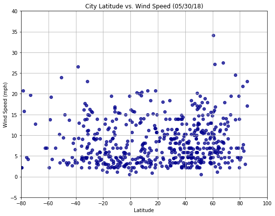

# *Analysis*
- There is a relatively strong correlation between latitude and temperature. 
- The higher latitudes have lower temperatures and the lower latitudes have higher temperatures.
- The correlation between humidity and latitude is very weak.
- There is almost no correlation between cloudiness and latitude.
- The correlation between latitude and wind speed is very weak.


```python
# Dependencies
import pandas as pd
import matplotlib.pyplot as plt
import numpy as np
from citipy import citipy
from config import api_key
import requests
import time
```


```python
# Generating random Latitude and Longitude
lat = np.random.uniform(low=-90.0, high=90.0, size=1500)
lng = np.random.uniform(low=-180.0, high=180.0, size=1500)
# Creating Dataframe
selected_cities = pd.DataFrame({"Latitude": lat, "Longitude": lng})
selected_cities.head()
```


<div>
<style scoped>
    .dataframe tbody tr th:only-of-type {
        vertical-align: middle;
    }

    .dataframe tbody tr th {
        vertical-align: top;
    }

    .dataframe thead th {
        text-align: right;
    }
</style>
<table border="1" class="dataframe">
  <thead>
    <tr style="text-align: right;">
      <th></th>
      <th>Latitude</th>
      <th>Longitude</th>
    </tr>
  </thead>
  <tbody>
    <tr>
      <th>0</th>
      <td>-54.177866</td>
      <td>140.932586</td>
    </tr>
    <tr>
      <th>1</th>
      <td>78.488880</td>
      <td>-135.729885</td>
    </tr>
    <tr>
      <th>2</th>
      <td>6.017698</td>
      <td>-105.342129</td>
    </tr>
    <tr>
      <th>3</th>
      <td>65.077074</td>
      <td>-30.670202</td>
    </tr>
    <tr>
      <th>4</th>
      <td>-83.427057</td>
      <td>-169.138367</td>
    </tr>
  </tbody>
</table>
</div>


```python
# Full Dataframe with all the required columns
selected_cities["City"] = ""
selected_cities["Country"] = ""
selected_cities["Date"] = ""
selected_cities["Temperature (F)"] = ""
selected_cities["Humidity (%)"] = ""
selected_cities["Cloudiness (%)"] = ""
selected_cities["Wind Speed (mph)"] = ""
selected_cities.head()
```


<div>
<style scoped>
    .dataframe tbody tr th:only-of-type {
        vertical-align: middle;
    }

    .dataframe tbody tr th {
        vertical-align: top;
    }

    .dataframe thead th {
        text-align: right;
    }
</style>
<table border="1" class="dataframe">
  <thead>
    <tr style="text-align: right;">
      <th></th>
      <th>Latitude</th>
      <th>Longitude</th>
      <th>City</th>
      <th>Country</th>
      <th>Date</th>
      <th>Temperature (F)</th>
      <th>Humidity (%)</th>
      <th>Cloudiness (%)</th>
      <th>Wind Speed (mph)</th>
    </tr>
  </thead>
  <tbody>
    <tr>
      <th>0</th>
      <td>34.188907</td>
      <td>-171.394363</td>
      <td></td>
      <td></td>
      <td></td>
      <td></td>
      <td></td>
      <td></td>
      <td></td>
    </tr>
    <tr>
      <th>1</th>
      <td>-69.620002</td>
      <td>7.069853</td>
      <td></td>
      <td></td>
      <td></td>
      <td></td>
      <td></td>
      <td></td>
      <td></td>
    </tr>
    <tr>
      <th>2</th>
      <td>65.159310</td>
      <td>-63.683458</td>
      <td></td>
      <td></td>
      <td></td>
      <td></td>
      <td></td>
      <td></td>
      <td></td>
    </tr>
    <tr>
      <th>3</th>
      <td>-24.672578</td>
      <td>127.655885</td>
      <td></td>
      <td></td>
      <td></td>
      <td></td>
      <td></td>
      <td></td>
      <td></td>
    </tr>
    <tr>
      <th>4</th>
      <td>41.880571</td>
      <td>5.974069</td>
      <td></td>
      <td></td>
      <td></td>
      <td></td>
      <td></td>
      <td></td>
      <td></td>
    </tr>
  </tbody>
</table>
</div>


```python
print("Beginning Data Retrieval")
print("-----------------------------------")
url = "https://api.openweathermap.org/data/2.5/weather?"
units = "imperial"
count = 1
for index, row in selected_cities.iterrows():
    try:
        random_lat = row["Latitude"]
        random_long = row["Longitude"]
        city = citipy.nearest_city(random_lat, random_long)
        cityname = city.city_name
        country_name = city.country_code
        
        query_url = url + "appid=" + api_key + "&units=" + units + "&q=" + cityname + "," + country_name
        
        print(f"Processing Record {count} | {cityname}, {country_name}")
        print(query_url)
        print("------------------------------------------------------------")
        
        response = requests.get(query_url).json()
              
        temperature = response["main"]["temp_max"]
        humidity = response["main"]["humidity"]
        cloudiness = response["clouds"]["all"]
        wind_speed = response["wind"]["speed"]
        new_lat = response["coord"]["lat"]
        new_long = response["coord"]["lon"]
        
        selected_cities.set_value(index, "City", cityname)
        selected_cities.set_value(index, "Country", country_name)
        selected_cities.set_value(index, "Temperature (F)", pd.to_numeric(temperature))
        selected_cities.set_value(index,"Humidity (%)", humidity)
        selected_cities.set_value(index,"Cloudiness (%)", cloudiness)
        selected_cities.set_value(index,"Wind Speed (mph)", wind_speed)
        
        #probably unnecessary, but replacing previous coordinates with city coordinates for accuracy
        selected_cities.set_value(index, "Longitude", new_lat)
        selected_cities.set_value(index, "Longitude", new_long)
    except:
        print("Invalid entry!")
    
    count = count + 1
    
print("----------------------------")
print("Data Retrieval Complete")
print("----------------------------")
```


```python
# printing the final dataframe
selected_cities.head()
```


<div>
<style scoped>
    .dataframe tbody tr th:only-of-type {
        vertical-align: middle;
    }

    .dataframe tbody tr th {
        vertical-align: top;
    }

    .dataframe thead th {
        text-align: right;
    }
</style>
<table border="1" class="dataframe">
  <thead>
    <tr style="text-align: right;">
      <th></th>
      <th>Latitude</th>
      <th>Longitude</th>
      <th>City</th>
      <th>Country</th>
      <th>Date</th>
      <th>Temperature (F)</th>
      <th>Humidity (%)</th>
      <th>Cloudiness (%)</th>
      <th>Wind Speed (mph)</th>
    </tr>
  </thead>
  <tbody>
    <tr>
      <th>0</th>
      <td>34.188907</td>
      <td>-159.32</td>
      <td>kapaa</td>
      <td>us</td>
      <td></td>
      <td>75.2</td>
      <td>88</td>
      <td>90</td>
      <td>13.87</td>
    </tr>
    <tr>
      <th>1</th>
      <td>-69.620002</td>
      <td>19.24</td>
      <td>hermanus</td>
      <td>za</td>
      <td></td>
      <td>51.38</td>
      <td>94</td>
      <td>92</td>
      <td>12.77</td>
    </tr>
    <tr>
      <th>2</th>
      <td>65.159310</td>
      <td>-65.72</td>
      <td>pangnirtung</td>
      <td>ca</td>
      <td></td>
      <td>25.73</td>
      <td>87</td>
      <td>88</td>
      <td>10.98</td>
    </tr>
    <tr>
      <th>3</th>
      <td>-24.672578</td>
      <td>130.99</td>
      <td>yulara</td>
      <td>au</td>
      <td></td>
      <td>69.8</td>
      <td>11</td>
      <td>0</td>
      <td>9.17</td>
    </tr>
    <tr>
      <th>4</th>
      <td>41.880571</td>
      <td>5.88</td>
      <td>la seyne-sur-mer</td>
      <td>fr</td>
      <td></td>
      <td>64.4</td>
      <td>88</td>
      <td>0</td>
      <td>4.94</td>
    </tr>
  </tbody>
</table>
</div>


```python
# delete repeated city, country and find unique city count
selected_cities.drop_duplicates(subset=["City","Country"], inplace=True)
len(selected_cities)
```


    539


# Temperature (F) vs. Latitude


```python
# Temperature (F) vs. Latitude
plt.figure(figsize=(9,7))
plt.scatter(selected_cities['Latitude'], pd.to_numeric(selected_cities['Temperature (F)']), marker='o', facecolor='darkblue',alpha = 0.75)

plt.title("City Latitude vs. Max Temperature (05/30/18)")
plt.xlabel("Latitude")
plt.ylabel("Max Temperature (F)")
plt.grid(True)
plt.xlim(-80,100)
plt.ylim(-100,150)
plt.savefig("Temperature.png")
plt.show()
```


# Humidity (%) vs. Latitude


```python
# Humidity (%) vs. Latitude
plt.figure(figsize=(9,7))
plt.scatter(selected_cities['Latitude'],pd.to_numeric(selected_cities['Humidity (%)']),marker='o',facecolor='darkblue', alpha = 0.75)

plt.title("City Latitude vs. Humidity (05/30/18)")
plt.xlabel("Latitude")
plt.ylabel("Humidity (%)")
plt.grid(True)
plt.xlim(-80,100)
plt.ylim(-20,120)
plt.savefig("Humidity.png")
plt.show()
```


# Cloudiness (%) vs. Latitude


```python
# Cloudiness (%) vs. Latitude
plt.figure(figsize=(9,7))
plt.scatter(selected_cities['Latitude'],pd.to_numeric(selected_cities['Cloudiness (%)']),marker='o',facecolor='darkblue', alpha = 0.75)

plt.title("City Latitude vs. Cloudiness (05/30/18)")
plt.xlabel("Latitude")
plt.ylabel("Cloudiness (%)")
plt.grid(True)
plt.xlim(-80,100)
plt.ylim(-20,120)
plt.savefig("Cloudiness.png")
plt.show()
```


# Wind Speed (mph) vs. Latitude


```python
# Wind Speed (mph) vs. Latitude
plt.figure(figsize=(9,7))
plt.scatter(selected_cities['Latitude'],pd.to_numeric(selected_cities['Wind Speed (mph)']),marker='o',facecolor='darkblue', alpha = 0.75)


plt.title("City Latitude vs. Wind Speed (05/30/18)")
plt.xlabel("Latitude")
plt.ylabel("Wind Speed (mph)")
plt.grid(True)
plt.xlim(-80,100)
plt.ylim(-5,40)
plt.savefig("Wind_Speed.png")
plt.show()
```




